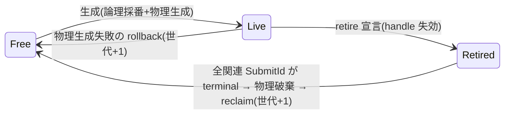

# リソースの所有モデルと論理レジストリ

- created: 2026-07-02
- updated: 2026-07-02
- status: ready for review
- implementation: not-started

## 解決したい問題

GPU リソース(buffer / image / image view / sampler)の生成・参照・破棄を、複数のサブシステムが 1 つの Device を共有する状況でも安全に扱えるようにする。
具体的には、次の問題を解消する。

- 破棄済みリソースへの参照(dangling)が、クラッシュや別リソースの黙った読み書きとして現れる問題。レジストリが世代(generation)を照合し、失効した参照を全 API で明示エラーとして拒否する。
- GPU がまだ使用中のリソースを CPU 側の都合で破棄してしまう問題。破棄(retire)を submit の完了追跡と結び、実体の解放を安全なタイミングまで遅延する。
- リソースの生成が途中で失敗したとき、レジストリと Vulkan 実体の対応が壊れる問題。生成プロトコルを「論理採番 → 物理生成、失敗時 rollback」と定め、失敗後もレジストリが一貫した状態に留まることを保証する。

これらを「あとからデバッグ機能で補う」のではなく、最初から test 可能な不変条件としてレジストリの仕様に固定する([philosophy](../philosophy.md)「正しさを後から補わない」)。

## 問題の背景

orvk の目標([0001](0001_goals-and-non-goals.md))は、レンダラー・アプリケーション本体・GUI 層のような複数のサブシステムが 1 つの Device とリソースレジストリを共有できることを含む。
Device 共有では、あるサブシステムが生成したリソースを別のサブシステムが参照する(cross-batch handoff、[0010](0010_device-sharing-and-handoff.md))ため、リソースの同一性と生存の判定を各サブシステムの内部規約に任せられない。
判定の出所は Device が所有するレジストリただ 1 つでなければならない。

また Vulkan では、GPU が参照中のリソースを `vkDestroy*` するのは未定義動作であり、image view は元の image より先に破棄しなければならない。
これらの制約を利用者に手で守らせると、同じ判定(「この submit はもう終わったか」「view は残っていないか」)がコードベースの複数箇所に分散して drift する。
レジストリが retire と submit 追跡([0006](0006_device-and-execution-model.md))を仕様として結び、判定点を一本化する。

handle・レジストリ・検証の語彙は Vulkan 実行を伴わない環境でもコンパイル可能とし(単一 crate 内の feature ゲート、[0001](0001_goals-and-non-goals.md))、採番・世代・retire の不変条件を Vulkan なしの単体テストで検証できるようにする。

## この文書では書かないこと

- descriptor heap の slot 割当・DescriptorHandle の ABI・publish バリアの導出([0003](0003_bindless-descriptor-heap.md))。本 doc はレジストリが descriptor 登録レコード(DescriptorRef)を保持するという契約までを書く。
- access 宣言と barrier / ResourceTransition の導出([0004](0004_access-declaration-and-sync.md))。
- TaskGraph / CommandEncoder の記録語彙と記録時検証([0005](0005_task-graph-and-command-encoder.md))。
- Device の生成・queue・SubmitTracker の状態機械・feature ゲートの詳細([0006](0006_device-and-execution-model.md))。本 doc は「SubmitId が terminal(Completed / Failed)かをレジストリが問い合わせられる」という契約だけを前提にする。
- upload / readback の転送 API と flush / invalidate([0008](0008_upload-and-readback.md))。本 doc は MemoryUsage と mapped buffer 予約の排他までを書く。
- swapchain image の取得・寿命([0009](0009_surface-swapchain-present.md))。
- publish / consume の依存宣言と消費 read の追跡([0010](0010_device-sharing-and-handoff.md))。本 doc はレジストリレコードが publication 情報を保持し、retire 安全判定が消費 read を考慮するという接続点までを書く。
- raw escape hatch 使用時の責務移転の詳細([0011](0011_raw-escape-hatch.md))。

## やらないこと

- **bulk retire / resource bundle(まとめて破棄する単位)を作らない。** 複数リソースを 1 つの寿命単位に束ねる API は、束の内外で retire 規則が二重になり、レジストリの判定点を増やす。利用者がループで retire を呼べば足り、必要なら helper としてレジストリの外に足せる。この設計では恒久的にやらない。
- **メモリの aliasing / defragmentation をやらない。** 1 handle = 1 実体の対応を崩し、生存判定を「slot の世代」から「メモリ範囲の重なり」へ複雑化させる。transient リソースのメモリ節約が実測で必要になった時点で、新しい design doc として再検討する(少なくとも v1 まではやらない)。
- **handle の serialize / プロセス間受け渡しをやらない。** handle は 1 Device のレジストリ内でだけ意味を持つ実行時の値であり、プロセスをまたぐ同一性は定義しない。external memory によるプロセス間共有は非目標([0001](0001_goals-and-non-goals.md))。
- **未使用リソースの自動回収(GC)をやらない。** 破棄は利用者の明示 retire だけを起点とする。暗黙の回収は「いつ消えるか」を API から読めなくする。恒久的にやらない。

## 用語集

- **論理レジストリ(logical registry)**: Device が所有する、handle の採番・世代・状態(生存 / retire 済み)・リソース記述・descriptor 登録・依存関係を記録するレジストリ。Vulkan 型に依存しない。
- **物理レジストリ(physical registry)**: handle から Vulkan 実体(`VkBuffer` / `VkImage` / `VkImageView` / `VkSampler` とメモリ割当)への対応表。Vulkan 実行 feature の下でのみ存在する。
- **retire**: 利用者が「このリソースをもう使わない」とレジストリへ宣言する操作。宣言の時点で handle は失効する(全 API で拒否される)が、Vulkan 実体の破棄は安全なタイミングまで遅延されうる。
- **reclaim**: retire 済み slot の物理破棄が完了し、slot が再採番可能(free list)に戻ること。
- **terminal**: SubmitId の完了追跡([0006](0006_device-and-execution-model.md))で Completed または Failed に達した状態。GPU がその submit のコマンドを参照し終えたことを意味する。

## 概要

リソース管理を論理レジストリと物理レジストリの 2 層に分ける。
論理レジストリは「どの handle が生きているか」という正しさの判定をすべて担い、物理レジストリは handle と Vulkan 実体の対応だけを持つ。
handle は index + generation を u64 にパックした Copy な値型(BufferHandle / ImageHandle / ImageViewHandle / SamplerHandle)で、レジストリは API 呼び出しごとに slot の世代と照合し、失効・偽 handle・別 Device の handle を明示エラーで拒否する。

生成は「論理採番 → 検証 → 物理生成」の順で行い、物理生成が失敗したら論理エントリを rollback して明示エラーを返す。
破棄は retire 宣言で handle を即座に失効させ、Vulkan 実体の破棄は「そのリソースに触れた全 SubmitId が terminal になった後」まで遅延する(view は image より先に破棄する)。
mapped buffer への CPU アクセスは RAII の予約 guard で排他し、予約中の retire を拒否する。



(図はレジストリ slot 1 つの状態遷移。矢印はすべて slot の状態遷移を表す。)

この 2 層分割により、採番・世代・retire 規則の不変条件は Vulkan なしの単体テストで固定でき、Vulkan 実体の寿命規則は物理レジストリ側だけに閉じる。

## シナリオ / ユースケース

**テクスチャの生成と破棄(単一サブシステム)。**
レンダラーが `device.create_image(ImageCreateInfo { .. })` で ImageHandle を得て、`device.create_image_view(ImageViewCreateInfo { image, desc })` で ImageViewHandle を得る。
数フレーム描画に使ったあと、view → image の順に retire を呼ぶ。
直前の submit がまだ GPU 上で走っていても retire は即座に成功し、handle はその場で失効する。
実体の `vkDestroy*` は、そのリソースに触れた最後の SubmitId が terminal になったあと、Device の破棄処理点で view → image の順に行われる。

**Device 共有下での失効検出。**
GUI 層サブシステムが、レンダラーから handoff(publish / consume、[0010](0010_device-sharing-and-handoff.md))で受け取った ImageHandle を保持し続けたとする。
レンダラーがその image を retire した後に GUI 層が access 宣言へその handle を渡すと、レジストリの世代照合が失敗し、`InvalidHandle`(retire 済み)の明示エラーが返る。
slot が再採番されて別リソースになっていても、世代が異なるため古い handle は決して新リソースに一致しない。

**別 Device の handle の混入。**
利用者が 2 つの Device を作り、Device A の BufferHandle を誤って Device B の API に渡すと、handle 内の Device タグ照合により決定的に `ForeignHandle` エラーが返る(偶然一致して別リソースを黙って触ることはない)。
Batch も同様で、Device A で作った Batch を Device B に submit しようとすると BatchId 内の Device 識別子の照合で拒否される。

**生成失敗の rollback。**
利用者がデバイスの対応していない format で image を生成しようとすると、物理生成に入る前の検証で `UnsupportedFormat` エラーが返る。
検証を通ってもメモリ割当が失敗した場合、論理エントリは rollback され、返されるはずだった handle の世代は消費済みになる(以後その値はどの API でも無効)。
レジストリはどちらの失敗でも一貫した状態に留まり、途中状態のリソースは残らない。

## 詳細設計

サブセクションの構成は次のとおり。

1. handle の表現(u64 パックと Device タグ)
2. 論理レジストリと物理レジストリの 2 層構造
3. リソース記述型と MemoryUsage
4. 生成プロトコル(採番 → 検証 → 物理生成 → rollback)
5. retire・遅延破棄・reclaim
6. mapped buffer 予約の RAII と排他
7. owner 照合
8. 不変条件の一覧(test 可能な形)

### handle の表現

handle は `index + generation` を u64 にパックした Copy + Eq + Hash な値型で、リソース種別ごとに newtype で分ける(BufferHandle / ImageHandle / ImageViewHandle / SamplerHandle)。
種別を型で分けるのは、buffer の handle を image の API に渡す取り違えをコンパイル時に排除するためである。

パックの内訳は次のとおり。

- 下位 32 bit: **index**。レジストリ slot 配列の添字。リソース種別ごとに独立した slot 空間を持つ。
- 上位 32 bit: **generation フィールド**。上位 8 bit を Device タグ、下位 24 bit を世代カウンタとする。世代カウンタ 0 は無効値として使わない(ゼロ初期化されたメモリが有効 handle にならないようにする)。

Device タグは Device 生成時にプロセス内カウンタから振られる 8 bit の識別子で、レジストリ照合の第一段で照合される。
これにより「別 Device の handle が偶然 index も世代も一致して別リソースを黙って触る」という確率的な取りこぼしを排除し、拒否を決定的にする(silent trap を残さない、[0001](0001_goals-and-non-goals.md))。
世代カウンタは slot ごとに保持し、rollback または reclaim のたびに +1 する。
24 bit(約 1,677 万世代)を使い切った slot は再採番せず恒久退役とする(「落とし穴」参照)。

handle は借用や lifetime を持たない。
生存の判定は型システムではなくレジストリの世代照合が担う(RAII 案との比較は「代替案」)。

### 論理レジストリと物理レジストリの 2 層構造

**論理レジストリ**は Device が所有し、リソース種別ごとの slot 配列と free list を持つ。
slot 1 つが保持するのは次の情報である。

- 世代カウンタと状態(Free / Live / Retired)。
- リソース記述(生成時の CreateInfo の写し)。生成後の情報照会 API(size / format / extent 等)と、view 生成時・記録時の検証の出所になる。
- descriptor 登録レコードへの参照(DescriptorRef、[0003](0003_bindless-descriptor-heap.md))。retire 時に heap slot の無効化・回収を連動させるために持つ。
- 依存関係: image slot は自分から生成された live な view の集合を持つ(retire 順序制約の検証に使う)。view slot は元 image の handle を持つ。
- 寿命追跡: このリソースに触れた submit の SubmitId 集合(正確には「最後に触れた submit」を判定できる最小限の記録。access 宣言の compile 時([0004](0004_access-declaration-and-sync.md))と handoff の consume 宣言([0010](0010_device-sharing-and-handoff.md))が記録する)。
- mapped 予約状態(後述)と publication 情報([0010](0010_device-sharing-and-handoff.md))。

論理レジストリは Vulkan 型に一切依存せず、Vulkan 実行 feature なしでコンパイルできる。
採番・世代照合・retire 順序・rollback の不変条件は、物理生成を伴わないテスト用の採番経路で単体テストできる。

**物理レジストリ**は handle(の index)から Vulkan 実体への対応表で、Vulkan 実行 feature の下にだけ存在する。
保持するのは `VkBuffer` / `VkImage` / `VkImageView` / `VkSampler` とメモリ割当(allocator の allocation)、および mapped pointer(CpuToGpu / GpuToCpu の buffer)である。
物理レジストリは正しさの判定を一切持たない。
「この handle は有効か」「今破棄してよいか」はすべて論理レジストリが判定し、物理レジストリはその判定結果に従って実体を出し入れするだけである。
この責務分離により、寿命バグの調査は常に論理レジストリの 1 箇所を見ればよくなる。

### リソース記述型と MemoryUsage

生成の入力は種別ごとの CreateInfo 構造体で受け取る。
フィールドは Vulkan の対応する create info の部分集合で、orvk が語彙として意味を与えないもの(descriptor set layout 等)は含めない。

- `BufferCreateInfo`: size、usage(transfer src/dst、storage、uniform、vertex、index、indirect の bitflags)、`MemoryUsage`。
- `ImageCreateInfo`: extent(1D/2D/3D)、format、usage(transfer src/dst、sampled、storage、color attachment、depth-stencil attachment の bitflags)、mip level 数、array layer 数、sample 数。メモリは常に GPU 専用(image を CPU visible メモリに置く経路は提供せず、CPU との転送は buffer 経由とする。[0008](0008_upload-and-readback.md))。
- `ImageViewCreateInfo`: 元 image の `ImageHandle` と、値ベースの `ImageViewDesc`。`ImageViewDesc` は view type(2D / 2D array / cube 等)、format(image と互換な再解釈を含む)、subresource range(aspect / base mip / mip 数 / base layer / layer 数)を持つ Copy + Eq + Hash な値型である。値型として handle から分離するのは、上位層が「同じ view 記述か」の比較やキャッシュキーとして handle 抜きで扱えるようにするためである。レジストリ自体は (image, desc) の重複生成を dedup しない(同じ desc で 2 回生成すれば独立した 2 つの view handle と実体ができる)。暗黙共有は retire の意味論(誰が消すと消えるのか)を曖昧にするため、共有したければ利用者が handle を配ればよい。
- `SamplerCreateInfo`: min/mag/mip filter、address mode(u/v/w)、anisotropy、compare op、LOD 範囲、border color。

`MemoryUsage` は buffer のメモリ配置意図を表す 3 値の enum である。

- `GpuOnly`: device local。CPU から直接触れない。
- `CpuToGpu`: host visible な書き込み用。生成時から persistent map され、mapped 予約(後述)で CPU から書ける。
- `GpuToCpu`: host visible な読み出し用(readback)。転送・整列の規則は [0008](0008_upload-and-readback.md)。

upload 用(CpuToGpu)と readback 用(GpuToCpu)を 1 つの「CPU visible」に統合しないのは、書く buffer と読む buffer では必要な usage・キャッシュ属性・整合性操作(flush / invalidate)が異なり、混ぜると誤用(readback buffer への書き込み等)が型で防げなくなるためである。

### 生成プロトコル

生成は全リソース種別で共通の 3 段プロトコルに従う。

1. **論理採番**: free list から slot を取り(なければ配列を伸長)、状態を Live にして handle を確定する。世代カウンタは reclaim / rollback 時に更新済みの現在値を使う。
2. **検証**: CreateInfo をデバイス能力と照合する。format のサポート(image は tiling / usage の組に対する format properties、buffer は usage の組)、extent / mip / layer / size のデバイス limit、usage bitflags の整合(空の usage 等)、view は元 image との互換性(format 互換クラス、subresource range が image の範囲内、view type と image type の整合)。**検証に落ちた入力は黙って丸めたり近い値に代替したりせず、何がなぜ不正かを持つ明示エラーを返す。**
3. **物理生成**: Vulkan 実体の生成とメモリ割当・bind、descriptor 登録([0003](0003_bindless-descriptor-heap.md))を行い、物理レジストリに登録する。

段 2 または段 3 が失敗したら、**rollback** する: 物理側で生成済みの中間物(実体はできたが割当に失敗した等)を破棄し、論理 slot の世代カウンタを +1 して状態を Free に戻し、free list へ返す。
世代を +1 するのは、失敗時に外へ出かけた handle 値(あるいは同値の再計算)が、その slot の次の住人に一致することを構造的に防ぐためである。
rollback 後のレジストリは「その生成が最初から起きなかった」のと観測上区別できない状態になる(世代の消費を除く)。

エラーは検証失敗(UnsupportedFormat / LimitExceeded / InvalidUsage / IncompatibleView 等)と物理失敗(AllocationFailed / DeviceLost 等)を区別できる型で返す。
利用者はどの段で失敗したかをプログラムで分岐できる。

### retire・遅延破棄・reclaim

retire は「宣言の即時性」と「破棄の遅延」を分離する。

**宣言(即時)**: `device.retire_buffer(handle)` 等を呼ぶと、レジストリは世代照合と順序制約(後述)を検証したうえで slot を Retired にする。
この時点で handle は失効し、以後すべての API(access 宣言、記録、view 生成、map、descriptor 取得、情報照会、再 retire)で `InvalidHandle` として拒否される。
retire は同じ handle に対して高々 1 回成功する。

**順序制約**: live な view が 1 つでも残っている image の retire は `HasLiveViews` の明示エラーとする。
利用者は view を先に retire しなければならない。
「image を retire したら view も連鎖 retire する」暗黙連鎖は採らない。
view handle は別のサブシステムが保持しているかもしれず、勝手に失効させると保持者から見て理由のない失効になるためである(Device 共有下では所有の主張は明示操作だけで行う)。

**破棄(遅延)**: Retired slot の Vulkan 実体をいつ `vkDestroy*` してよいかは、論理レジストリが記録した寿命追跡で判定する。
条件は「そのリソースに触れた(access 宣言・転送・handoff consume を含む)すべての SubmitId が terminal であること」である。
一度も submit に触れていないリソースは即時破棄できる。
まだ building 中の Batch がそのリソースを access 宣言に含めている場合、retire 宣言自体は成功するが、その Batch の submit は compile 時の世代照合で失敗する(宣言時点で有効でも submit 時点で失効していれば拒否する。判定点は [0004](0004_access-declaration-and-sync.md) の compile)。
handoff で publish 済みのリソースは、追跡されている consume read の SubmitId も条件に含める([0010](0010_device-sharing-and-handoff.md))。

破棄の実行点は Device 内の破棄キューで、submit 完了の観測時(wait / is_submit_complete の内部、および submit 時の駆け込み確認)に条件を満たした slot を処理する。
専用スレッドは立てない(暗黙の並行性を増やさない)。
同一の破棄処理点に view とその元 image の両方が並んでいる場合、**view を image より先に破棄する**。
順序制約(image retire は view retire が先)により、破棄キュー上でも view の retire 宣言は必ず image より先行しているが、terminal 到達のタイミングによって同一処理点に両方が揃うことがあるため、破棄キュー側でも種別順(view → image → buffer / sampler)を固定する。

**reclaim**: 物理破棄が完了した slot は descriptor 登録の回収([0003](0003_bindless-descriptor-heap.md))を終えたあと、世代カウンタを +1 して Free に戻し、free list へ返す。
slot の再採番は必ず reclaim 後であり、したがって「旧 handle と新 handle が index を共有しても世代が必ず異なる」ことが保証される。

Device の drop 時は、未 retire のリソースが残っていることを明示エラー(または debug assert + ログ)として報告したうえで、全 submit の完了を待ってから種別順に全実体を破棄する。
黙って leak しないし、黙って握りつぶしもしない。

### mapped buffer 予約の RAII と排他

CpuToGpu / GpuToCpu の buffer への CPU アクセスは、レジストリから取得する予約 guard を通してだけ行える。

```rust
let mut guard = device.map_buffer_mut(buffer)?; // CpuToGpu 用の書き込み予約
guard.as_mut_slice()[..data.len()].copy_from_slice(data);
// guard の drop で予約解除
```

guard は RAII で、drop まで次の排他をレジストリに対して主張する。

- 同じ buffer への二重予約は `AlreadyMapped` の明示エラー。
- 予約中の buffer の retire は `MappedInUse` の明示エラー(予約が dangling pointer になるのを防ぐ)。
- GpuOnly buffer への map 要求は `NotHostVisible` の明示エラー。

guard は Vulkan の `vkMapMemory` を都度呼ぶのではなく、生成時の persistent map への排他アクセス権を表す論理的な予約である(物理的な map/unmap を予約に連動させない。都度 map は同一メモリの多重 map 制約と絡み、予約の意味論をメモリ割当の実装詳細に結合させるため)。
GPU が同時にその buffer を読み書きしうるかどうかの hazard 管理は本 doc の範囲外で、access 宣言と同期導出([0004](0004_access-declaration-and-sync.md))および upload / readback の完了規則([0008](0008_upload-and-readback.md))が扱う。
予約はあくまで CPU 側同士の排他と retire 保護である。

### owner 照合

複数 Device の併用時に、オブジェクトが別の Device へ渡る誤用を決定的に拒否する。

- **handle**: 前述の Device タグ(generation フィールド上位 8 bit)をレジストリ照合の第一段で照合し、不一致は `ForeignHandle`。
- **Batch / SubmitId**: BatchId / SubmitId に生成元 Device の識別子を含め、submit・wait・is_submit_complete・handoff の consume 宣言など Device の口に渡された時点で照合し、不一致は `ForeignBatch` / `ForeignSubmit`。
- **guard 類**(mapped 予約 guard 等): 生成元 Device への参照を内部に持つため、構造上他 Device へ渡せない。

照合は Free / Retired の判定より前に行う。
「別 Device の handle がたまたま自分の free slot を指していた」ケースでも、返るエラーは `InvalidHandle` ではなく `ForeignHandle` であり、利用者は取り違えの種類を区別できる。

### 不変条件の一覧(test 可能な形)

以下をレジストリ仕様の不変条件として固定し、テストで検証する。
1〜6 は論理レジストリのみで(Vulkan なしで)検証でき、7〜9 は Vulkan 実行 feature 下の統合テストで検証する。

1. retire 済み handle は、handle を受け取るすべての API(access 宣言、記録、view 生成、map、descriptor 取得、情報照会、retire)で `InvalidHandle` エラーになる。成功する API は 1 つも存在しない。
2. 世代が現在の slot 世代と一致しない handle は、slot の状態によらず `InvalidHandle` エラーになる(ABA の排除)。
3. 別 Device の handle / Batch / SubmitId は、状態照合より前の owner 照合で `ForeignHandle` / `ForeignBatch` / `ForeignSubmit` エラーになる(確率的でなく決定的)。
4. slot の再採番後、旧 handle と新 handle は index が同じでも等しくない(reclaim / rollback は必ず世代を +1 する)。
5. live な view を持つ image の retire は `HasLiveViews` エラーになり、レジストリの状態を変えない。
6. mapped 予約中の buffer の retire は `MappedInUse`、二重予約は `AlreadyMapped` エラーになり、guard の drop 後は retire が成功する。
7. 生成の物理段が失敗したとき、レジストリに Live でも Retired でもある残骸 slot は残らず、失敗した採番の handle 値は以後すべての API で `InvalidHandle` になる。
8. リソースに触れた SubmitId のうち 1 つでも terminal でないものがある間、そのリソースの Vulkan 実体は破棄されない(validation layer 併用のテストで検証)。
9. 同一破棄処理点に view と元 image が並んだとき、view の `vkDestroyImageView` は image の `vkDestroyImage` より先に呼ばれる。

## 落とし穴

- **世代カウンタの枯渇**。世代は slot ごとに 24 bit で、同一 slot を約 1,677 万回 reclaim すると使い切る。枯渇した slot は恒久退役とし(再採番しない)、slot 配列の当該 index は以後 Free に戻らない。生成 / retire を毎フレーム繰り返す利用(たとえば 1000 個/frame × 60 fps)では数十時間で個々の slot が退役しうるが、退役 slot の分だけ配列が伸長するだけで正しさは壊れない。メモリ増加が問題になる利用パターンが実測されたら、その時点で世代幅の再設計を新しい doc で行う。
- **retire しても実体はすぐには消えない**。破棄は submit の terminal 化に依存するため、submit が長く完了しない(または wait / is_submit_complete が長期間呼ばれない)と Retired slot と Vulkan 実体が破棄キューに滞留し、VRAM を保持し続ける。破棄処理は完了観測に便乗する設計なので、「submit したきり観測しない」利用では解放が進まない。これは仕様であり、解放を進めたい利用者は完了を観測する必要がある。
- **retire 宣言の成功は「その handle をもう誰も使っていない」ことを意味しない**。building 中の Batch が access 宣言済みの handle を retire すると、宣言自体は成功するが、その Batch の submit が compile 時に失敗する。エラーの発生点が retire 呼び出しから submit へ移るため、原因(先行する retire)と症状(submit 失敗)が離れる。エラー型には失効した handle を含め、追跡の手がかりを残す。
- **view の先行 retire は利用者の義務**。image と view を別々のサブシステムが保持していると、image 側は view 保持者に retire してもらうまで image を retire できない。これは Device 共有下で所有権の調停をレジストリが肩代わりしない(暗黙連鎖 retire をしない)ことの裏面であり、view を配る側は返却(retire)の取り決めを上位の設計で持つ必要がある。
- **raw escape hatch の外は保証外**。[0011](0011_raw-escape-hatch.md) の unsafe な口から raw Vulkan handle を取り出して destroy した場合や、u64 から偽の handle 値を組み立てた場合、レジストリの不変条件は成立しない。保証の境界は unsafe の境界と一致する。
- **CreateInfo 検証の結果は環境依存**。format / limit の検証はその物理デバイスの能力に対して行うため、開発機で通る生成が別のデバイスで `UnsupportedFormat` になりうる。これは検証を黙った代替(近い format への丸め)にしないことの帰結であり、可搬性が要る利用者は生成前に能力照会 API で分岐する。
- **レジストリは Device 内の共有状態**。複数サブシステムからの生成・retire・照合はレジストリのロックで直列化される。照合(読み)は頻繁だが短く、生成・retire(書き)は Vulkan 呼び出しを含み長い。物理生成をロック外で行う分割(採番と登録だけロック内)を前提に設計するが、生成を hot loop で叩く利用ではロック競合が観測されうる(「負荷・コスト」参照)。

## 代替案

- **利用者(サブシステム)ごとにレジストリを分け、リソースを import / export で受け渡す案**。
  各サブシステムが自分専用のレジストリと handle 空間を持ち、他サブシステムのリソースを使うときは export された記述を import して自分のレジストリに登録し直す。
  - Pros: サブシステム間でレジストリロックを共有せず、競合がない。あるサブシステムの handle 誤用が他へ波及しない。
  - Cons: 同一の Vulkan 実体に複数の論理エントリができ、「誰が retire したら実体が消えるのか」という寿命の出所が複数レジストリに分散する。handoff のたびに import / export の変換手続きと handle の対応表が要る。同期導出([0004](0004_access-declaration-and-sync.md))がレジストリをまたいで access 履歴を突き合わせる必要が生じ、判定点の一本化(philosophy)が壊れる。
  - 1 Device = 1 handle 空間・レジストリは Device が所有という全体決定([0001](0001_goals-and-non-goals.md))のとおり、生存判定の出所は 1 つであるべきなので採らない。分離が欲しい動機(競合・誤用の遮断)は、owner 照合とロック粒度の設計で満たす。
- **RAII ハンドル(Drop で解放)案**。
  handle を Copy な値型ではなく、Drop 実装を持つ所有型(`Buffer` 等)にし、スコープを抜けたら自動で解放する。
  - Pros: retire の呼び忘れによる leak が構造的に起きない。Rust の所有権と一致した見た目になる。
  - Cons: Drop は失敗を返せないため、「GPU 使用中の破棄」を Drop 内の暗黙ブロック(silent block)か暗黙の遅延キュー投入で処理するしかなく、解放のタイミングが API から読めなくなる。所有型は Copy でないため、access 宣言・記録・handoff のすべての口が参照 or clone の設計判断を背負い、複数サブシステムが同じリソースを参照する Device 共有では `Arc` 相当の共有所有が事実上必須になって「最後の drop はどこか」が実行時の偶然になる。失効の検出(不変条件 1・2)が「そもそも失効した値を作れない」設計に置き換わる代わりに、寿命が型の都合で暗黙化する。
  - 明示 retire + 世代照合は、leak の可能性(明示エラーで検出する)と引き換えに、破棄の宣言点がコード上に必ず 1 箇所現れることを取る。simple over easy の選択として値 handle を採る。leak 防止の RAII wrapper が欲しい利用者は、値 handle の上に自分の所有型を被せられる(逆は不可能)。
- **世代を slot ごとではなくグローバル単調カウンタにする案**。
  レジストリ全体で 1 つのカウンタを持ち、採番のたびに +1 した値をその handle の世代にする。
  - Pros: slot ごとの世代保存が不要で、ABA が原理的に起きない。
  - Cons: 世代の消費速度が全 slot の生成数の合計になり、24 bit では現実的な時間で枯渇する。枯渇時の影響が特定 slot の退役ではなくレジストリ全体の停止になる。
  - 枯渇の影響半径を slot 1 つに閉じられる per-slot 世代を採る。
- **view を image retire に連鎖して暗黙 retire する案**。
  image を retire したら、レジストリがその image の live view をすべて自動で retire する。
  - Pros: 利用者の retire 呼び出しが減り、`HasLiveViews` エラーに当たらない。
  - Cons: view handle の保持者(image の retire 呼び出し元とは別のサブシステムかもしれない)から見ると、自分の handle が自分の操作なしに失効する。失効の原因(他者の image retire)が handle 側の履歴に現れず、Device 共有下でのデバッグを難しくする。
  - 失効はその handle への明示操作だけを起点とする方が判定点が読めるので採らない。
- **レジストリが (image, ImageViewDesc) で view を自動 dedup(共有)する案**。
  同じ記述の view 生成要求に対して既存の view handle を返し、参照カウントで寿命を管理する。
  - Pros: 同一 view の重複実体を作らない。
  - Cons: retire の意味が「参照カウントのデクリメント」になり、「retire したのに消えない」「他人の retire で消える」という共有状態の寿命問題をレジストリが抱え込む。値ベースの `ImageViewDesc` により、dedup が欲しい利用者は上位で desc をキーにキャッシュを組める。
  - レジストリは 1 生成 = 1 実体 = 1 handle の対応を守る方が simple なので採らない。

## セキュリティ・プライバシー

この設計は外部入力・機微データを扱わず、プロセス内の GPU リソース管理に閉じるため、新たなセキュリティ・プライバシー上の検討は不要である。
なお世代照合と owner 照合は安全性(誤用検出)の機構であり、悪意あるコードに対する防御(unsafe や raw 値の偽造への耐性)は目的に含めない(保証境界は「落とし穴」の raw escape hatch 項を参照)。

## 負荷・コスト

- **handle 照合**: slot 配列への添字アクセス 1 回と整数比較 2 回(Device タグ、世代)の O(1)。access 宣言・記録の hot path に載るが、per-handle の定数コストでありリソース数にスケールしない。
- **生成・retire**: 生成は Vulkan 呼び出し(実体生成 + メモリ割当)が支配的で、レジストリ操作(採番・登録)はその誤差に収まる。retire 宣言は O(1)(image は live view 集合の空判定を含む)。どちらもフレームの hot path で毎フレーム大量に呼ぶ操作ではない前提であり、その前提が崩れる利用(毎フレーム数千生成)ではロック競合と Vulkan 呼び出し自体が先にボトルネックになる。
- **遅延破棄の走査**: 破棄キューの処理は submit 完了の観測時に走り、コストは「terminal 待ちの Retired slot 数」に比例する。フレームごとの定常状態では当該フレームで retire された数に比例し、リソース総数には比例しない。
- **メモリ**: 論理レジストリは slot あたり数十〜百数十バイト(CreateInfo の写し + 追跡情報)× 生成済み slot 数(退役 slot を含む)。物理レジストリは handle → 実体の対応で slot あたり数十バイト。リソース 1 万個で MB オーダーに収まり、リソース実体(VRAM)に対して無視できる。
- **ロック**: レジストリロックの保持区間は採番・照合・状態更新に限定し、Vulkan 呼び出し(物理生成・破棄)をロック外に置ける構造にする。競合コストは「同時に生成 / retire を行うサブシステム数」に比例し、照合(読み)主体の定常フレームでは競合しない。
