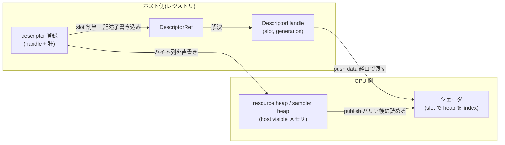

# bindless descriptor heap と descriptor ABI

- created: 2026-07-02
- updated: 2026-07-02
- status: ready for review
- implementation: not-started

## 解決したい問題

シェーダからリソースを参照するとき、descriptor set のレイアウト定義・pool 管理・set のバインドという Vulkan の記述子運用を利用者が一切書かなくて済むようにする。
利用者は「リソースを登録すると番号が返り、その番号をシェーダに渡すと参照できる」という一本の契約だけを覚えればよい。
同時に、破棄済みリソースの番号を使い回す事故(解放済み slot が別リソースに再利用され、シェーダが黙って別のデータを読む)を、仕様として検出可能にする。

この doc は、そのための descriptor heap の構造(2 ヒープモデル)、レジストリとシェーダ ABI の 2 層の参照型(DescriptorRef / DescriptorHandle)、slot 割当と再利用の安全規則、ヒープ実体のメモリ設計とホスト書き込みの可視化(publish)、および利用者側シェーダとの能力ネゴシエーション(binding profile)を決める。

## 問題の背景

orvk は `VK_EXT_descriptor_heap` を必須とし、fallback backend を持たない([0001](0001_goals-and-non-goals.md)、[docs/philosophy.md](../philosophy.md))。
この拡張では記述子は「型ごとの set」ではなく「一様な配列(heap)」であり、シェーダは heap 内の index で直接リソースを参照する。
つまりハードウェアの実態が既に bindless であり、descriptor set / pool / layout という API 語彙は、この前提ではラッパーが利用者へ漏らす必要のない中間概念である。

一方で bindless には固有の危険がある。
index は単なる整数なので、リソースを破棄して slot を再利用すると、古い index を持ったままのコードが新しいリソースを黙って読む。
レンダラー・アプリケーション・GUI 層のような複数のサブシステムが 1 つの Device を共有する利用シナリオ([0001](0001_goals-and-non-goals.md)、[0010](0010_device-sharing-and-handoff.md))では、slot 空間は共有資源であり、この誤参照はサブシステム境界を越えて波及する。
silent trap を残さないという方針(philosophy)から、slot 再利用の安全規則と世代(generation)による検出は最初から仕様として固定する必要がある。

また heap の実体はメモリ上の記述子配列なので、「ホストが書いた記述子バイト列を GPU がいつから読めるか」という可視化(publish)の同期問題が、リソース自体のハザードとは別に存在する。
これはタスクグラフの access 宣言([0004](0004_access-declaration-and-sync.md))から導出できるが、その導出契約はこの doc の担当である。

## この文書では書かないこと

- リソース handle(BufferHandle 等)の採番・世代管理・retire の一般規則。[0002](0002_resource-ownership-and-registry.md) が決める。この doc はそのうち descriptor slot に固有の部分だけを書く。
- access 宣言と barrier 導出の一般機構。[0004](0004_access-declaration-and-sync.md) が決める。この doc は heap の publish バリアという特定の適用だけを書く。
- push data の記録 API と検証。[0005](0005_task-graph-and-command-encoder.md) が決める。この doc は push data に積まれる DescriptorHandle の ABI 形だけを決める。
- Device 生成・feature gate・queue 構成。[0006](0006_device-and-execution-model.md) が決める。この doc は DeviceConfig のうちヒープ容量の項目だけを決める。
- pipeline layout を利用者 API に出さないこと自体の決定と pipeline 生成。[0007](0007_pipeline-registration-and-cache.md) が扱う。
- cross-batch handoff の publish / consume 契約。[0010](0010_device-sharing-and-handoff.md) が扱う(用語集で本 doc の「heap publish」との区別を定義する)。
- シェーダ言語・シェーダコンパイラ。orvk は SPIR-V を受け取るだけで、heap を index するシェーダコードの生成はライブラリ外の責務である。

## やらないこと

- **combined image sampler を descriptor 種に入れない。** image と sampler の組ごとに記述子を作る方式は、slot 消費が image 数 × sampler 数で膨らみ、image と sampler の寿命・登録を結合させる。sampled image と sampler を別 descriptor として渡し、シェーダ側で組み合わせる。これは方針決定であり、再検討しない(詳細は代替案)。
- **ヒープの自動成長をやらない。** 容量は Device 生成時に DeviceConfig で固定し、枯渇は明示エラーにする。成長は heap の再確保と全 slot の再配置(=発行済み DescriptorHandle の全無効化)を意味し、共有資源としての slot 空間の安定性を壊す。容量計画は利用者(Device を組み立てる統合層)の責務とする。実運用で固定容量が立たないと証明されたら新しい doc で再検討する。
- **サブシステムごとの slot 区画(quota)を設けない。** 共有 Device の各サブシステムに slot 範囲を予約割当する機構は、いま必要性が証明されていない。単一の free list で共有し、枯渇エラーに要求元の情報を含める方から始める。
- **既定での GPU 側 generation 検証をやらない。** シェーダが読む直前に generation 一致を検査する仕組みは、全リソース参照に読み取りとバイト比較を足す。既定では host 側検証(記録時)に留め、GPU 側検証は将来の debug 用計装として必要が証明されてから検討する。
- **5 種以外の descriptor 種(acceleration structure 等)を当面入れない。** 必要になった時点で binding profile の対応種集合に追加する形で拡張する(設計はそれを許す形にする)。

## 用語集

- **resource heap / sampler heap**: Device が持つ 2 本の記述子配列。resource heap は buffer / image 系の記述子を、sampler heap は sampler 記述子を格納する。
- **slot**: heap 内の 1 記述子分の位置。ヒープごとに独立した index 空間を持つ。
- **DescriptorRef**: レジストリ([0002](0002_resource-ownership-and-registry.md))上の descriptor 登録レコードへの参照。ホスト側 API の型であり、シェーダには渡らない。
- **DescriptorHandle**: シェーダ ABI 上の `uint2 = (heap slot, generation)`。push data やリソース内データとしてシェーダに渡る唯一の記述子参照形。
- **heap publish**: ホストが heap メモリへ書いた記述子バイト列を、GPU の記述子読み取りに対して可視化するバリア操作。cross-batch handoff の publish / consume([0010](0010_device-sharing-and-handoff.md))はリソース内容の受け渡し契約であり別概念。本 doc で単に「publish」と書いたら heap publish を指す。
- **binding profile**: Device が公開する、シェーダ ABI の能力記述(記述子 stride、DescriptorHandle のレイアウト、対応 descriptor 種の集合など)。利用者側のシェーダ生成が orvk の ABI に適合するための照会面。

## 概要

記述子は Device が所有する 2 本の heap(resource heap / sampler heap)に集約する。
利用者はリソース handle と descriptor 種を指定してレジストリに登録し、DescriptorRef を得る。
レジストリは free list から slot を割り当て、記述子バイト列を host visible な heap メモリへ直接書き込む。
シェーダへ渡す形は DescriptorRef から解決した DescriptorHandle(`uint2 = slot + generation`)であり、シェーダは slot で heap を index する。
descriptor 種は uniform buffer / storage buffer / sampled image / storage image / sampler の 5 種で、storage image は sampled image と同格の登録経路を持つ。

slot の再利用は世代で守る。
登録解除された slot は、その slot を参照しうる submit がすべて terminal(Completed / Failed、[0006](0006_device-and-execution-model.md))になるまで reclaim せず、reclaim 時に generation を +1 する。
古い DescriptorHandle は generation 不一致として記録時に明示エラーで検出される。
slot 枯渇も黙って失敗せず明示エラーにする。

ホストが書いた記述子は、batch の実行前に HOST_WRITE → HEAP_READ の publish バリアで可視化する。
バリア範囲はタスクグラフの heap access 宣言から「書かれた slot 範囲 × 読まれる slot 範囲」の交差として導出し、隣接範囲をマージして発行する。
ヒープ容量は DeviceConfig で利用者が決める(複数サブシステムで共有する資源だから)。
シェーダ側との ABI 適合は binding profile の照会で取る。

(矢印はすべて「データが渡る向き」を表す。)

## シナリオ / ユースケース

レンダラーサブシステムがテクスチャを 1 枚使う流れを、共有 Device 上でなぞる。

1. image と image view を作る([0002](0002_resource-ownership-and-registry.md))。`ImageViewHandle` を得る。
2. その view を sampled image として Device のレジストリに登録する。レジストリは resource heap の free list から slot を取り、記述子バイト列を heap メモリへ書き、`DescriptorRef` を返す。slot が尽きていればこの時点で枯渇エラーが返る。
3. sampler も同様に sampler heap へ登録し、別の `DescriptorRef` を得る。
4. タスクグラフにタスクを記録するとき、`DescriptorRef` を `DescriptorHandle` に解決して push data に積む([0005](0005_task-graph-and-command-encoder.md))。解決時に generation の有効性が検証され、破棄済みならここで明示エラーになる。
5. batch の submit 時、この batch までにホストが書いた slot 範囲と、この batch が読む slot 範囲の交差に publish バリアが入り、シェーダは正しい記述子を読む。シェーダは push data の `uint2` の slot で heap を index し、テクスチャと sampler を組み合わせてサンプルする。
6. テクスチャが不要になったら descriptor の登録を解除し、view と image を retire する。slot は参照しうる submit が terminal になるまで free list に戻らず、戻るとき generation が +1 される。

同じ Device を共有する別サブシステム(たとえば GUI 層)も、同じレジストリ・同じ heap に対して 2〜6 を行う。
slot 空間は共有なので、両者の登録数の合計が DeviceConfig で決めた容量に収まるよう、Device を組み立てる統合層が容量を見積もる。

compute で storage image に書く場合も経路は同じで、登録時の descriptor 種を storage image にするだけである。
同じ `ImageViewHandle` を sampled image と storage image の両方で使うなら、種ごとに別の登録(別 slot・別 `DescriptorRef`)を作る。

## 詳細設計

サブセクションの目次:

- **2 ヒープモデルと descriptor 種**: heap の分け方と 5 つの descriptor 種、種と heap の対応。
- **DescriptorRef と DescriptorHandle**: レジストリ参照とシェーダ ABI の 2 層分離と、それぞれの形・意味論。
- **slot 割当と再利用の安全**: free list・reserved floor・generation・retire safety・枯渇エラー。
- **ヒープ実体と共通 stride**: メモリ属性、stride の決め方、driver 予約 range の扱い。
- **heap publish**: 記述子の不変条件と、access 宣言からのバリア導出・毎 batch の publish 契約。
- **容量と DeviceConfig**: 容量指定の意味論。
- **binding profile**: ABI の照会と能力ネゴシエーション。

### 2 ヒープモデルと descriptor 種

heap は resource heap と sampler heap の 2 本とする。
`VK_EXT_descriptor_heap` がリソース記述子と sampler 記述子を別 heap として扱う構造をそのまま採り、ラッパー独自の統合や再分割をしない。

descriptor 種は次の 5 つで、種と heap の対応は固定である。

| descriptor 種 | heap | 登録に使う handle |
|---|---|---|
| uniform buffer | resource | BufferHandle(offset / size 付き) |
| storage buffer | resource | BufferHandle(offset / size 付き) |
| sampled image | resource | ImageViewHandle |
| storage image | resource | ImageViewHandle |
| sampler | sampler | SamplerHandle |

storage image は sampled image と同格の第一級の登録経路を持つ。
compute パイプラインが image へ書く経路は bindless レンダリングの中心的ユースケースであり、sampled だけを特別扱いすると compute 側だけ別の仕組みが要る非対称が生まれる。
登録 API は descriptor 種を明示引数で受け取り、handle の usage と種が矛盾する登録(storage usage の無い image を storage image として登録する等)は登録時の明示エラーにする。
対応しない種を黙って読み替える・無視することはしない(silent trap の禁止)。

### DescriptorRef と DescriptorHandle

記述子への参照は 2 層に分ける。
ホスト側のレジストリ参照(DescriptorRef)とシェーダ ABI(DescriptorHandle)は要求が異なるからである。

**DescriptorRef** はレジストリ上の descriptor 登録レコードへの参照で、リソース handle と同じ index + generation のパック形式([0002](0002_resource-ownership-and-registry.md))を持つホスト側の型である。
登録レコードは「どのリソース handle を、どの種で、どの slot に登録したか」を保持し、登録解除・逆引き・retire 連動はこのレコードを単位に行う。
DescriptorRef はシェーダに渡らない。

**DescriptorHandle** はシェーダ ABI 上の `uint2` で、`x = heap slot`、`y = generation` である。
シェーダは `x` で heap を index する。
`y` は heap の index には使われないが、次の 2 つの理由で ABI に含める。

- 記録時検証の単位になる。push data に積む時点([0005](0005_task-graph-and-command-encoder.md))でレジストリの現 generation と照合し、破棄済み記述子の使用を submit 前に明示エラーで止める。
- 利用者が DescriptorHandle を GPU 上のデータ(マテリアルテーブル等)として永続化する使い方を許すため、handle 自体に世代情報を持たせる。slot 番号だけを永続化すると、再利用後の誤参照を事後にも検出できない(GPU 側検証の限界は「落とし穴」を参照)。

DescriptorRef → DescriptorHandle の解決はレジストリへの照会であり、解決のたびに現 generation の有効性が検証される。
resource heap と sampler heap の slot 空間は独立なので、DescriptorHandle 単体はどちらの heap かの情報を持たない。
どちらの heap を index するかは、シェーダ側でその値を使う文脈(sampler として使うか否か)が決める。
これは binding profile が定義する ABI 契約の一部である。

### slot 割当と再利用の安全

slot 割当は heap ごとの free list で行う。

- **slot 0 は永続不使用の番兵とする。** ゼロ初期化された DescriptorHandle が偶然有効値にならないよう、slot 0 はどのリソースにも割り当てない。
- **reserved floor**: slot 空間の下位に、ライブラリ内部用の固定枠を予約する(番兵を含む)。内部が使う記述子(転送系の内部バッファ等)が利用者の割当と混ざらず、安定した slot を持てるようにする。floor のサイズはライブラリ定数であり、利用者の容量指定([0006](0006_device-and-execution-model.md) の DeviceConfig)とは別枠で確保する。
- **割当**: free list から 1 slot を取り、記述子バイト列を書き、登録レコードを作る。free list が空なら枯渇エラーを返す。エラーにはどちらの heap か・容量・要求時点の使用数を含め、容量計画の失敗を特定できる情報にする。黙った失敗や暗黙の成長はしない。
- **reclaim と generation**: 登録解除された slot は即座には free list に戻さない。その slot を参照しうる submit(登録解除時点で terminal でない、その Device 上の submit)がすべて terminal(Completed / Failed)になった後に reclaim し、slot の generation を +1 して free list へ戻す。これを **retire safety** と呼ぶ。実行中の GPU 作業が読んでいる可能性のある slot のバイト列を書き換えないための規則であり、リソース本体の遅延破棄([0002](0002_resource-ownership-and-registry.md))と同じ考え方の slot 版である。submit の terminal 判定は SubmitTracker([0006](0006_device-and-execution-model.md))に照会する。
- **generation の表現**: generation は slot ごとの u32 カウンタで、reclaim ごとに +1 する。周回(2^32 回の再利用)は実運用で到達しない値だが、到達時の挙動は「周回させず、その slot を永続に退役させる」と定義する(黙った周回で古い handle が再び有効に見える事故を仕様レベルで排除する)。

### ヒープ実体と共通 stride

heap の実体は host visible(CpuToGpu)なメモリ上の記述子配列である。
ホストが mapped ポインタ経由で記述子バイト列を直接書き、GPU がそれを読む。
device local への staging 転送を挟まない(理由は代替案「device local heap + 転送」)。
メモリは HOST_COHERENT を要求し、書き込みの flush 管理を持ち込まない。
可視性の同期は次節の publish バリアだけが担う。

slot index からバイトオフセットへの変換は、heap ごとの **共通 stride** で行う。
`VK_EXT_descriptor_heap` は descriptor 種ごとに異なる記述子サイズを報告するが、resource heap 内の 4 種(uniform buffer / storage buffer / sampled image / storage image)のサイズを揃えず種ごとに詰めると、slot index が種に依存し、単一の free list で slot 空間を管理できなくなる。
resource heap の stride は 4 種の記述子サイズとアラインメント要求をすべて満たす最小値(実効的には最大サイズのアラインメント切り上げ)とし、sampler heap の stride は sampler 記述子サイズから同様に決める。
これにより「1 slot = 1 記述子、種を問わず同じ index 算術」という単純な構造を保つ。
小さい記述子種に padding の無駄が出るが、これは受け入れる(「負荷・コスト」参照)。

driver が heap 先頭に予約する range(拡張が報告する driver 予約領域)は、slot 空間に含めない。
ライブラリは heap 確保時に「driver 予約 range + reserved floor + 利用者容量」を合算してサイズを決め、slot 0 を reserved floor の先頭に対応させる。
利用者が指定した容量は、予約分に食われない正味の利用可能 slot 数である。

### heap publish(ホスト書き込みの可視化)

まず記述子バイト列の不変条件を固定する。

> **ある (slot, generation) の記述子バイト列は、登録時に一度だけ書かれ、その generation の間は変更されない。**

記述子の「更新」という操作は存在せず、内容を変えたければ新しい登録(新しい slot または reclaim 後の slot、新しい generation)を作る。
この write-once 規則により、「どの slot がいつ書かれたか」は「どの slot がいつ登録されたか」と一致し、publish の追跡が登録イベントの追跡に一本化される。
実行中の GPU が読んでいる slot をホストが書き換える競合は、retire safety(前節)とこの規則の組で構造的に起きない。

そのうえで、ホストの書き込み(HOST_WRITE)を GPU の記述子読み取り(HEAP_READ: シェーダ実行段の記述子アクセス)へ可視化するバリアを、batch の実行前に発行する。
バリア範囲の導出は次の契約による。

- レジストリは「前回 publish 済み点より後に登録(=書き込み)された slot 範囲」を heap ごとに保持する(write 側)。
- タスクグラフの compile は、batch 内の access 宣言と push data に積まれた DescriptorHandle から「この batch が読みうる slot 範囲」を得る(read 側)。宣言の機構は [0004](0004_access-declaration-and-sync.md) に従う。
- **write 範囲 × read 範囲の交差**を取り、交差した範囲を隣接マージして、heap バッファ上のバイト範囲バリアとして発行する。交差しない write(この batch が読まない新規登録)はバリアを発行せず、未 publish のまま次の batch の write 側に残す。

**毎 batch の publish 契約**: batch の submit 時点で登録済み(かつその batch が読む)descriptor は、その batch の実行開始までに必ず publish される。
言い換えると、利用者から見た契約は「登録が完了した DescriptorRef は、それ以降に submit されるどの batch からも使える」である。
batch をまたいだ「publish 済みかどうか」の状態を利用者が追跡する必要はなく、追跡はレジストリの write 側記録として内部に閉じる。
記録済みタスクが未登録の DescriptorHandle を含むことは、記録時の generation 検証(前節)で submit 前に排除されている。

### 容量と DeviceConfig

resource heap / sampler heap の容量(利用者が使える slot 数)は DeviceConfig の項目として利用者が指定する。
Device 生成の全体像は [0006](0006_device-and-execution-model.md) に従い、この doc は項目の意味論だけを決める。

- 容量はライブラリが推測しない。slot 空間は Device を共有する全サブシステムの合算需要で決まる共有資源であり、必要量を知っているのは Device を組み立てる統合層だけだからである。
- 指定容量が実装・ハードウェアの上限(拡張が報告する最大 heap サイズ)を超える場合は、Device 生成時の明示エラーにする(黙った切り詰めをしない)。
- レジストリは heap ごとの現在使用数を照会できる口を持つ。各サブシステムが自分の消費を測り、統合層が容量計画を検証できるようにするためである。

### binding profile

orvk は SPIR-V を受け取るだけで、シェーダの生成はライブラリ外にある。
そのため「シェーダが heap をどう index すべきか」の ABI 契約を、Device から照会可能なデータとして公開する。
これを binding profile と呼ぶ。

binding profile が持つ情報は次のとおりである。

- DescriptorHandle のレイアウト(`uint2 = slot + generation` であること、どちらの word が slot か)。
- resource heap / sampler heap それぞれの stride(記述子サイズ)。シェーダ側・ツール側が heap 内オフセットを計算する場合や、記述子を GPU 側で扱う計装のために公開する。
- 対応する descriptor 種の集合(現状は 5 種。将来の種追加はこの集合の拡張として現れる)。
- push data の上限と DescriptorHandle word の詰め方([0005](0005_task-graph-and-command-encoder.md) の push data 契約への参照点)。

利用者側のシェーダ生成・シェーダテンプレートは、この profile に対して「必要とする descriptor 種・ABI 形が対応されているか」を照合してから pipeline を登録する(**能力ネゴシエーション**)。
profile に無い種を要求するシェーダは、pipeline 登録時([0007](0007_pipeline-registration-and-cache.md))の明示エラーになる。
profile を照会せずハードコードで適合させることも技術的には可能だが、その場合の ABI 不一致は orvk が検出できない未定義動作になる(「落とし穴」参照)。

## 落とし穴

- **GPU 上に永続化した DescriptorHandle の失効は GPU 側では検出されない。** 記録時の generation 検証は push data に積む瞬間の検証であり、利用者がマテリアルバッファ等へ書き込んで複数 batch にわたり使い続ける DescriptorHandle は検証を通らない。参照先が登録解除・reclaim された後にそのデータを読むシェーダは、再利用後の別リソースを黙って読む。generation が ABI に含まれているため利用者側の debug 計装(generation テーブルとの比較)は書けるが、既定の orvk はこれを守らない。GPU 永続化した handle の寿命管理は利用者の責務である。
- **retire safety は「terminal まで待つ」であり「即時解放」ではない。** 登録解除しても、長い batch が走っている間は slot が free list に戻らない。解放→即再割当を前提に容量ぎりぎりで回すコードは、GPU 負荷が高いときだけ枯渇エラーになる(タイミング依存で顕在化する)。容量には in-flight 分の余裕を含めて見積もる必要がある。
- **共通 stride は小さい記述子に padding を生む。** resource heap の stride は 4 種の最大に揃うため、たとえば buffer 記述子が image 記述子より小さい実装では buffer slot ごとに差分が無駄になる。メモリ量は容量 × stride で決まる(「負荷・コスト」)ので、容量を過大に指定するとこの無駄も比例して増える。
- **枯渇は Device 共有全体の問題として現れる。** slot を使い切るのは特定のサブシステムでも、枯渇エラーは次に登録しようとした(無実かもしれない)サブシステムで発生する。エラーに含まれる使用数と、レジストリの使用数照会で原因サブシステムを特定する運用が要る。quota 機構は持たない(「やらないこと」)。
- **binding profile を無視したシェーダは未定義動作になる。** slot の index 算術や DescriptorHandle の word 順を profile と食い違えて生成したシェーダは、範囲外 index や別リソースの読み取りを起こすが、orvk はシェーダ内部の index 演算を検証できない。SPIR-V を受け取る境界の外側(シェーダ生成)の正しさは利用者の責務である。
- **heap は host visible 固定であり、device local を選べない。** 記述子読み取りがボトルネックになる環境が実在した場合の最適化余地を閉じているが、これは必要が証明されるまで実装しない方針(philosophy)の適用である。証明されたら新しい doc で転送方式(代替案参照)を再検討する。

## 代替案

- **descriptor set / pool モデル(Vulkan 標準の記述子運用)を薄くラップする案。**
  set layout・pipeline layout・pool を型として公開し、利用者がリソースの組を set として束ねてバインドする。
  - Pros: Vulkan の教科書的な形に一致し、既存の Vulkan 経験がそのまま通じる。`VK_EXT_descriptor_heap` 非対応環境でも動く。
  - Cons: layout / pool / set の管理という、bindless 前提では消せる中間概念を利用者 API に持ち込む。pipeline と記述子レイアウトが結合し、リソースの組み替えごとに set の再構築かキャッシュ管理が要る。descriptor set を利用者 API に出さないという全体決定([0001](0001_goals-and-non-goals.md))とも矛盾する。
  - 見送り理由: orvk は `VK_EXT_descriptor_heap` 必須と決めており(fallback なし)、set モデルの互換性という唯一の利点が意味を持たない。heap の実態に薄く乗る方が simple である。
- **combined image sampler を descriptor 種に加える案。**
  image と sampler の組を 1 記述子として登録し、シェーダは 1 handle でサンプルできるようにする。
  - Pros: シェーダに渡す handle が 1 つ減り、旧来の GL 風テクスチャの書き味に近い。
  - Cons: slot 消費が image 数 × sampler 数の組み合わせで膨らむ。image と sampler の登録・寿命が結合し、片方の差し替えに組の再登録が要る。sampled image / sampler を別に持つ経路と併存すると、同じ参照に 2 つの語彙ができて概念が絡む。
  - 見送り理由: bindless では sampler は少数を共有し image と直交させるのが自然な形であり、組み合わせ爆発を仕様に招き入れる利点がない。separate image / sampler の 5 種に固定する(全体決定 6 とも一致)。
- **DescriptorHandle を slot のみの `uint` にする案。**
  - Pros: push data・GPU 上のデータが 4 byte 小さくなる。
  - Cons: 記録時の失効検証の材料が handle 自体から消え、DescriptorRef との突き合わせでしか検証できない。GPU 永続化された handle の失効を事後検出する足がかり(debug 計装)も失う。
  - 見送り理由: 4 byte の節約より、silent な誤参照を検出可能にする方針を優先する。
- **heap を device local に置き、staging からの転送で更新する案。**
  - Pros: 記述子読み取りが device local 帯域に乗る。
  - Cons: 記述子更新のたびに転送コマンドのスケジューリングが要り、「登録すれば次の batch から使える」という契約に転送完了の追跡が挟まる。write-once + publish バリアだけの現設計より機構が増える。
  - 見送り理由: 記述子は小さく読み取り頻度も限定的で、host visible がボトルネックになる証拠がない。必要が証明されるまで最適化しない方針に従い、simple な直書きを採る。
- **単一 heap に sampler も統合する案。**
  - Pros: heap が 1 本になり、DescriptorHandle だけでどの記述子か一意になる。
  - Cons: `VK_EXT_descriptor_heap` はリソースと sampler を別 heap として扱うため、統合はラッパー側での slot 空間の多重化(内部で 2 heap へ振り分け)を意味し、実態と語彙がずれる。stride も 2 系統を 1 つの index 算術に押し込むことになる。
  - 見送り理由: ハードウェア・拡張の実態にそのまま乗る 2 ヒープの方が、変換層のない simple な構造になる。

## セキュリティ・プライバシー

この設計は外部入力・機微データを扱わないため、新たなセキュリティ検討は不要である。
ただし信頼境界として、シェーダによる heap の index はライブラリの検証が届かない領域であり(binding profile 逸脱・GPU 永続化 handle の失効は「落とし穴」参照)、その範囲の安全性は SPIR-V を供給する利用者の責務である。

## 負荷・コスト

- **メモリ**: heap 常駐メモリは `(driver 予約 + reserved floor + 容量) × stride` を 2 heap 分で、容量に線形。記述子 stride は実装依存で数十〜百数十 byte のオーダーなので、たとえば容量 10 万 slot・stride 128 byte の resource heap で約 12.8 MB。容量は利用者指定なので、このコストは利用者の容量計画に比例する。
- **登録・解除(hot path 外)**: 1 登録 = free list pop + 記述子バイト列書き込み(stride 分)+ レジストリレコード作成で O(1)。解除は retire safety の待ち行列追加で O(1)、reclaim は terminal 判定のたびに解除待ち件数に線形。
- **記録時(hot path)**: DescriptorRef → DescriptorHandle 解決はレジストリ照会 + generation 比較で O(1)。push data 1 word ごとに定数コストが乗るだけで、タスク数・記述子参照数に線形。
- **submit 時(hot path)**: publish バリア導出は「前回以降の登録 slot 範囲数 × batch の read 範囲数」の交差 + ソート済みマージで、登録が落ち着いた定常状態では write 側が空になり導出コストはゼロに近づく。バリア発行数は交差範囲のマージ後の個数で、最悪でも新規登録 slot 数に線形。
- **スケール挙動**: 定常フレーム(新規登録なし)では、この設計が submit ごとに足す仕事は read 範囲収集のみで、記述子数ではなく batch 内の記述子参照数に比例する。登録バーストのあるフレームだけ publish 導出コストが登録数に比例して乗る。
