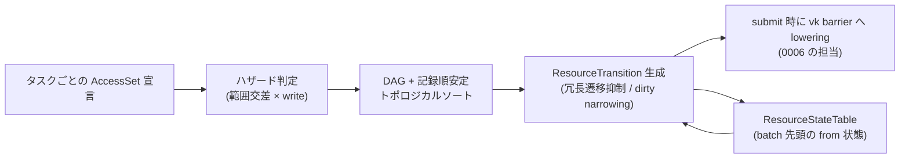

# access 宣言と同期(barrier)の導出

- created: 2026-07-02
- updated: 2026-07-02
- status: ready for review
- implementation: not-started

## 解決したい問題

Vulkan の同期(pipeline barrier・image layout 遷移・メモリ可視性)を手で書くと、「このリソースはいまどの状態か」「この 2 つのパスは依存するか」という同じ判定がコードの複数箇所に分散し、一箇所の変更が他の箇所と歩調を崩して drift する。
barrier の漏れや layout の取り違えは即座にクラッシュせず、非決定的な描画破損として後から現れる silent trap である。
この doc は、同期の判断点を「タスクごとの access 宣言」という一本の経路に集約し、barrier と layout 遷移をそこから機械的に導出することで、この分散と silent trap を解消する設計を決める。

## 問題の背景

orvk はレンダラーやアプリケーション、GUI 層のような複数のサブシステムが 1 つの Device を共有する利用シナリオを想定する([0006](0006_device-and-execution-model.md))。
このとき、あるサブシステムが書いた image を別のサブシステムが読むといったリソースの受け渡しが日常的に起きる。
手動 barrier では、各サブシステムが「相手がリソースをどの状態で残したか」を知らなければ正しい barrier を書けず、同期の正しさがサブシステム間の暗黙の合意に依存してしまう。

さらに orvk は bindless を前提とし([0003](0003_bindless-descriptor-heap.md))、シェーダは DescriptorHandle 経由で任意のリソースへアクセスする。
コマンドの引数(bind した buffer や attachment)を見てもシェーダが実際に触るリソースは静的に分からないため、「コマンドから同期を自動推定する」経路は原理的に成立しない。
タスク自身が「何にどうアクセスするか」を宣言する経路だけが、bindless と両立する同期導出の入口である。

同期を宣言からの導出に一本化するという方針自体は [docs/philosophy.md](../philosophy.md) と [0001](0001_goals-and-non-goals.md) で確定しており、この doc はその方針の内側で「宣言の形・ハザード判定・遷移の導出・batch をまたぐ状態追跡・宣言と記録の整合検証」の詳細を決める。

## この文書では書かないこと

- TaskGraph builder の API 形状、タスクの記録手順、checkpoint / truncate によるロールバック。[0005](0005_task-graph-and-command-encoder.md) が決める。この doc は「タスクが access 宣言を持つ」というデータ契約と、宣言からの同期導出だけを扱う。
- CommandEncoder のコマンド集合と、コマンドごとの記録時検証規則(rendering 状態機械、push data 上限など)。[0005](0005_task-graph-and-command-encoder.md) が決める。この doc は「記録コマンドが触るリソースは宣言済みでなければならない」という整合検証の契約だけを定める。
- ResourceTransition から `VkImageMemoryBarrier2` / `VkBufferMemoryBarrier2` への lowering と queue submit の手順。[0006](0006_device-and-execution-model.md) が決める。
- descriptor heap のホスト書き込みと GPU 読み取りの間の publish バリア(heap メモリ自体の同期)。[0003](0003_bindless-descriptor-heap.md) が決める。この doc が扱うのはリソース(buffer / image)本体の同期である。
- cross-batch handoff(publish / consume)の API と semaphore 依存の宣言。[0010](0010_device-sharing-and-handoff.md) が決める。この doc は handoff が運ぶ「最終 access 状態」が本 doc の access state 型であることと、ResourceStateTable との接続だけを書く。
- raw escape hatch の API 形状。[0011](0011_raw-escape-hatch.md) が決める。この doc は escape hatch 使用後のリソースを dirty として扱う契約だけを書く。

## やらないこと

- **split barrier(`vkCmdSetEvent2` / `vkCmdWaitEvents2`)による barrier の分割最適化はやらない。** 導出した ResourceTransition はすべて `vkCmdPipelineBarrier2` 相当の即時 barrier に lowering する。split barrier は barrier のレイテンシ隠蔽に有効だが、遷移の発行点と待機点を分離するとコンパイル結果の検証と debug が難しくなる。導出の正しさが test で固定され、実測でバブルが問題になったときに再検討する(この設計での拡張は可能で、ResourceTransition の表現は発行点と待機点の分離を将来足せる形にしておく)。
- **タスクの並べ替えによるスケジューリング最適化はやらない。** トポロジカルソートの tie-break は常に記録順であり、barrier 数を減らすための並べ替え探索はしない。決定性(同じ記録は常に同じ実行順・同じ barrier 列になる)を test 可能性のために優先する。並べ替え最適化は決定性を保った形(同じ入力には同じ出力)でなら将来導入しうる。
- **queue 間の ownership transfer はやらない。** 実行は単一 queue 前提であり([0006](0006_device-and-execution-model.md))、queue family をまたぐ acquire / release barrier は導出しない。async compute 用の複数 queue を導入する設計変更があれば、新しい doc で扱う。
- **render pass 内の self-dependency(同一 attachment への feedback ループ)はやらない。** タスク内部の同期はタスク境界の宣言では表現できず、必要になった時点で専用の宣言語彙を検討する。

## 用語集

- **access state**: リソースへの 1 つのアクセスの仕方を表す値。pipeline stages・access flags・(image のみ)image layout の組。
- **AccessSet**: 1 つのタスクが触るリソースの集合の宣言。エントリごとに handle・範囲(buffer range / image subresource range)・アクセス種別(read / write / read_write)・access state を持つ。
- **ResourceTransition**: コンパイルが生成する論理的な状態遷移レコード。「このリソースのこの範囲を、この access state からこの access state へ遷移させる」を表す。submit 時に Vulkan の barrier へ lowering される。
- **ResourceStateTable**: Device が所有する、リソースの範囲ごとの「最後に確定した access state」の表。batch をまたぐ同期導出の初期状態を供給する。
- **dirty**: リソースの現在状態が同期導出の管理外にあることを表すマーク。生成直後、および raw escape hatch での使用後がこれに当たる。

## 概要

同期の経路を 1 本にする。
タスクは自分が触るリソースを AccessSet として宣言し、barrier・layout 遷移はすべてそこから導出される。
手動 barrier の API は安全な語彙には存在しない(raw escape hatch [0011](0011_raw-escape-hatch.md) は unsafe の境界の外である)。

宣言は「handle + 範囲 + read / write / read_write + access state(stages / access flags / layout)」の形を取る。
コンパイル(TaskGraph の compile)は、宣言同士の範囲交差から write が絡む重なりをハザードとして検出して DAG を作り、記録順を tie-break とする安定トポロジカルソートで実行順を確定し、リソース範囲ごとの状態遷移列を ResourceTransition として生成する。
同じ read 状態が続く場合は冗長な遷移を出さず(安定 read の抑制)、状態が未知(dirty)なリソースへの最初のアクセスは必ず遷移を発行して状態を宣言どおりに狭める(narrowing)。

batch をまたぐ状態は Device が所有する ResourceStateTable が追跡し、batch 先頭の遷移の from 状態を供給する。
記録コマンドが宣言に無いリソースへ触れた場合は記録時の明示エラーとし、宣言と実際のアクセスの乖離を silent trap にしない。



(矢印はすべてデータの流れ。ResourceStateTable は from 状態をコンパイルへ供給し、submit 確定時に最終状態で更新される。)

## シナリオ / ユースケース

レンダラーが image へ描画し、別サブシステムの後段パスがそれを読む、典型的な 2 タスクを考える。

```rust
// タスク 1: シーンを color image へ描画する
graph.task("scene")
    .write(scene_color, ImageRange::full(), AccessState::color_attachment_write())
    .read(scene_depth, ImageRange::full(), AccessState::depth_attachment_read_write())
    .record(|enc| { /* begin_rendering / draw ... */ });

// タスク 2: scene_color をフラグメントシェーダで sampled read する
graph.task("post")
    .read(scene_color, ImageRange::full(), AccessState::sampled_read(Stages::FRAGMENT))
    .write(swap_image, ImageRange::full(), AccessState::color_attachment_write())
    .record(|enc| { /* フルスクリーン描画 ... */ });
```

コンパイルはここから次を導出する。

- `scene_color` は「write(COLOR_ATTACHMENT)→ read(SAMPLED, FRAGMENT)」の write-read 重なりを持つのでハザードであり、タスク 1 → タスク 2 のエッジが張られる。
- `scene_color` の ResourceTransition として「COLOR_ATTACHMENT_OPTIMAL → SHADER_READ_ONLY_OPTIMAL、COLOR_ATTACHMENT_OUTPUT stage の write を FRAGMENT stage の read へ可視化」が生成される。
- `scene_color` が生成直後(dirty)なら、タスク 1 の write の from は UNDEFINED layout となり、以前の内容を保持しない遷移になる。
- 続く batch で別のタスクが `scene_color` を再び FRAGMENT で sampled read する場合、ResourceStateTable が SHADER_READ_ONLY_OPTIMAL を保持しているので遷移は生成されない(安定 read)。

利用者はどのシナリオでも barrier を書かない。
サブシステム間でリソースを受け渡す場合も、受け取る側は自分の宣言だけを書けばよく、相手がどの状態で残したかは ResourceStateTable(同一 batch 列)または handoff の publish 状態([0010](0010_device-sharing-and-handoff.md))が知っている。

## 詳細設計

サブセクションの構成は次のとおり。

1. 宣言の型 — access state と AccessSet のデータ契約。
2. ハザード判定 — 範囲交差と read / write の組み合わせ規則。
3. コンパイル — DAG・安定トポロジカルソート・ResourceTransition 生成。
4. 冗長遷移の抑制と dirty の narrowing。
5. ResourceStateTable — batch をまたぐ状態追跡。
6. 宣言と記録コマンドの整合検証。

### 1. 宣言の型

access state はリソースへの 1 つのアクセスの仕方を表す。

```rust
pub struct AccessState {
    pub stages: PipelineStages,   // synchronization2 の stage flags に対応
    pub access: AccessFlags,      // synchronization2 の access flags に対応
    pub layout: Option<ImageLayout>, // image のみ Some。buffer は None
}
```

stages / access / layout は Vulkan synchronization2 の語彙をそのまま型にした薄い表現であり、独自の抽象レイヤ(「用途 enum」だけに丸める等)は挟まない。
ただしよく使う組には `AccessState::color_attachment_write()` のような helper コンストラクタを用意する(simple な構造の上に easy を足す)。
helper は正確な stages / access / layout の組を返すだけで、特別扱いの経路を持たない。

タスクへの宣言は read / write / read_write の 3 種で、範囲を伴う。

```rust
pub enum BufferRange { Whole, Range { offset: u64, size: u64 } }
pub struct ImageRange {
    pub aspect: ImageAspects,
    pub base_mip: u32, pub mip_count: u32,
    pub base_layer: u32, pub layer_count: u32,
}
```

AccessSet は 1 タスク分の宣言エントリの集合である。
各エントリは「handle(index+generation の u64 パック、[0002](0002_resource-ownership-and-registry.md))+ 範囲 + 種別 + access state」を持つ。
membership は世代付きで判定する: エントリは宣言時点の handle をそのまま(generation 込みで)保持し、コンパイル時にレジストリと照合して retire 済み世代への宣言は明示エラーにする。
これにより「retire 後に再利用された slot を古い宣言が指してしまう」取り違えを構造的に排除する([0002](0002_resource-ownership-and-registry.md) の generational validity の同期側での適用)。

**read 宣言は保守的でよい(任意 handle を取れる)。**
bindless では、タスクが実際に読むリソース集合が実行時データ(indirect 引数やマテリアルの DescriptorHandle)に依存し、静的に確定しないことがある。
そのため read 宣言は「触るかもしれないリソース」を上限として宣言することを正当な使い方として認める。
宣言したが触らなかった read はエラーにしない(過剰同期のコストは「落とし穴」参照)。
一方 write 宣言も同様に上限として扱うが、write は宣言しただけでハザードと遷移を生むため、触らない write の宣言は read より高くつく。

### 2. ハザード判定

2 つのタスクの宣言エントリ同士が次の両方を満たすとき、ハザードである。

- **同一リソースで範囲が交差する。** buffer は offset / size の区間交差、image は aspect・mip 区間・layer 区間のすべてが交差すること。交差しない範囲同士(buffer の別区間、mip chain の別レベル)はハザードにしない。これが range / subresource range を宣言に持たせる理由であり、たとえば「mip N を read して mip N+1 へ write する」ダウンサンプル連鎖を偽ハザードで直列化しないために必要である。
- **少なくとも一方が write(write または read_write)である。** read-read はハザードではなく、依存エッジも遷移も生まない。ただし image の read-read で要求 layout が異なる場合は例外で、layout 遷移が必要になるため記録順に従って順序付けし、間に遷移を挟む(同時に 2 つの layout では存在できないという Vulkan の制約の帰結)。異 layout read-read を並列にしたい場合、利用者は同じ layout(例: GENERAL)で宣言を揃えるという選択ができる。

ハザードの種別(write→read、read→write、write→write)は区別して扱う必要がない。
いずれも「先行タスク → 後続タスク」の実行順序エッジと、範囲に対する ResourceTransition(後述)に一様に落ちる。
先行・後続はタスクの記録順で決まる: 宣言はタスク列として記録された順に意味を持ち、ハザードのある 2 タスクの依存方向は常に記録順に従う。

### 3. コンパイル — DAG・安定トポロジカルソート・ResourceTransition 生成

TaskGraph の compile([0005](0005_task-graph-and-command-encoder.md) が呼び出しの位置づけを定める)は、次を行う。

1. **DAG 構築**: 全タスク対の宣言からハザードエッジを張る。エッジは記録順方向にしか張られないため、グラフは構築時点で非循環である(循環検出は不要)。
2. **安定トポロジカルソート**: 依存を満たす実行順を確定する。複数の順序が可能な場合の tie-break は常に記録順とする。これにより compile は決定的(同じ記録列は常に同じ実行順・同じ barrier 列)になり、同期導出の正しさを golden な期待値との比較で test できる。ソートが記録順を保つため、依存の無いタスク同士も記録順で並ぶが、単一 queue へ直列に流す実行モデル([0006](0006_device-and-execution-model.md))ではこれによる性能上の損失はない。
3. **ResourceTransition 生成**: 実行順に沿ってリソース範囲ごとの状態遷移列を確定する。各遷移は次のレコードである。

```rust
pub struct ResourceTransition {
    pub handle: /* BufferHandle または ImageHandle */,
    pub range: /* BufferRange または ImageRange */,
    pub from: AccessState,   // 直前の確定状態(batch 先頭は ResourceStateTable から)
    pub to: AccessState,     // このタスクの宣言状態
    pub before_task: TaskIndex, // このタスクの実行前に発行する
}
```

from はグラフ内の直前の宣言状態、batch 内で最初のアクセスなら ResourceStateTable の現在状態である。
ResourceTransition は論理レコードであり、Vulkan の barrier 構造体そのものではない。
submit 時の lowering([0006](0006_device-and-execution-model.md))が、同一タスク前の遷移群を 1 回の barrier 発行にまとめる。
範囲が部分交差する場合(宣言範囲と現在状態の範囲がずれている場合)は、交差部分を切り出して遷移を生成し、非交差部分は元の状態のまま残す(範囲分割)。

### 4. 冗長遷移の抑制と dirty の narrowing

**安定 read の冗長遷移抑制。**
連続する read で to 状態が現在状態に包含される場合(layout が同一で、stages / access が現在状態のカバー範囲に含まれる)、遷移を生成しない。
これが無いと「毎フレーム sampled read されるだけのテクスチャ」に毎フレーム no-op barrier が並び、barrier 数がアクセス数に比例して増える。
包含判定は保守的に行う: layout の同一性は厳密比較、stages / access はビット包含で判定し、迷ったら遷移を出す(正しさ側に倒す)。

**dirty の narrowing。**
dirty は「リソースの現在状態が同期導出の管理外にある」ことを表すマークで、次の 2 つの経路で付く。

- リソース生成直後。内容は未定義で、image の layout は UNDEFINED である。
- raw escape hatch([0011](0011_raw-escape-hatch.md))でリソースを触った後。利用者が何をしたか導出エンジンは知り得ない。

dirty なリソースは「あらゆる stage のあらゆる access が触った可能性がある」最も広い保守的状態として扱う。
dirty への最初のアクセスは、read であっても必ず ResourceTransition を発行し(冗長遷移抑制の対象外)、状態を宣言された具体的な access state へ狭める。
この narrowing により、以降のアクセスは通常の(dirty でない)状態追跡に乗る。
image の場合、dirty のうち「生成直後」は from layout を UNDEFINED とし、以前の内容を保持しない遷移になる。
一方「escape hatch 後」は利用者が dirty マークとともに現在 layout を申告する契約とし([0011](0011_raw-escape-hatch.md))、内容を保持したまま narrowing できるようにする。
申告が無ければ内容保持は保証しない(UNDEFINED from として扱う)。

これは AccessSet の membership 規則に対する **dirty 例外**でもある。
通常、read はハザード判定と抑制の対象として「先行 write との交差」だけを見ればよいが、dirty なリソースには「先行 write が見えないのに状態が不定」という例外があり、交差の有無にかかわらず遷移を強制する。
黙って古い状態のまま読ませない(silent trap の排除)。

### 5. ResourceStateTable — batch をまたぐ状態追跡

batch([0006](0006_device-and-execution-model.md))は同期導出の単位だが、リソースは batch より長く生きる。
Device は ResourceStateTable を所有し、リソースの範囲ごとに「最後に確定した access state(または dirty)」を保持する。

- **参照**: batch の compile は、batch 内で最初にアクセスされるリソースの from 状態を ResourceStateTable から取る。
- **更新**: batch の submit が受理された時点(queue への投入成功)で、その batch が確定させた各リソース範囲の最終状態を書き込む。submit が失敗した batch は table を変更しない(GPU 上で何も実行されていないため、直前の確定状態が引き続き真である)。
- **範囲の分割・統合**: 部分範囲への write は table のエントリを分割する。隣接範囲が同一状態になったら統合する。分割の増殖は「落とし穴」参照。
- **直列性**: table の更新は submit の受理順に直列である。複数サブシステムが Device を共有しても、batch の submit 順が table の進化を一意に決める。あるリソースを 2 つの batch が「未完了のまま並行に」触る場合の順序保証と semaphore 依存は handoff([0010](0010_device-sharing-and-handoff.md))の担当で、publish は「handle + 最終 access state + SubmitId」を運び、その最終 access state は本 doc の AccessState 型そのものである。consume 側の batch では、publish された状態が from 状態として ResourceStateTable と同じ位置づけで働く。
- **retire との接続**: リソースの retire([0002](0002_resource-ownership-and-registry.md))は table から該当エントリを除去する。retire 済み handle の宣言はコンパイル時エラーなので、table に幽霊エントリが残って古い状態を供給することはない。

table は「宣言から導出した状態」だけを記録する。
GPU の実状態を検査する手段は Vulkan に無いため、この表が唯一の真実であり、表の外でリソース状態を変える行為(escape hatch)には dirty マークを義務づける。

### 6. 宣言と記録コマンドの整合検証

宣言は「同期を導出するためのヒント」ではなく「タスクが触ってよいリソースの契約」である。
CommandEncoder([0005](0005_task-graph-and-command-encoder.md))でコマンドを記録するとき、コマンドが直接参照する handle(copy の src / dst、attachment、bind する vertex / index buffer、indirect buffer など)は、そのタスクの AccessSet に整合する宣言(種別とアクセス方向が合い、コマンドの触る範囲が宣言範囲に含まれる)が無ければ**記録時に明示エラー**とする。
未宣言のまま記録が通ってしまうと、barrier が導出されず非決定的破損になる — これは orvk が最も避けたい silent trap であり、記録時点で止める。

DescriptorHandle 経由のシェーダ内アクセスはコマンド引数に現れないため、記録時検証の対象にできない。
ここを守るのは前述の「read 宣言は保守的でよい」の側であり、シェーダが触りうるリソースを宣言する責任は利用者にある。
検証できる部分(コマンド引数)は機械的に検証し、検証できない部分(bindless アクセス)は宣言契約として文書化する、という線引きである。

## 落とし穴

- **保守的宣言による過剰同期。** read 宣言は上限でよいという契約は、雑に「全部 read_write で宣言する」使い方も許してしまう。write を含む宣言は範囲交差するすべてのタスクと直列化されるため、保守的すぎる宣言は並列性と barrier 数の両方を悪化させる。これはエラーにできない(宣言が上限であることは bindless の要請)ので、性能上の責任は利用者側に残る仕様である。診断支援(宣言されたが一度も整合検証に現れなかった write の報告など)は将来の拡張余地として残す。
- **depth 系 stage の近似。** depth / stencil アクセスの stage は本来 EARLY_FRAGMENT_TESTS と LATE_FRAGMENT_TESTS に分かれるが、helper コンストラクタは両方を含む組で宣言する近似を取る。厳密に分けても得られる並列性がごく僅かな一方、early / late の使い分けを利用者に判断させるのは誤宣言(必要な側を落とす)の温床になるためである。厳密な宣言が必要な利用者は AccessState を直接構築すればよい(helper は経路を独占しない)。
- **異 layout read-read の直列化。** 同一 image 範囲を異なる layout で read する 2 タスクは、read 同士なのに遷移を挟んで直列化される(詳細設計 2)。並列にしたい場合は layout を揃えて宣言する必要があることを利用者は知らないと、意図せぬ直列化に気づきにくい。
- **範囲分割の増殖。** 部分範囲 write を繰り返すと ResourceStateTable のエントリが細片化し、交差判定と遷移生成のコストが分割数に比例して増える。隣接同一状態の統合で自然に回収されるが、常に異なる状態で細切れに書き続けるワークロードでは統合が効かない。粒度の粗い宣言(範囲全体の write)へ寄せることが利用者側の回避策になる。
- **dirty 申告漏れ。** escape hatch でリソースを触ったのに dirty を付け忘れると、ResourceStateTable が古い状態を真として遷移を導出し、非決定的破損になる。unsafe の境界内の責務(escape hatch を使った時点でレジストリ整合の責任は利用者に移る、[0011](0011_raw-escape-hatch.md))として文書化するしかなく、機械的検出はできない。

## 代替案

- **自動追跡(全コマンドからの暗黙導出)。** access 宣言を廃し、CommandEncoder に記録されたコマンドの引数(copy の src / dst、attachment、bind したリソース)から各タスクの access 集合を自動抽出し、同期を導出する案。
  - Pros: 利用者は宣言を書かなくてよく、宣言と実使用の乖離(宣言漏れ・過剰宣言)が原理的に発生しない。
  - Cons: bindless と両立しない。シェーダは DescriptorHandle 経由で任意のリソースを読み書きし、それはコマンド引数に一切現れないため、自動抽出は「コマンドに現れたリソースだけ同期し、bindless アクセスは同期しない」不健全な導出になるか、「全リソースを毎タスク全同期する」全直列化になるかの二択しかない。また抽出は記録の実行を要するため、記録前に同期計画を立てられず、タスクの依存構造(DAG)も宣言なしには得られない。
  - 見送り理由: orvk の前提(bindless、[0003](0003_bindless-descriptor-heap.md))の下では健全に成立しない。宣言は bindless がコマンド列から消した情報を利用者が返す唯一の口である。
- **raw barrier API の公開。** `pipeline_barrier(image, from, to, stages, ...)` のような手動 barrier コマンドを安全な記録語彙に含め、同期を利用者の責任とする案。
  - Pros: 導出エンジンが不要になり、ライブラリ実装は薄くなる。利用者は Vulkan の知識をそのまま使え、導出が保守的になる場面でも手で最適な barrier を書ける。
  - Cons: 「このリソースはいまどの状態か」の判定が利用者コードの全 barrier 呼び出し箇所へ分散し、変更のたびに drift する(この doc の解決したい問題そのもの)。Device を共有する複数サブシステム間では、相手が残した状態を知る共通の仕組みが無くなり、サブシステム境界での barrier の責任分担が暗黙の合意になる。barrier 漏れはエラーにならず非決定的破損として現れる silent trap である。
  - 見送り理由: 同期の判断点の一本化という orvk の中核方針([docs/philosophy.md](../philosophy.md))に正面から反する。手動 barrier が要る場面は raw escape hatch([0011](0011_raw-escape-hatch.md))が unsafe の境界として引き受け、安全な語彙と混ぜない。
- **リソース全体粒度(範囲なし)の追跡。** 宣言・ハザード判定・状態追跡をすべて「リソース 1 個 = 状態 1 個」で行い、buffer range / image subresource range を持たない案。
  - Pros: 宣言が短くなり、交差判定は handle の一致だけ、ResourceStateTable は handle → 状態の平坦な map になる。範囲分割の増殖も起きない。
  - Cons: 大きな buffer の別領域を別タスクが読み書きするケースや、mip chain のダウンサンプル(mip N read → mip N+1 write)が偽ハザードになり、本来並列・非依存な仕事が直列化される。とくに mip 連鎖は全レベルが write-read 重なりと誤判定され、遷移も全範囲に発行される。
  - 見送り理由: GPU パイプラインで頻出する正当なパターンを構造的に罰する。範囲付きでも「範囲全体」を既定(`BufferRange::Whole` / `ImageRange::full()`)にすれば宣言の手間は全体粒度と同等であり、simple さを失わずに表現力だけを足せる。

## セキュリティ・プライバシー

この設計はプロセス内のリソース状態管理であり、外部入力・機微データ・信頼境界を新たに導入しないため、新たな検討は不要である。
なお dirty の narrowing で from を UNDEFINED として扱う場合、遷移後の内容は未定義(以前の内容が見える可能性を含む)だが、これは同一プロセス・同一 Device 内のメモリであり情報漏洩の境界をまたがない。

## 負荷・コスト

- **コンパイルの計算量。** ハザード判定は素朴には batch 内のタスク対 × 宣言エントリ対の交差判定で、タスク数 T・タスクあたり宣言数 D に対し O(T²D²) が上限である。実際にはリソース handle ごとに宣言をグループ化して「同一リソース内の記録順隣接関係」だけを見るため、リソースごとのアクセス列長の和に概ね線形で済む。これは submit ごと(batch の compile ごと)の CPU コストであり、GPU 側のコストはない。
- **barrier 数。** 生成される ResourceTransition 数は「状態が実際に変わったアクセス境界の数」に一致し、安定 read の抑制によりアクセス数には比例しない。手書き barrier の理論最小に対する上乗せは、保守的包含判定で「迷ったら出す」とした遷移だけである。
- **ResourceStateTable のメモリ。** エントリ数は「生存リソース数 + 部分範囲アクセスによる分割数」に比例する。全範囲アクセスが支配的な典型ワークロードでは生存リソース数と同オーダーに収まる。
- **記録時整合検証。** コマンドごとに宣言との照合(handle 検索 + 範囲包含判定)が入る。タスクあたり宣言数 D に対しコマンドあたり O(log D) 程度(宣言を handle でソート済みに保つ)で、記録の hot path に定数的な検索を足す。この検証は debug ビルド限定にせず常時有効とする — 検証を落とした瞬間に未宣言アクセスが silent trap に戻るためで、これは正しさを test 可能な不変条件として固定する方針([0001](0001_goals-and-non-goals.md))の適用である。
