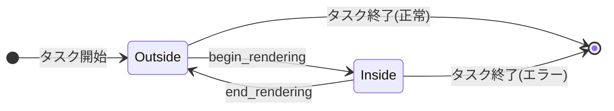

# タスクグラフと command encoder

- created: 2026-07-02
- updated: 2026-07-02
- status: ready for review
- implementation: not-started

## 解決したい問題

GPU コマンドの記録を「access 宣言から同期を導出できる構造」と「記録した時点で誤りが分かる検証」の両方を備えた形にしたい。
生の Vulkan では、コマンド記録と barrier 挿入が同じ command buffer に混在し、記録誤り(rendering 外での draw、push constant サイズ超過、layout 不一致など)は validation layer か GPU の誤動作として実行時にしか現れない。
本 doc は、記録の構造単位である TaskGraph(タスク = access 宣言 + record closure)と、タスク内でコマンドを記録する CommandEncoder のコマンド全集合・記録時静的検証・push data 契約を決める。
これにより、同期は宣言から一意に導出でき(導出自体は 0004)、記録の誤りは submit を待たず記録したその行でエラーになる。

## 問題の背景

orvk の同期は access 宣言からの導出に一本化する(docs/philosophy.md、[0004](0004_access-declaration-and-sync.md))。
導出の入力となる「各タスクが何にどうアクセスするか」を得る経路には、記録されたコマンドから推論する形と、利用者が宣言する形がある。
コマンドからの推論は、descriptor 経由の shader アクセス(bindless では任意の DescriptorHandle をシェーダが読む)をコマンド列から静的に知る手段がなく、成立しない。
したがって宣言が必須であり、宣言とコマンドの不整合(宣言していないリソースに触るコマンド)を検出する検証点が要る。

また、orvk は複数サブシステムが 1 つの Device を共有する利用形態を契約に含める([0001](0001_goals-and-non-goals.md)、[0010](0010_device-sharing-and-handoff.md))。
複数のサブシステムが 1 つの Batch に順にタスクを積む構成では、途中のサブシステムが記録に失敗したとき、そのサブシステムの分だけを巻き戻して残りを生かす手段(部分ロールバック)がないと、上位は Batch 全体を捨てて最初から作り直すしかない。

記録語彙は feature なしでコンパイル可能で、Vulkan 実行は device feature でゲートする([0001](0001_goals-and-non-goals.md)、[0006](0006_device-and-execution-model.md))。
そのため CommandEncoder は vkCmd\* を直接呼ぶのではなく、コマンドをデータとして記録し、submit 時の lowering([0006](0006_device-and-execution-model.md))で vkCmd\* に変換する。

## この文書では書かないこと

- AccessSet の型・宣言の意味論と、宣言からの barrier / ResourceTransition 導出アルゴリズム(ハザード解析、DAG、トポロジカルソート、安定 read の冗長遷移抑制)。[0004](0004_access-declaration-and-sync.md) が決める。
- Batch のライフサイクル、submit、SubmitId による完了追跡、記録データから vkCmd\* への lowering の実装。[0006](0006_device-and-execution-model.md) が決める。
- pipeline の記述(頂点レイアウト、format、blend 等)・登録・解決とキャッシュ。[0007](0007_pipeline-registration-and-cache.md) が決める。本 doc は「登録済み pipeline を bind して使う」側の契約だけを書く。
- upload / readback のバッファ型と転送手順([0008](0008_upload-and-readback.md))。copy 系コマンドの記録語彙は本 doc、転送の設計は 0008。
- swapchain image の acquire / present([0009](0009_surface-swapchain-present.md))。
- cross-batch handoff(publish / consume)の契約([0010](0010_device-sharing-and-handoff.md))。
- raw Vulkan escape hatch の安全契約の詳細([0011](0011_raw-escape-hatch.md))。本 doc は記録側の接続点(unsafe record)だけを決める。

## やらないこと

- **タスク内の自動同期はやらない(この設計ではやらない)。** barrier はタスク境界でのみ導出する。1 つのタスク内で同じリソースへ「書いてから読む」ような GPU 可視の順序が必要な処理は、タスクを分けて書く。タスク内にも barrier を挿すには record closure 内のコマンド位置と access の対応が要り、宣言一本化の構造を壊すため、恒久的にやらない。
- **タスクの並列(マルチスレッド)記録はやらない(将来の再検討余地あり)。** TaskGraph への記録は単一スレッドの順次記録とする。secondary command buffer 相当の並列記録は、記録順に依存する検証(状態機械、checkpoint)を複雑にするため、記録がボトルネックだと実測されるまでやらない。
- **pass の自動統合・並べ替えによる最適化(subpass 融合、rendering scope のマージ)はやらない(将来の再検討余地あり)。** 記録した構造と GPU に渡る構造の対応を崩すため、実需が証明されるまでやらない。タスクの実行順序自体は 0004 の記録順安定トポロジカルソートに従う。
- **indirect dispatch(dispatch_indirect)は今はやらない。** draw_indirect は要件にあるため入れるが、compute の indirect は現時点の利用シナリオに現れないため、必要になった時点でコマンドを追加する。
- **image から image への blit / copy はやらない(将来の再検討余地あり)。** 現時点の利用シナリオ(upload、readback、attachment への描画、compute 書き込み)に現れないため。
- **conditional rendering・query・timestamp はやらない(将来の再検討余地あり)。** 必要になるまで記録語彙を増やさない。それまでは unsafe record([0011](0011_raw-escape-hatch.md))で書ける。

## 概要

GPU 仕事の記録単位を**タスク**とする。
タスクは「このタスクが触るリソースと access の宣言」と「コマンドを記録する record closure」の 2 つからなり、TaskGraph に順に積む。
宣言が先、record が後という順序を型(builder)で強制し、同期導出([0004](0004_access-declaration-and-sync.md))はコマンドではなく宣言だけを入力にする。
record closure はタスク登録時にその場で 1 回だけ実行され、CommandEncoder がコマンドをデータとして記録する。

CommandEncoder は copy・clear・rendering・bind・push data・draw・dispatch・viewport/scissor の全 17 コマンドを提供し、各コマンドは記録した瞬間に静的検証(rendering 状態機械、bind 済み pipeline との整合、宣言済み access との整合、push data サイズ、indirect の stride / offset 制約)を通る。
検証に失敗したコマンドはその場で `RecordError` を返し、silent trap を残さない。
rendering は dynamic rendering のみで、render pass object は語彙に存在しない。

push data は pod 値と DescriptorHandle word を詰めた最大 128 byte のブロックで、graphics / compute とも同一契約とする。
記録語彙に無い Vulkan コマンドは unsafe record([0011](0011_raw-escape-hatch.md))から挿入できる。

TaskGraph は checkpoint / truncate による部分ロールバックを持つ。
上位(たとえば複数サブシステムから 1 つの Batch を組み立てるホスト)は、サブシステム境界で checkpoint を取り、途中で失敗したらそのサブシステムのタスクだけを truncate で巻き戻して Batch の残りを生かせる。

```mermaid
flowchart LR
    subgraph task["タスク(1 つ分)"]
        decl["access 宣言\n(handle + AccessSet)"] --> rec["record closure\n(CommandEncoder で記録)"]
    end
    rec --> graph["TaskGraph\n(タスク列 + checkpoint)"]
    decl -.宣言のみを入力.-> sync["同期導出(0004)"]
    graph --> submit["Batch submit / lowering(0006)"]
    sync --> submit
```

(矢印はデータの流れ。点線は「宣言だけが同期導出の入力になる」ことを示す。)

## シナリオ / ユースケース

レンダラーが shadow pass → 本描画 → 後段 compute を 1 つの Batch に記録する例。

```rust
let mut graph = batch.task_graph();

graph
    .task("shadow")
    .write(shadow_view, Access::DEPTH_ATTACHMENT_WRITE)
    .read(scene_buffer, Access::VERTEX_SHADER_READ)
    .record(|enc| {
        enc.begin_rendering(&RenderingInfo::depth_only(shadow_view, Clear::depth(1.0)))?;
        enc.bind_graphics_pipeline(shadow_pipeline)?;
        enc.set_viewport(vp)?;
        enc.set_scissor(sc)?;
        enc.push_data(&ShadowPush { scene: scene_buffer_descriptor, .. })?;
        enc.draw(vertex_count, 1, 0, 0)?;
        enc.end_rendering()
    })?;

graph
    .task("post")
    .read(color_view, Access::COMPUTE_SHADER_SAMPLED_READ)
    .write(output_image, Access::COMPUTE_SHADER_STORAGE_WRITE)
    .record(|enc| {
        enc.bind_compute_pipeline(post_pipeline)?;
        enc.push_data(&PostPush { src: color_descriptor, dst: output_descriptor })?;
        enc.dispatch(groups_x, groups_y, 1)
    })?;
```

shadow タスクと post タスクの間の barrier・layout 遷移は、宣言(`write` / `read`)から 0004 が導出する。
record closure の中に同期の記述は一切現れない。

複数サブシステムが同じ Batch にタスクを積む例(部分ロールバック)。

```rust
let cp = graph.checkpoint();
if let Err(e) = subsystem_b.record_tasks(&mut graph) {
    graph.truncate(cp)?; // サブシステム B のタスクだけを巻き戻す
    report(e);           // サブシステム A のタスクと以降のサブシステムは生きる
}
```

## 詳細設計

サブセクションの目次:

1. **記録モデル** — タスク = 宣言 + record closure、record の実行タイミング、宣言とコマンドの整合規則。
2. **TaskGraph / TaskBuilder の API 形状** — 型と builder の流れ、エラーの返し方。
3. **checkpoint / truncate** — 部分ロールバックの契約と不変条件。
4. **CommandEncoder のコマンド全集合** — 17 コマンドの一覧と、各コマンドが要求する状態・宣言。
5. **記録時静的検証** — rendering 状態機械、pipeline 整合、push data、indirect、attachment の各検証。
6. **push data 契約** — レイアウト、上限、graphics / compute 同一契約。
7. **unsafe record** — escape hatch との接続点。

### 1. 記録モデル

タスクは次の 2 要素からなる。

- **access 宣言**: このタスクが触るリソース handle と、その AccessSet(型と意味論は [0004](0004_access-declaration-and-sync.md))の組の集合。
- **record closure**: `FnOnce(&mut CommandEncoder) -> Result<(), RecordError>`。タスクのコマンド列を記録する。

宣言が record より先に完結することを builder の型遷移で強制する(`record` を呼ぶと builder が消費され、以降宣言を足せない)。
この順序には 2 つの理由がある。

1 つ目は、同期導出の入力を宣言だけに閉じるためである。
bindless では shader が任意の DescriptorHandle を読むため、コマンド列から access を推論することは原理的にできない(問題の背景を参照)。
宣言を唯一の入力にすれば、導出([0004](0004_access-declaration-and-sync.md))は record closure を実行せずに計画でき、「コマンドを捨てるためだけの record 実行」のような二重実行は構造上存在しない。

2 つ目は、記録なしの見積もりを可能にするためである。
上位フレームワークには「実際にコマンドを記録する前に、pass 構成だけから descriptor 容量などを見積もる」段階を持つものがある。
宣言がタスクのメタデータとして record と独立に存在するので、上位は宣言相当の情報だけで計画を立て、記録は実 Batch で 1 回だけ行える。

record closure はタスク登録時(`record` 呼び出しの中)にその場で 1 回だけ実行される。
記録の誤りは登録呼び出しのエラーとして即座に呼び出し元へ返り、submit まで潜伏しない。

**宣言とコマンドの整合規則**: 記録されるコマンドが handle に触るとき、その handle はこのタスクの宣言に含まれ、宣言された AccessSet がコマンドの要求する access を含んでいなければならない(コマンド ⊆ 宣言)。
違反は記録時の `RecordError` である。
逆方向(宣言したがコマンドが触らない)はエラーにしない。
shader が DescriptorHandle 経由で触るリソースはコマンド列に現れないため、「宣言したのに使われていない」を機械的に判定できないからである(帰結は「落とし穴」を参照)。
なお shader アクセス(push data に詰めた DescriptorHandle 経由)については、encoder は handle の対応を検証できない。
検証できるのは encoder API に handle が直接渡るコマンド(copy、clear、attachment、vertex/index/indirect buffer)だけであり、shader アクセスの宣言漏れは利用者の責任である(「落とし穴」を参照)。

**タスク内同期は存在しない**: 1 つの handle への宣言はタスクごとに 1 つで、同じ handle を同じタスクに二重宣言するのは明示エラーとする。
barrier はタスク境界でのみ導出されるため、タスク内で同じリソースに「書いてから読む」順序が必要ならタスクを分ける。
二重宣言をエラーにするのは、「宣言を 2 つ書けばタスク内に barrier が入る」という誤解(silent trap)を型ではなく検証で塞ぐためである。

### 2. TaskGraph / TaskBuilder の API 形状

```rust
pub struct TaskGraph { /* タスク列 + 記録状態 */ }

impl TaskGraph {
    pub fn task(&mut self, name: &str) -> TaskBuilder<'_>;
    pub fn checkpoint(&self) -> GraphCheckpoint;
    pub fn truncate(&mut self, cp: GraphCheckpoint) -> Result<(), TruncateError>;
}

impl TaskBuilder<'_> {
    pub fn read(self, handle: impl Into<AnyHandle>, access: AccessSet) -> Self;
    pub fn write(self, handle: impl Into<AnyHandle>, access: AccessSet) -> Self;
    pub fn record(
        self,
        f: impl FnOnce(&mut CommandEncoder) -> Result<(), RecordError>,
    ) -> Result<TaskId, RecordError>;
}
```

- `name` は診断用ラベルで、エラーメッセージと将来のデバッグ出力に使う。一意性は要求しない。
- `read` / `write` の宣言 API の意味論(read 宣言が任意 handle を取れること、buffer range / image subresource range の指定を含む)は [0004](0004_access-declaration-and-sync.md) の契約に従う。本 doc では「builder 上で record より先に積まれる」ことだけを決める。
- `record` は closure を即時実行し、closure 内の記録エラー・整合違反をそのまま返す。エラー時、そのタスクは登録されない(グラフは呼び出し前の状態のまま)。
- TaskGraph が Batch とどう結び付くか(`batch.task_graph()` の所有関係、compile の呼び出し)は [0006](0006_device-and-execution-model.md) が決める。

タスク登録が `Result` を返し、encoder の各コマンドも `Result` を返す。
closure 内は `?` で伝播すればよく、エラーは発生したコマンドの位置で止まる。
panic ではなく `Result` にするのは、複数サブシステム共有(0010)の利用形態で、あるサブシステムの記録失敗をホストが回復可能な失敗として扱えるようにするためである(checkpoint / truncate と対になる)。

### 3. checkpoint / truncate

```rust
pub struct GraphCheckpoint { /* graph 識別子 + タスク数 + 世代 */ }
```

- `checkpoint()` はその時点のタスク数を記録した opaque な値を返す。O(1)。
- `truncate(cp)` は checkpoint 以降に登録されたタスクをすべて破棄し、グラフを checkpoint 時点の状態に戻す。破棄されるタスク数に比例するコスト。
- 契約(すべて明示エラー、silent trap にしない):
  - 別の TaskGraph の checkpoint を渡したら `TruncateError`(graph 識別子で照合)。
  - truncate すると、その checkpoint より後に取った checkpoint はすべて無効になる(世代で照合し、無効な checkpoint での truncate は `TruncateError`)。
  - truncate 後のグラフには通常どおりタスクを積み直せる。

checkpoint はタスク境界の巻き戻しであり、record closure の途中を巻き戻すことはできない(closure 内のエラーはタスク登録ごと失敗するので、タスク単位の粒度で十分である)。
submit 失敗時の Batch 状態機械(Pending / Recorded / Submitted / Completed / Failed のような上位の状態管理)は [0006](0006_device-and-execution-model.md) の失敗報告契約の上に上位が組む。
本機構はその材料となる「記録の巻き戻し」だけを提供する。

### 4. CommandEncoder のコマンド全集合

CommandEncoder が提供するコマンドは次の 17 個で全部である(これ以外の Vulkan コマンドは unsafe record 経由)。
「要求状態」は rendering 状態機械(次節)上の位置、「宣言要求」はコマンドに直接渡る handle に対して宣言されているべき access を示す。

| コマンド | 要求状態 | 宣言要求(コマンドに渡る handle) |
|---|---|---|
| `copy_buffer(src, dst, regions)` | rendering 外 | src: transfer read / dst: transfer write |
| `copy_buffer_to_image(src, dst, regions)` | rendering 外 | src: transfer read / dst: transfer write |
| `copy_image_to_buffer(src, dst, regions)` | rendering 外 | src: transfer read / dst: transfer write |
| `clear_color_image(image, color, ranges)` | rendering 外 | image: transfer write |
| `begin_rendering(info)` | rendering 外 → rendering 中へ遷移 | 各 attachment view: attachment access(次節) |
| `end_rendering()` | rendering 中 → rendering 外へ遷移 | — |
| `bind_graphics_pipeline(pipeline)` | どちらでも | — |
| `bind_compute_pipeline(pipeline)` | どちらでも | — |
| `bind_vertex_buffers(first_binding, buffers)` | どちらでも | 各 buffer: vertex input read |
| `bind_index_buffer(buffer, index_type)` | どちらでも | buffer: index read |
| `push_data(&data)` | どちらでも(pipeline bind 後) | —(data 内の DescriptorHandle は検証対象外) |
| `draw(vertices, instances, first_vertex, first_instance)` | rendering 中 + graphics pipeline | — |
| `draw_indexed(indices, instances, first_index, vertex_offset, first_instance)` | rendering 中 + graphics pipeline + index buffer bind 済み | — |
| `draw_indirect(buffer, offset, draw_count, stride)` | rendering 中 + graphics pipeline | buffer: indirect read |
| `dispatch(x, y, z)` | rendering 外 + compute pipeline | — |
| `set_viewport(viewport)` | どちらでも | — |
| `set_scissor(scissor)` | どちらでも | — |

- pipeline 引数は [0007](0007_pipeline-registration-and-cache.md) で登録済みの pipeline を指す handle である。graphics pipeline は viewport / scissor を常に dynamic state とする(0007)ため、`set_viewport` / `set_scissor` が唯一の指定経路である。
- コマンドは記録時にはデータとして積まれ、submit 時の lowering([0006](0006_device-and-execution-model.md))で vkCmd\* に変換される。コマンド集合は vkCmd\* と 1:1 の thin wrapper であり、encoder がコマンドを合成・分解することはない。

### 5. 記録時静的検証

検証はすべて記録時(各コマンド呼び出しの中)に同期的に行い、違反は `RecordError` で返す。
submit 時に初めて分かる記録エラーを作らない。

**rendering 状態機械**: encoder は「rendering 外」と「rendering 中」の 2 状態を持つ。



(ノードは encoder の状態、矢印は状態遷移。`Outside` = rendering 外、`Inside` = rendering 中。)

- `begin_rendering` は rendering 外でのみ、`end_rendering` は rendering 中でのみ呼べる(ネスト不可)。
- `draw` / `draw_indexed` / `draw_indirect` は rendering 中のみ、`dispatch` / copy 系 / `clear_color_image` は rendering 外のみ。
- record closure が rendering 中のまま返ったら、タスク登録は `RecordError`(end 忘れを黙って補完しない)。

**pipeline 整合**:

- draw 系は graphics pipeline が bind 済みであること、`dispatch` は compute pipeline が bind 済みであることを要求する。
- draw 時に、bind 中の graphics pipeline が宣言する color / depth attachment format 列([0007](0007_pipeline-registration-and-cache.md))が、現在の rendering scope の attachment format 列と一致することを検証する。format 検証を draw の 1 点に置くのは、bind と begin_rendering の順序がどちらでも書けるようにしつつ検証点を一本化するためである。
- draw 時に viewport と scissor がこのタスク内で set 済みであることを検証する(graphics pipeline は常に dynamic viewport のため、未設定は Vulkan では未定義動作になる。silent trap にしない)。
- `draw_indexed` は index buffer が bind 済みであることを検証する。

**push data**:

- `push_data(&data)` は pipeline が bind 済みであることを要求し、`size_of_val(&data)` が bind 中 pipeline の宣言済み push data サイズ([0007](0007_pipeline-registration-and-cache.md))と一致することを検証する。上限は既定 128 byte(Vulkan の `maxPushConstantsSize` 保証最小値。全実装で成立する移植可能な上限)。
- pipeline の宣言サイズが 0 より大きいとき、draw / dispatch の時点でそのタスク内に `push_data` が記録済みであることを検証する(データを渡し忘れた shader 実行を silent trap にしない)。宣言サイズ 0 の pipeline には `push_data` を呼べない(明示エラー)。

**indirect 制約**(`draw_indirect`):

- `stride` は `size_of::<DrawIndirectCommand>()`(16 byte)以上かつ 4 byte 整列。
- `offset` は 4 byte 整列。
- `offset + stride × (draw_count - 1) + 16 ≤ buffer サイズ` をレジストリ([0002](0002_resource-ownership-and-registry.md))の buffer info で検証する(範囲外読みを GPU まで持ち込まない)。

**attachment 制約**(`begin_rendering`):

- 各 color attachment の ImageViewHandle は、このタスクで color attachment write を含む AccessSet で宣言されていること。depth attachment は depth attachment read または write を含む宣言があること。
- attachment に使う image の layout は宣言から 0004 が導出するため、encoder API に layout 引数は存在しない。record 側の検証は「宣言と attachment 用途の対応」だけである。
- 全 attachment の extent が一致すること、view が有効な世代であること(レジストリ照合、[0002](0002_resource-ownership-and-registry.md))。

**handle の有効性**: handle を受け取る全コマンドで、handle が retire 済みでないことをレジストリの世代で検証する([0002](0002_resource-ownership-and-registry.md))。

### 6. push data 契約

push data は shader へ渡す唯一のパラメータブロックである(descriptor set / pipeline layout は利用者 API に出さない。[0001](0001_goals-and-non-goals.md)、[0003](0003_bindless-descriptor-heap.md))。

- 内容は pod 値(`#[repr(C)]` の平坦な構造体)と DescriptorHandle word の任意の混在。DescriptorHandle は shader ABI 上 uint2(heap slot + generation)の 8 byte pod([0003](0003_bindless-descriptor-heap.md))なので、利用者の push 構造体のフィールドとしてそのまま埋め込める。
- graphics と compute で契約は完全に同一である。同じ `push_data` API、同じサイズ検証、同じ ABI。lowering 時の stage flags は pipeline 種別から決まり、利用者には見えない。
- レイアウトの意味(どのフィールドを shader がどう読むか)は利用者の shader ABI の責務であり、orvk は「サイズの一致」と「128 byte 上限」だけを保証する。フィールド単位の型検証はしない(SPIR-V の reflection をしないため。[0007](0007_pipeline-registration-and-cache.md) のスコープ判断に従う)。
- push data はタスク内で bind 中 pipeline に対する状態として振る舞い、次の `push_data` まで有効である。タスク境界を越えて持ち越さない(タスク開始時は未設定状態)。

### 7. unsafe record

記録語彙に無い Vulkan コマンドのための接続点として、TaskBuilder は `record` の代わりに unsafe な `record_raw` を提供する。

- `record_raw` の closure は CommandEncoder を受け取らず、lowering 時([0006](0006_device-and-execution-model.md))に生の vk::CommandBuffer へ直接コマンドを書く。safe な語彙と raw の混在は 1 タスク内では許さず、タスク単位で分ける(混在させない理由と却下した細粒度混在案は [0011](0011_raw-escape-hatch.md) の代替案)。
- 宣言は通常タスクと同じ read / write に加え、語彙外機能のための raw access 宣言(最保守宣言)が使える([0011](0011_raw-escape-hatch.md))。
- `record_raw` を使った瞬間、そのタスクにおける宣言との整合の維持は利用者の責務に移る(レジストリ整合・ambient state・責務移転の契約は [0011](0011_raw-escape-hatch.md))。
- 安全な `record` と unsafe な `record_raw` を別メソッドに分けるのは、unsafe の境界を API の顔で見えるようにするためである(philosophy「安全な語彙の内側と unsafe の外側を型と API の境界で分ける」)。

## 落とし穴

- **shader アクセスの宣言漏れは検出できない。** push data に詰めた DescriptorHandle 経由のアクセスはコマンド列に現れないため、宣言を忘れても記録時エラーにならず、barrier 欠落として GPU 側の誤動作になる。encoder が検証できるのは API に直接渡る handle だけであり、shader アクセスの宣言は利用者の規律に依存する。これは bindless を選んだ時点で避けられない境界である(緩和策としての debug 検証は 0004 の検討範囲)。
- **過剰宣言は検出されず、余分な barrier になる。** 宣言したが実際には触らないリソースはエラーにできず(前項と同じ理由)、0004 の導出が不要な遷移・依存を生む。性能問題として現れるだけで正しさは壊れないが、宣言のコピペ蓄積には注意が要る。
- **タスク内に同期は無い。** 同じタスク内で copy した buffer を続けて shader で読む、といった記録は(二重宣言エラーで大半は弾かれるものの)構造上サポートされない。タスク分割の粒度を誤ると barrier の位置も誤る。
- **record closure は登録時に即時実行される。** closure が捕捉した参照はその場で使い終わるため寿命の問題は起きにくい一方、「後で実行される」と誤解して submit 直前の値を捕捉しても、記録されるのは登録時点の値である。
- **truncate は後続 checkpoint を無効化する。** 複数サブシステムが各自 checkpoint を持つ構成では、先頭側のサブシステムの truncate が後続の checkpoint を全部無効にする。無効化は明示エラーで検出されるが、上位のリトライ設計はこの順序制約を織り込む必要がある。
- **format 検証は draw 時にしか走らない。** draw の無い rendering scope(clear 目的の begin/end だけ等)では pipeline との format 不一致は検出されない(pipeline を使っていないので実害も無い)。「bind したのに draw しなかった」ミスは検出されない。
- **push data の意味的整合は保証されない。** サイズ一致しか検証しないため、フィールド順の取り違えや DescriptorHandle の入れ違いは実行結果の誤りとして現れる。

## 代替案

### 即時記録(graph なし)案

タスクグラフを設けず、CommandEncoder が直接 command buffer 相当へ記録し、barrier は利用者が明示コマンド(`pipeline_barrier(...)`)で挿す、または encoder がリソースの直前状態を追跡してその場で挿す設計。

- Pros: 構造が 1 層減り、記録 = 実行内容がそのまま対応する。graph の compile が不要で、記録メモリも減る。
- Cons: 手動 barrier は「同じ判定が複数箇所に分散して drift する」という、orvk が一本化で解こうとしている問題そのものを利用者に戻す。encoder 内の逐次追跡で自動化する形は、複数サブシステムが独立に記録する利用形態で「直前状態」が記録順に依存して非決定になり、また記録済みコマンドの巻き戻し(部分ロールバック)時に追跡状態の巻き戻しも要り、状態の経路が一本でなくなる。
- 見送り理由: 同期を宣言からの導出に一本化する方針(philosophy、0004)と両立しない。宣言ベースの graph は Device 共有・headless を同じ入口に立たせる要でもある。

### render pass object 案

Vulkan の VkRenderPass / VkFramebuffer を記録語彙に持ち、attachment 構成を事前にオブジェクト化して begin/end で使い回す設計。

- Pros: タイルベース GPU では subpass による on-chip 最適化の余地がある。pass 構成が型として固定され、format 整合を pass object 生成時に 1 回だけ検証できる。
- Cons: render pass / framebuffer / pipeline の 3 者に compatibility 制約が生まれ、attachment 構成の変更が 3 種のオブジェクトの再生成に波及する。swapchain 再生成や動的な pass 構成のたびに framebuffer 管理が要る。orvk は Vulkan 1.3 + dynamic rendering を前提にできる(0001)ため、この複雑さに対する見返りが無い。
- 見送り理由: dynamic rendering は begin_rendering に attachment を直接渡すだけで同じことができ、概念が 2 つ(pass object、framebuffer)減る。simple over easy。subpass 最適化が要る場面は現時点の対象領域に無い。

### record closure を submit 時まで遅延実行する案

record closure を登録時に実行せず保持し、Batch の compile / submit の段階でまとめて実行する設計。

- Pros: 記録メモリが closure の捕捉分だけで済み、truncate は closure を捨てるだけで安い。submit 直前の最新値で記録できる。
- Cons: 記録エラー(状態機械違反、宣言不整合)が submit 時まで潜伏し、エラーの発生行と検出点が離れる。closure が捕捉する参照の寿命が Batch の寿命まで延び、`'static` 境界か self-referential な寿命設計が要る。上位の「部分失敗のロールバック」は記録エラーを登録時に知れないと成立しない。
- 見送り理由: 記録時静的検証を doc の核に据える本設計と正面から衝突する。「正しさを後から補わない」(philosophy)に反する。

### 記録コマンドから access を自動推論する案

宣言を不要にし、record closure を一度実行してコマンド列から各リソースの access を抽出し、そこから barrier を導出する設計。

- Pros: 宣言とコマンドの二重記述が消え、宣言漏れ・過剰宣言という誤りの類が存在しなくなる。
- Cons: bindless では shader が push data 内の DescriptorHandle 経由で任意リソースに触るため、コマンド列から shader アクセスを知ることは原理的にできない。それを補うには「shader アクセスだけは宣言する」ハイブリッドになり、経路が二本になる。また計画段階で access が要る利用形態では、コマンドを捨てるためだけの record 実行が必要になる。
- 見送り理由: bindless 前提(0001、0003)と両立せず、宣言一本の経路(0004)より複雑になる。

## セキュリティ・プライバシー

この設計は外部入力・機微データを扱わないため新たな検討は不要である。
記録時検証は GPU への不正なコマンド列(範囲外 indirect 読み等)を API 境界で弾くが、これは安全性(誤動作防止)の話であり、攻撃面の追加は無い。

## 負荷・コスト

- 記録時検証はコマンド 1 つあたり O(1) である。状態機械・pipeline 整合・push data サイズは整数比較、宣言整合と handle 世代照合はタスク内宣言テーブルとレジストリへのハッシュ/インデックス参照が各 1 回。draw call 数に比例したコストがコマンド記録の hot path に乗るが、乗るのは submit ごとに 1 回の記録時だけである(実行時 lowering には検証コストを乗せない)。
- コマンドはデータとして保持するため、メモリはタスク数 + コマンド数に比例する。コマンドは固定サイズの enum で、タスクごとの連続バッファに積む(コマンドあたりのヒープ確保はしない)。
- checkpoint は O(1)、truncate は破棄タスク数に比例。いずれも失敗経路でのみ呼ばれ、hot path に無い。
- 宣言から導出する同期のコスト(compile のスケール挙動)は [0004](0004_access-declaration-and-sync.md) が扱う。
