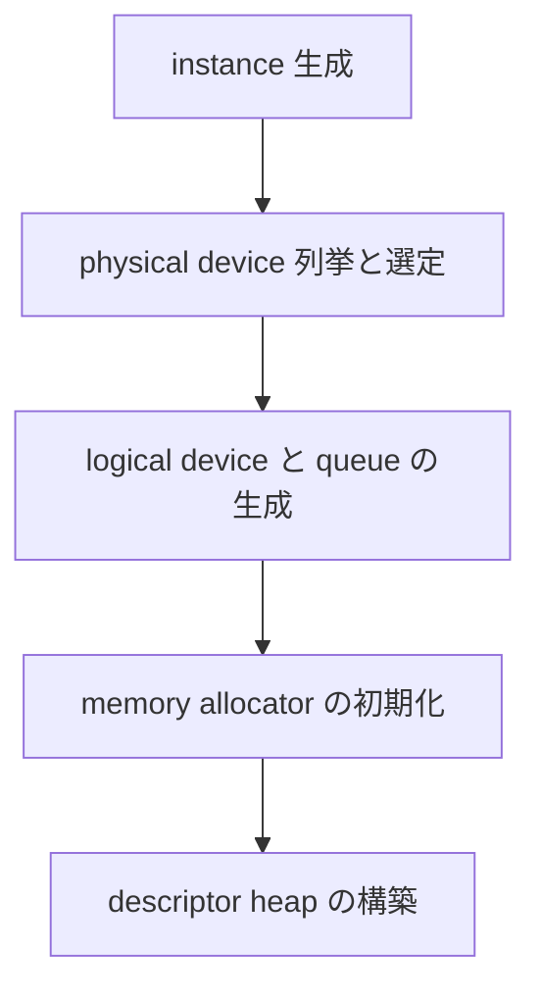
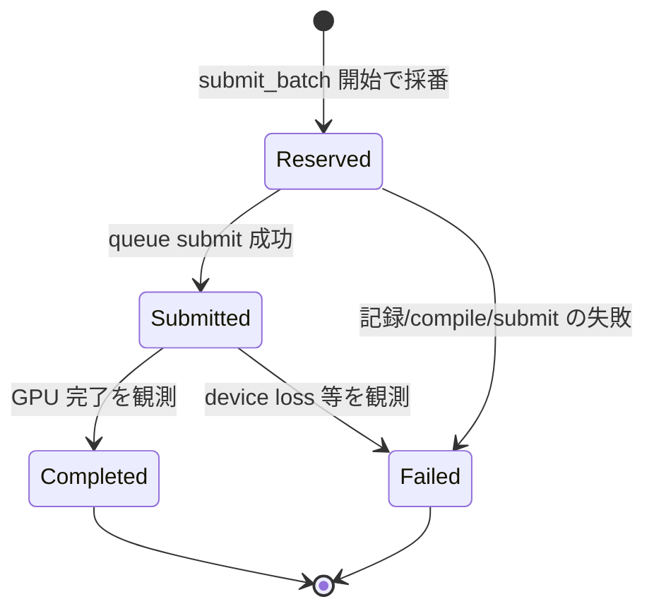

# Device・実行モデルと feature ゲート

- created: 2026-07-02
- updated: 2026-07-02
- status: ready for review
- implementation: not-started

## 解決したい問題

orvk の利用者が、GPU 実行の入口を 1 つの型(`Device`)として手に入れ、その上で「記録した仕事を submit し、完了を確実に観測する」までを曖昧さなく行えるようにする。
具体的には次の問題を解消する。

- Vulkan の初期化(instance、physical device 選定、logical device、queue、allocator、descriptor heap)は手で書くと順序依存と暗黙の要件チェックが分散し、要件未達の環境で「途中まで動いて不可解に落ちる」silent trap になりやすい。起動を 1 本の列に固定し、要件未達は起動時に理由付きの明示エラーで止める。
- submit の完了・失敗の観測が曖昧だと、readback の読み出しタイミングや resource retire の安全性を上位が組めない。submit を `SubmitId` で追跡できる前進のみの状態機械として定義し、ブロッキング(`wait`)とポーリング(`is_submit_complete`)の両方の観測手段を公開する。
- GPU の無い環境(CI、単体テスト)でも記録語彙・レジストリ・検証をコンパイル・実行できるように、crate 構成と feature ゲートの境界を決める。

## 問題の背景

orvk はレンダラーやアプリケーション、GUI 層のような複数のサブシステムが 1 つの `Device` を共有する利用シナリオを一級で支える([0001](0001_goals-and-non-goals.md)、[0010](0010_device-sharing-and-handoff.md))。
共有が成り立つには、handle 空間・レジストリ・queue・descriptor heap の所有者が一意である必要があり、その所有者と生成順序をこの doc で確定させる。

また orvk は `VK_EXT_descriptor_heap` を必須とし fallback backend を持たない([docs/philosophy.md](../philosophy.md))。
fallback が無い以上、要件未達の環境をどう報告するかは利用者体験の生命線であり、「起動 gate で何をどう検査し、どう伝えるか」は後から変えにくい公開契約である。

さらに、リソース handle・access 宣言・タスクグラフといった記録語彙([0002](0002_resource-ownership-and-registry.md)、[0004](0004_access-declaration-and-sync.md)、[0005](0005_task-graph-and-command-encoder.md))は GPU 実行と独立に検証可能な設計になっている。
この検証可能性を CI で実際に使えるかどうかは crate/feature の物理構成で決まるため、実行系の設計と同じ doc で決める必要がある。

## この文書では書かないこと

- リソース handle・論理レジストリの構造と retire 規則。[0002](0002_resource-ownership-and-registry.md) が決める。
- descriptor heap の内部レイアウト(stride、slot 割当、publish バリア)と descriptor ABI。[0003](0003_bindless-descriptor-heap.md) が決める。
- access 宣言から barrier・`ResourceTransition` を導出する規則。[0004](0004_access-declaration-and-sync.md) が決める。
- `TaskGraph` の記録 API・compile の中身・`CommandEncoder` のコマンド集合と静的検証。[0005](0005_task-graph-and-command-encoder.md) が決める。本 doc は compile / lowering を実行パイプラインの段階名としてだけ扱う。
- pipeline の登録・解決・キャッシュ。[0007](0007_pipeline-registration-and-cache.md) が決める。
- upload / readback バッファの型と非同期読み出しの詳細。[0008](0008_upload-and-readback.md) が決める。
- surface・swapchain 生成・present と再生成。[0009](0009_surface-swapchain-present.md) が決める。本 doc は「present 用途の有無が起動要件を変える」ことと、present 失敗が失敗分類に現れることだけを扱う。
- 複数サブシステム間の handle 受け渡し(publish / consume)の契約。[0010](0010_device-sharing-and-handoff.md) が決める。
- raw Vulkan handle への escape hatch。[0011](0011_raw-escape-hatch.md) が決める。

## やらないこと

- **マルチ queue 構成(専用 transfer / async compute queue)は当面やらない。** 単一 queue で正しさの仕様を固めてから、必要が測定で証明されたときに新しい design doc で導入する(詳細は「代替案」)。cross-queue の ownership transfer と semaphore 配線は同期契約([0004](0004_access-declaration-and-sync.md))全体に波及するため、後付けの拡張として設計する。
- **frames-in-flight 管理(フレームパイプライン化のための in-flight 数制御)を Device に組み込まない。** orvk は submit 単位の完了追跡だけを提供し、「何フレーム先行するか」は利用者がアプリの構造に合わせて `SubmitId` の上に組む。これは責務境界の決定であり、将来も Device 側には持たせない。
- **physical device 選定の利用者 override(名前指定・選定 callback)は今はやらない。** スコアリングの既定則で足りない実例が出たら、そのとき `DeviceConfig` に選定の口を足す。
- **追加 device feature(pNext chain)の利用者指定は今はやらない。** `DeviceConfig` で受けるのは追加 extension 名までとする。raw escape hatch([0011](0011_raw-escape-hatch.md))で必要になる feature が具体化した時点で、chain をどう安全に受けるかを別 doc で決める。
- **validation layer・debug utils の制御 API 設計はこの doc ではやらない。** 開発時の診断は必要だが、公開契約に昇格させる判断は実装で運用してから行う。

## 用語集

- **Batch** — 1 回の submit にまとめる仕事の単位。記録(taskの追加)→ compile → submit のライフサイクルを持つ。識別子は `BatchId`。
- **SubmitId** — queue へ submit した(または submit を予約した)仕事の完了追跡用 ID。Device ごとに単調増加で採番される。
- **SubmitTracker** — `SubmitId` ごとの状態(Reserved / Submitted / Completed / Failed)を追跡する Device 内部の前進のみ状態機械。
- **device feature** — Cargo feature `device`。Vulkan 実行系(Device、allocator、heap 実体、submit、swapchain)をゲートする。既定で有効。

## 概要

`Device::new(DeviceConfig)` を GPU 実行の唯一の入口とし、instance → physical device 選定 → logical device + queue → allocator → descriptor heap の起動列を 1 回の呼び出しで完了させる。
要件(Vulkan 1.3、`VK_EXT_descriptor_heap` ほか必須 feature 群)を満たさない環境では、どの device が何故 reject されたかを列挙した明示エラーで起動を止める。
queue は graphics + compute + present 兼用の単一 queue から始め、同期契約を単純に保つ。

実行は `Device::submit_batch` に閉じる。
利用者は closure で記録コンテキスト(`Batch`)を受け取ってタスクを記録し、closure を抜けると orvk が compile → lowering → queue submit を行い `SubmitId` を返す。
完了観測は `wait(SubmitId)`(ブロッキング)と `is_submit_complete(SubmitId)`(ポーリング)の 2 本で、`SubmitTracker` の前進のみ状態機械(Reserved → Submitted → Completed / Failed)に裏打ちされる。
失敗は GraphCompile / CommandRecord / QueueSubmit / Present / DeviceLost / Other に分類して報告し、上位が自前の再試行・破棄の状態機械を組めるようにする。
複数スレッドからの `submit_batch` は Device 内部で直列化し、`SubmitId` の順序と queue への投入順序を一致させる。

crate は単一 crate `orvk` とし、Vulkan 実行系を Cargo feature `device`(既定 on)でゲートする。
handle・レジストリ・access 宣言・タスクグラフの記録と compile・記述からの容量見積もりは feature なしでコンパイル・実行でき、GPU の無い CI で検証できる。

## シナリオ / ユースケース

**standalone(headless)の compute 実行。**
CLI ツールが window なしで画像処理をする。
`DeviceConfig` で present 用途を無効にして `Device::new` し(`VK_KHR_swapchain` は要求されない)、`submit_batch` で dispatch と readback 転送を記録し、返った `SubmitId` を `wait` でブロッキング待ちして readback buffer から結果を読む([0008](0008_upload-and-readback.md))。

**単独アプリの present ループ。**
アプリが present 用途を有効にして `Device::new` し、surface / swapchain を作る([0009](0009_surface-swapchain-present.md))。
フレームごとに `submit_batch` で描画を記録・submit し、前フレームの `SubmitId` を `is_submit_complete` でポーリングして GPU 内 readback(ピッキング結果など)を非同期に回収する。
ブロッキングの `wait` はフレームループには使わず、終了時のドレインにだけ使う。

**複数サブシステムの Device 共有。**
アプリ本体と、その中のレンダラー・UI 層がそれぞれ独立に `submit_batch` を呼ぶ。
各呼び出しは Device 内部で直列化され、それぞれの `SubmitId` を受け取って独立に完了観測する。
サブシステム間の成果物の受け渡しは publish / consume([0010](0010_device-sharing-and-handoff.md))で行い、本 doc の範囲では「どの submit がいつ終わったか」を全員が同じ `SubmitTracker` で観測できることだけを保証する。

**GPU の無い CI。**
`cargo test --no-default-features` で記録語彙のテスト(handle の世代検証、access 宣言とコマンドの整合、graph compile の順序と transition 導出)を実行する。
Device は存在しないが、テスト対象のロジックは Device に依存しない。

## 詳細設計

各サブセクションの内容は次の通り。

1. 起動列と `DeviceCreateError` — `Device::new` の段階構成と失敗報告。
2. physical device 選定 — 要件フィルタとスコアリング、reject 理由の記録。
3. 要求 extension / feature — 必須集合と present 条件付き集合。
4. `DeviceConfig` — 利用者に開ける自由度の範囲。
5. queue 構成 — 単一 queue の判断。
6. 実行モデル `submit_batch` — closure による記録と実行パイプライン。
7. `SubmitTracker` と失敗分類 — 前進のみ状態機械と `SubmitErrorKind`。
8. 完了観測 API — `wait` と `is_submit_complete` の意味論。
9. 並行 submitter の直列化 — `SubmitId` 順序の不変条件。
10. crate 構成と device feature — feature なしで使える集合の確定。
11. metadata だけの計画 — 実リソースに触れない見積もり語彙。

### 起動列と DeviceCreateError

`Device::new(DeviceConfig)` は次の段階を順に実行し、どの段階で失敗しても `DeviceCreateError` として即座に返す。



(矢印は起動処理の実行順を表す。各段階の失敗は後続へ進まず `DeviceCreateError` として呼び出し元へ返る。)

段階を 1 本の列に固定するのは、部分的に初期化された Device を利用者に渡さないためである。
`Device::new` が `Ok` を返したら、レジストリ・queue・allocator・descriptor heap のすべてが使用可能である、を不変条件とする。
`DeviceCreateError` はどの段階で何が失敗したかを保持し、とくに physical device 選定の失敗では列挙した全 device の reject 理由(次節)を含める。

Device は生成されたこれらすべての所有者であり、handle 空間・レジストリも Device が所有する([0002](0002_resource-ownership-and-registry.md))。
1 Device = 1 handle 空間である。

### physical device 選定

選定は「要件フィルタ → スコアリング」の 2 段で行う。

**要件フィルタ**: 各 physical device について、API バージョン(1.3 以上)、必須 device extension、必須 feature(次節)、queue 要件(graphics + compute を兼ねる family の存在。present 用途なら加えてその family の present support)を検査する。
1 つでも満たさない device は候補から外し、「device 名 + 満たさなかった要件の列挙」を reject 理由として記録する。

**スコアリング**: フィルタを通過した device を device type で順序付ける(Discrete > Integrated > その他)。
同順位が複数ある場合は列挙順の先頭を選ぶ。

候補が 0 件のときは、記録した全 reject 理由を `DeviceCreateError` に含めて返す。
「GPU はあるのに起動できない」環境で、利用者がドライバ更新すべきか GPU 非対応かをエラーメッセージだけで判断できるようにするためであり、fallback を持たない([docs/philosophy.md](../philosophy.md))orvk では起動 gate の説明能力が使い物になるかどうかを決める。

### 要求 extension / feature

起動 gate で検査し有効化する集合は次の通り。

- **instance extension**: present 用途が有効なときのみ `VK_KHR_surface` + プラットフォーム surface extension(Win32 / Wayland。[0009](0009_surface-swapchain-present.md))。
- **device extension**: `VK_EXT_descriptor_heap`(常時)。present 用途が有効なときのみ `VK_KHR_swapchain`。
- **API バージョン**: Vulkan 1.3 以上。
- **feature**: `dynamic_rendering`、`synchronization2`、`buffer_device_address`、`shader_draw_parameters`、`multi_draw_indirect`、descriptor heap の feature。

この集合は orvk の記録語彙が前提とする能力の写像である。
dynamic rendering は render pass object を持たない `begin_rendering` / `end_rendering`([0005](0005_task-graph-and-command-encoder.md))、synchronization2 は transition の lowering([0004](0004_access-declaration-and-sync.md))、buffer_device_address と descriptor heap は bindless 契約([0003](0003_bindless-descriptor-heap.md))、shader_draw_parameters と multi_draw_indirect は draw コマンド集合の前提である。
optional 扱いの feature は持たない。
「有るときだけ使える API」は利用者コードに環境分岐を強いる silent trap の温床であり、必須にできない機能はそもそも語彙に入れない方針を取る。

### DeviceConfig

`DeviceConfig` に開ける自由度は次の 3 つに絞る。

```rust
pub struct DeviceConfig {
    /// present 用途を有効にするか。false なら swapchain/surface 系の
    /// extension を要求せず、surface/swapchain API は使えない。
    pub enable_present: bool,
    /// resource heap / sampler heap の descriptor 容量(slot 数)。
    /// Device を共有する全サブシステムの合算を利用者が指定する。
    pub resource_heap_capacity: u32,
    pub sampler_heap_capacity: u32,
    /// 必須集合に追加で要求する device extension 名。
    /// raw escape hatch(0011)で使う機能の有効化に用いる。
    pub extra_device_extensions: Vec<String>,
}
```

- **present 用途の有無**: headless 利用で swapchain 系の extension を要求しないための選択。present 無効の Device で surface / swapchain API を呼んだ場合は明示エラーとする([0009](0009_surface-swapchain-present.md))。
- **descriptor heap 容量**: heap は Device 生成時に固定容量で確保する([0003](0003_bindless-descriptor-heap.md))。Device を複数サブシステムで共有する場合、必要量は利用者側の合算でしか決まらないため、総量を config で受ける。見積もりには後述の metadata 語彙を使える。
- **追加 extension 要求**: escape hatch で必須集合の外の Vulkan 機能を使う利用者のための口。追加分も要件フィルタの対象になり、満たさない device は reject 理由に含めて報告する。

これ以外(device 選定 override、追加 feature chain、validation 制御)は「やらないこと」の通り現時点では開けない。
自由度を増やすのは要求が具体化してからでよく、config の口は一度開けると閉じにくい。

### queue 構成

queue は graphics + compute + present(present 用途有効時)を兼用する単一 queue、queue index 0 で始める。
選定時の queue 要件(前述)はこの兼用 family の存在を必須にする。

単一 queue を選ぶ根拠は同期契約の単純さである。
queue が 1 本なら、submit の順序 = GPU での実行開始順序であり、cross-queue の ownership transfer・queue 間 semaphore・queue family ごとの能力差がすべて存在しない。
access 宣言から barrier を導出する契約([0004](0004_access-declaration-and-sync.md))も、cross-batch handoff の semaphore 依存([0010](0010_device-sharing-and-handoff.md))も、単一 queue の上でまず正しさを固定する。
兼用 family は Discrete / Integrated GPU の実環境で index 0 に存在するのが通例であり、この前提が成り立たない環境は要件フィルタが理由付きで reject する。

### 実行モデル submit_batch

GPU に仕事をさせる唯一の口は `Device::submit_batch` である。

```rust
impl Device {
    pub fn submit_batch<F>(&self, record: F) -> Result<SubmitId, SubmitError>
    where
        F: FnOnce(&mut Batch) -> Result<(), BatchError>;
}
```

`Batch` は 1 回の submit にまとめる仕事の記録コンテキストで、`TaskGraph` builder への口を持つ([0005](0005_task-graph-and-command-encoder.md))。
closure が `Ok` を返すと、orvk は次のパイプラインを実行して `SubmitId` を返す。

1. **compile** — 記録されたタスクと access 宣言からハザードの DAG と `ResourceTransition` 列を作る([0005](0005_task-graph-and-command-encoder.md))。
2. **lowering** — 論理 transition を synchronization2 の barrier に、タスクを `CommandEncoder` 経由の command buffer 記録に落とす。
3. **queue submit** — 完了検知(fence 相当)を伴って単一 queue へ投入する。

closure に記録コンテキストを渡す形を取るのは、`Batch` のライフサイクルを型で閉じるためである。
記録途中の `Batch` が closure の外に生き残らないので、「記録したまま submit されない batch」「submit 後に追記される batch」という状態が API 上作れない。
`Batch` は生成した Device との owner 照合を持ち、別 Device の文脈で作られた handle や batch の混入は compile 時の明示エラーとする(1 Device = 1 handle 空間の帰結)。

closure が `Err` を返した場合、および compile / lowering / submit の各段階が失敗した場合は、その batch の仕事は GPU に一切届かず、`SubmitError`(次節の分類付き)が返る。
部分的に submit される中間状態は存在しない。

内部の完了検知と submit 間の順序付けにどの Vulkan プリミティブ(fence、binary semaphore、timeline semaphore)を使うかは公開契約にせず、実装の自由度として残す(「代替案」参照)。
公開契約は `SubmitId` の意味論だけである。

### SubmitTracker と失敗分類

`SubmitTracker` は `SubmitId` ごとの状態を持つ前進のみの状態機械である。



- **Reserved**: `submit_batch` の開始時点で `SubmitId` を採番し、tracker に登録する。queue に届く前の予約状態。
- **Submitted**: queue submit が成功した状態。
- **Completed / Failed**: 終端状態。一度終端に達した `SubmitId` の状態は以後変わらない(前進のみ)。

失敗は原因段階で分類する。

```rust
pub enum SubmitErrorKind {
    GraphCompile,   // access 宣言の矛盾、owner 照合違反などの compile 失敗
    CommandRecord,  // lowering / command buffer 記録の失敗
    QueueSubmit,    // vkQueueSubmit 系の失敗
    Present,        // present 段の失敗(0009 の再生成契約と接続)
    DeviceLost,     // VK_ERROR_DEVICE_LOST の観測
    Other,          // 上記に分類できない失敗
}
```

submit より前の失敗(GraphCompile / CommandRecord / QueueSubmit)は `submit_batch` の返り値で即座に伝わるが、そのときも採番済み `SubmitId` は Failed の終端として tracker に残す。
Device を共有する他サブシステムが handoff 等で他人の `SubmitId` を観測する([0010](0010_device-sharing-and-handoff.md))とき、「存在したが失敗した submit」と「存在しない submit」を区別できる必要があるためである。
DeviceLost は submit 後に非同期に判明しうるので、`wait` / `is_submit_complete` の観測時に Failed へ遷移させる。
この分類は、上位(アプリやフレームワーク)が pending work の再試行・破棄を自前の状態機械で組むための最小語彙であり、orvk 自身は再試行しない。

なお device loss は Device 全体の終端であり、以後の `submit_batch` は `DeviceLost` で失敗し続ける。
回復(Device の作り直し)は利用者の責務とする。

### 完了観測 API

```rust
impl Device {
    /// SubmitId が終端に達するまでブロックする。
    /// Completed なら Ok、Failed ならその分類を Err で返す。
    pub fn wait(&self, id: SubmitId) -> Result<(), SubmitError>;

    /// ノンブロッキングに問い合わせる。
    /// Ok(true) = Completed、Ok(false) = まだ終端でない、
    /// Err = Failed(その分類)。
    pub fn is_submit_complete(&self, id: SubmitId) -> Result<bool, SubmitError>;
}
```

2 本を用意するのは利用形態の住み分けのためである。
standalone(headless)のワンショット実行は `wait` でブロッキングに完結し、フレームループ内の readback 回収は `is_submit_complete` のポーリングでフレームを止めずに行う([0008](0008_upload-and-readback.md))。

意味論として次を固定する。

- Failed の submit を `is_submit_complete` で問い合わせたときは `Ok(false)` ではなく `Err` を返す。`Ok(false)` を返し続けると、ポーリングループが永遠に回る silent trap になる。
- この Device で採番されたことのない `SubmitId` の問い合わせは明示エラー(`SubmitError` の `Other` とは別の、API 誤用としてのエラー)とする。黙って `false` を返さない。
- `wait(id)` から `Ok` が返ったら、その `SubmitId` 以前に採番されたすべての `SubmitId` も終端に達している。単一 queue と後述の直列化により submit は採番順に queue へ入るため、この保証を公開契約にでき、retire の safety 判定([0002](0002_resource-ownership-and-registry.md))が「terminal な SubmitId との比較」で書ける。

### 並行 submitter の直列化

`Device` は `&self` で `submit_batch` を受け、複数スレッド(複数サブシステム)からの並行呼び出しを許す。
内部では compile 結果を queue へ投入する区間と `SubmitId` 採番を 1 つの直列化点(mutex)で保護し、次の不変条件を保つ。

**`SubmitId` の大小順序 = queue への投入順序。**

この不変条件が前節の `wait` の全順序保証と、handoff の「書いた SubmitId より後の consume は安全」という判定([0010](0010_device-sharing-and-handoff.md))を支える。
closure の実行(タスク記録)自体は直列化点の外で並行に走ってよい。
直列化するのは採番と queue 投入だけであり、記録の重い仕事を mutex の下に入れない。

### crate 構成と device feature

crate は単一 crate `orvk` とし、Cargo feature `device`(既定 on)で Vulkan 実行系をゲートする。

**feature なしでコンパイル・実行できる集合**(記録語彙):

- handle 型(`BufferHandle` / `ImageHandle` / `ImageViewHandle` / `SamplerHandle`)と世代検証、論理レジストリ([0002](0002_resource-ownership-and-registry.md))。
- `AccessSet` と access 宣言、transition 導出([0004](0004_access-declaration-and-sync.md))。
- `TaskGraph` の記録・compile と静的検証、`DescriptorRef` / `DescriptorHandle` の語彙([0003](0003_bindless-descriptor-heap.md)、[0005](0005_task-graph-and-command-encoder.md))。
- `SubmitId` / `BatchId` / 失敗分類などの追跡語彙の型。
- 次節の metadata 見積もり語彙。

**`device` feature が足す集合**(実行系): `Device` / `DeviceConfig`、instance/allocator/heap 実体、`submit_batch` と `SubmitTracker` の実体、surface / swapchain、raw escape hatch。

この境界の目的は、正しさの仕様(handle の世代規則、access 整合、compile の順序性)を GPU の無い CI で常時テストすることである。
境界は「Vulkan の関数を呼ぶか否か」で機械的に引ける。
記録語彙は Vulkan の型に依存せず、lowering(論理 transition → synchronization2 barrier)以降だけが Vulkan に触れる。

### metadata だけの計画

Device を作らず、実 GPU リソースにも触れずに、「この構成ならどれだけの descriptor 容量・リソースが要るか」を見積もれる語彙を feature なしの集合に置く。

- リソース記述型(format / extent / usage などの生成パラメータの値型。[0002](0002_resource-ownership-and-registry.md) の生成 API と同じ記述を、生成せずに値として扱えるもの)。
- 記述の集合から descriptor slot 数(resource heap / sampler heap 別)を計算する見積もり関数。実 handle ではなく記述と個数から計算する。

これが要るのは Device 共有のシナリオである。
`DeviceConfig` の heap 容量は Device 生成時に固定なので、複数サブシステムの必要量を起動前に合算する段階がどうしても存在する。
各サブシステムが「自分はリソースをまだ 1 つも作らずに、必要 slot 数だけ申告する」ためには、実リソースに触れない記述の語彙が要る。
また、GPU の無い環境でパイプライン構成の妥当性(容量超過の検出など)を検証するテストにもこの語彙を使う。

見積もりは記述から決定的に計算できる値(slot 数)に限る。
driver 依存で実測しないと分からない値(実メモリ消費量など)は見積もり API に入れない。
保証できない数字を返す API は silent trap になる。

## 落とし穴

- **単一 queue の head-of-line blocking。** 長時間かかる compute の batch を submit すると、後続の描画・present も同じ queue で待たされる。フレームレートが重要なアプリは、重い仕事を小さい batch に割るか、フレームをまたいで分散する必要がある。専用 queue による解決は将来の doc に委ねる(「やらないこと」)。
- **失敗は後続を自動キャンセルしない。** ある `SubmitId` が Failed になっても、既に submit 済みの後続 batch は独立に実行される。「前段の結果を前提にした後段」を組む利用者は、handoff の consume 宣言([0010](0010_device-sharing-and-handoff.md))か自前の順序制御で依存を明示する必要がある。
- **heap 容量は起動後に増やせない。** `DeviceConfig` で指定した descriptor 容量が不足したら、リソース登録が明示エラーになる([0003](0003_bindless-descriptor-heap.md))。Device の再生成なしに拡張する手段は無いので、共有利用では metadata 見積もりで余裕を持って合算する運用になる。
- **feature なしビルドは維持しないと壊れる。** 記録語彙に Vulkan 依存をうっかり足すと feature なしコンパイルが割れる。CI で `--no-default-features` ビルドを常時回すことがこの境界の実効性の条件である。
- **`wait` の全順序保証は単一 queue の帰結である。** 「`wait(id)` 成功 = それ以前の全 submit も終端」という契約を利用者コードが前提にすると、将来マルチ queue を導入するときにこの契約の再定義が必要になる。マルチ queue 導入時は既存契約を黙って弱めず、新しい design doc で観測 API ごと再設計する。
- **device loss からの回復は重い。** DeviceLost 後は Device を作り直すしかなく、全 handle・レジストリ・heap が失われる。利用者資産(pipeline 記述やリソース記述)を再生成可能な形で持つのは利用者の責務である。

## 代替案

- **記録語彙と実行系を 2 crate に分割する案(`orvk-core` + `orvk-device`)。**
  記録語彙・レジストリ・検証を `orvk-core` に、Vulkan 実行系を依存 crate `orvk-device` に分ける構成。
  - Pros: GPU なしでコンパイルできる境界が crate 境界として物理的に強制され、feature の付け忘れによる依存混入がコンパイルエラーで即座に分かる。依存(ash 等)が core から完全に消える。
  - Cons: pre-v1 の現段階では記録語彙と実行系の境界(とくに lowering がどちら側の知識をどこまで持つか)がまだ動く。crate 分割はその境界を公開 API として固定してしまい、境界の試行錯誤のたびに 2 crate の同時変更と版管理を強いる。利用者にも常に 2 crate の対応関係を意識させる。
  - 見送り理由: 構造の物理的な形は境界が実装で安定するまで遅延する([docs/philosophy.md](../philosophy.md))。GPU なし CI という実利は単一 crate + feature ゲートで同等に得られ、境界の強制力は CI の `--no-default-features` ビルドで担保できる。境界が安定した後に分割し直すのは機械的な作業であり、逆(早すぎる分割の統合)より安い。

- **最初からマルチ queue(専用 transfer / async compute)を持つ案。**
  起動時に transfer 専用・compute 専用の queue family を追加取得し、転送や非同期 compute を別 queue で走らせる構成。
  - Pros: 転送と描画のオーバーラップ、present と独立した compute など、GPU の並列資源を引き出せる。後から足すより最初から同期契約に織り込む方が一貫した設計になりうる。
  - Cons: cross-queue の resource ownership transfer、queue 間 semaphore の配線、queue family ごとの能力差の吸収が、access 宣言からの同期導出([0004](0004_access-declaration-and-sync.md))・handoff 契約([0010](0010_device-sharing-and-handoff.md))・完了観測の全順序保証のすべてを複雑化する。性能上の必要はまだ測定で示されていない。
  - 見送り理由: 最適化は必要が証明されるまで実装しない方針([docs/philosophy.md](../philosophy.md))に従い、単一 queue で正しさの仕様を固定する。導入するときは観測 API の契約再定義を含む新しい design doc で行う(「落とし穴」参照)。

- **timeline semaphore を公開契約にする案。**
  `SubmitId` を timeline semaphore の counter 値そのものと定義し、利用者が raw の timeline semaphore handle を取得して外部の Vulkan コードや他ライブラリと同期できるようにする構成。
  - Pros: `SubmitId` の実装と意味が一致して説明が単純になる。escape hatch 経由の外部コードとの同期が semaphore 1 本で書ける。
  - Cons: 内部の同期実装(fence でよいか、semaphore の再利用戦略、swapchain の binary semaphore との併用方法)が公開契約に固定され、実装の自由度が失われる。timeline semaphore と swapchain 間の制約(present の待ち合わせは binary semaphore が要る環境がある)への対処まで公開面に漏れる。
  - 見送り理由: 公開契約は `SubmitId` の意味論(単調増加、前進のみ、全順序)だけに絞り、実装プリミティブの選択は内部に留める。外部同期の需要が具体化したら、escape hatch([0011](0011_raw-escape-hatch.md))側の口として別途設計できる。採用ではなく保留であり、内部実装として timeline semaphore を使うことは妨げない。

- **`submit_batch` の closure ではなく、`Batch` を値として作って後で `submit(batch)` する 2 段 API 案。**
  `device.begin_batch()` で `Batch` を受け取り、任意のタイミングで記録し、`device.submit(batch)` で投入する構成。
  - Pros: 記録を複数の関数・時点に分散でき、フレーム構築の途中で batch を持ち回る書き方が自然にできる。
  - Cons: 記録途中の `Batch` が任意に生存し、「submit されないまま破棄される batch」「複数フレーム持ち越される batch」という状態を型で防げない。owner 照合やレジストリの予約状態(mapped buffer 予約など)の寿命が batch の寿命に引きずられ、契約が増える。
  - 見送り理由: 記録の分散は closure の中から複数のサブルーチンに `&mut Batch` を渡せば足り、2 段 API でしか書けない利用形態は現時点で無い。ライフサイクルを型で閉じる方が simple である。必要が実証されたら、closure API の上に共存する形ではなく置き換えの design doc として再検討する。

## セキュリティ・プライバシー

この設計はネットワーク・永続データ・機微データを扱わず、新たな検討は不要である。
唯一の信頼境界は raw escape hatch([0011](0011_raw-escape-hatch.md))で、unsafe 境界の内側(本 doc の API)はレジストリと検証により GPU の未定義動作を型と実行時エラーで防ぐ。

## 負荷・コスト

- **`Device::new` は一度きりのコストである。** instance 生成・device 列挙・heap 確保を含み数十〜数百 ms かかりうるが、hot path ではない。
- **submit ごとの CPU コストは「batch 内のタスク数・access 宣言数」に比例する(compile / lowering。[0005](0005_task-graph-and-command-encoder.md) 参照)。** 本 doc が足す分は `SubmitId` 採番と tracker 登録で、submit 1 回あたり O(1) である。完了検知プリミティブ(fence 等)はプール再利用を前提とし、定常状態で submit ごとの Vulkan オブジェクト生成を増やさない。
- **`SubmitTracker` のメモリは in-flight な submit 数に比例する。** 終端に達したエントリは retire 判定([0002](0002_resource-ownership-and-registry.md))が参照しなくなった時点で回収でき、無限に成長しない。
- **直列化 mutex の競合は submit 回数に比例し、コマンド数には比例しない。** mutex の下に置くのは採番と queue 投入だけで、記録・compile は外で並行に走る。フレームあたり数〜数十 submit のオーダーでは競合は測定可能な問題にならない見込みであり、なるとすればそれはマルチ queue を検討する測定根拠になる。
- **`is_submit_complete` は O(1) の状態問い合わせ**(fence status query または tracker 参照)であり、ポーリングループに置ける。
