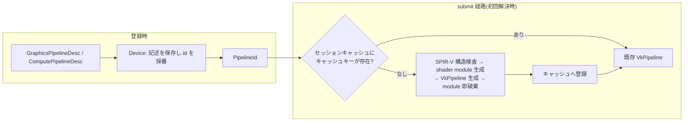

# pipeline の登録・解決とキャッシュ

- created: 2026-07-02
- updated: 2026-07-02
- status: ready for review
- implementation: not-started

## 解決したい問題

Vulkan の pipeline 生成は、shader module・pipeline layout・render pass 互換性・fixed-function 状態の組み立てを利用者に強い、生成コストも大きい(ドライバのシェーダコンパイルを伴う)。
この doc は、利用者が「pipeline の記述(SPIR-V + 状態)を宣言して id を受け取る」だけで graphics / compute pipeline を使えるようにし、Vulkan オブジェクトの生成タイミング・再利用・破棄をライブラリが一貫した規則で管理する設計を決める。
これにより、利用者は pipeline layout や shader module の lifetime を一切扱わずに描画・計算を記録でき、同一内容の pipeline が重複生成されることもなくなる。

## 問題の背景

orvk は bindless 前提のライブラリであり、descriptor set layout / pipeline layout を利用者 API に出さない(0001_goals-and-non-goals.md、0003_bindless-descriptor-heap.md)。
そのため pipeline 生成に必要な layout はライブラリ内部で完結させる必要があり、「利用者が VkPipeline を自分で作って持ち込む」形は取れない。
pipeline の記述と生成をライブラリの責務として引き取ることが、bindless 化の帰結として必要になる。

また、タスクグラフへの記録(0005_task-graph-and-command-encoder.md)は「GPU リソースに触れない metadata だけの記述」と「実 Batch での記録」を分けられる契約を持つ。
pipeline の登録がその場で Vulkan オブジェクトを作る設計だと、記述だけしたい文脈(容量見積もり、headless の検証)でも device 側の生成コストと失敗可能性を背負うことになる。
登録と生成を時期として分離できる設計が、この契約と整合する。

さらに graphics pipeline は dynamic rendering(0006_device-and-execution-model.md の前提)の下でも attachment format に依存して生成されるため、「どの format で使うか」が確定する時点まで生成を遅らせる方が、記述の時点で利用文脈を先取りさせずに済む。

## この文書では書かないこと

- shader ABI(DescriptorHandle の uint2 表現、heap slot + generation)と descriptor heap の構造。0003_bindless-descriptor-heap.md が決める。
- push data の記録時 API(`push_data`)と記録時検証(上限超過・整合)。0005_task-graph-and-command-encoder.md が決める。
- `bind_graphics_pipeline` / `bind_compute_pipeline` を含む CommandEncoder のコマンド語彙と rendering 状態機械。0005_task-graph-and-command-encoder.md が決める。
- Device の生成、要求 extension / feature、feature ゲート。0006_device-and-execution-model.md が決める。
- SPIR-V の生成方法(シェーダ言語・コンパイラ)。orvk は SPIR-V バイト列を受け取るだけで、コンパイルはライブラリ外の責務である(0001_goals-and-non-goals.md)。

## やらないこと

- **specialization constants を desc に入れない。** specialization は同一 SPIR-V から状態違いの pipeline を派生させる仕組みだが、キャッシュキーと記述の等価性判定を複雑にする。同じ効果は SPIR-V を変えて別 pipeline として登録すれば得られる。実需(定数違いの大量バリアントでコンパイル時間が問題になる)が証明されるまでやらない。
- **シェーダホットリロードを持たない。** ファイル監視・再コンパイル・差し替えは開発ツールの関心事であり、ライブラリの記録・実行の語彙と絡めない。利用者は新しい SPIR-V で pipeline を登録し直せばよく、その上にホットリロードを組む余地は残る。この設計では恒久的にやらない(ライブラリ外で実現できるため)。
- **pipeline の破棄・登録解除 API を持たない。** 登録された pipeline と生成済み VkPipeline は Device の寿命まで生きる。レンダラーの pipeline 数は有限(数十〜数百)で、セッション途中に手放す需要が証明されていない。実需が出たら retire の意味論(使用中 Batch との安全性)を含めて別 doc で設計する。
- **ディスクへの永続キャッシュを持たない。** キャッシュはセッション(Device 寿命)内のみ。VkPipelineCache による永続化は代替案で述べる理由で見送る。
- **pipeline libraries / pipeline derivatives を使わない。** 部分コンパイルの共有は生成時間の最適化であり、必要が測定で証明されるまで導入しない(思想: 最適化は実需が証明するまで遅延する)。
- **multisample rendering(MSAA)をスコープに入れない。** desc に sample count を持たず、pipeline は常に 1 sample で生成する。samples > 1 の attachment への描画は記録時の明示エラーにする(黙って validation エラーに落とさない)。実需が出たら desc の拡張として別 doc で設計する。
- **stencil を扱わない。** stencil aspect を持つ depth format(D24S8 / D32S8 等)の宣言は解決時の明示エラーとする。stencil 状態の記述と attachment 契約は実需が出てから depth と同じ形で足す。

## 概要

pipeline は「記述の登録」と「Vulkan オブジェクトの解決」の 2 段階で扱う。

利用者は `GraphicsPipelineDesc` / `ComputePipelineDesc`(SPIR-V + 状態の記述)を Device に登録し、`GraphicsPipelineId` / `ComputePipelineId` を受け取る。
登録は記述の保存と id 採番だけを行い、Vulkan オブジェクトは作らない(infallible)。
タスクの記録ではこの id で pipeline を参照する。

VkPipeline の生成(解決)は、Batch の submit 経路で bind コマンドを lowering する時点で行い(draw の有無は問わない)、結果をセッションキャッシュに入れて以後再利用する。
キャッシュキーは記述の content hash のみとする。
viewport / scissor は常に動的状態で生成し(0005 の記録契約と一致)、attachment format は desc に宣言させるため、graphics も compute も利用文脈(extent や rendering scope)に依存せず解決できる。

pipeline layout は descriptor set layout を 1 つも含まず、push data 用の push constant range だけを持つ共有 layout を Device が 1 つ保持して全 pipeline で使い回す。
shader module は pipeline 生成の材料としてだけ作り、生成直後に破棄する。
解決時には SPIR-V の構造検査(エントリポイントの存在、descriptor heap ABI で書かれているか)を行い、未登録 id・エントリポイント不在・生成失敗はすべて解決時の明示エラーとして submit 経路から報告する(silent trap を残さない)。



(矢印はすべて「データが次の段階へ渡る」流れを表す。)

## シナリオ / ユースケース

レンダラーの初期化で pipeline を登録し、frame の記録で id を使う流れを示す。

```rust
// 初期化: 登録は Vulkan オブジェクトを作らず、id を返すだけ。
let mesh_pipeline: GraphicsPipelineId = device.register_graphics_pipeline(GraphicsPipelineDesc {
    vertex: ShaderStageDesc { spirv: mesh_vs_spirv, entry_point: "main".into() },
    fragment: Some(ShaderStageDesc { spirv: mesh_fs_spirv, entry_point: "main".into() }),
    vertex_layout: VertexLayout {
        bindings: vec![VertexBindingDesc { binding: 0, stride: 32, input_rate: VertexInputRate::Vertex }],
        attributes: vec![
            VertexAttributeDesc { location: 0, binding: 0, format: Format::R32G32B32Sfloat, offset: 0 },
            VertexAttributeDesc { location: 1, binding: 0, format: Format::R32G32Sfloat, offset: 24 },
        ],
    },
    topology: PrimitiveTopology::TriangleList,
    color_formats: vec![Format::R16G16B16A16Sfloat],
    depth: Some(DepthDesc { format: Format::D32Sfloat, test: true, write: true, compare: CompareOp::GreaterOrEqual }),
    cull: CullDesc { mode: CullMode::Back, front_face: FrontFace::CounterClockwise },
    blend: vec![BlendDesc::disabled()],
    push_data_size: 24,
});

let blur_pipeline: ComputePipelineId = device.register_compute_pipeline(ComputePipelineDesc {
    spirv: blur_cs_spirv,
    entry_point: "main".into(),
    push_data_size: 16,
});

// frame の記録: id で参照するだけ。VkPipeline はここではまだ存在しなくてよい。
// encoder 呼び出しは記録時静的検証のため Result を返す(0005)。
// begin_rendering / access 宣言を含む完全な記録列は 0005 / 0004 を参照。
enc.bind_graphics_pipeline(mesh_pipeline)?;
enc.set_viewport(viewport)?;
enc.set_scissor(scissor)?;
enc.push_data(&push)?;
enc.draw(36, 1, 0, 0);
```

この Batch を submit すると、初回だけ `mesh_pipeline` と `blur_pipeline` の VkPipeline が生成されてキャッシュされ、次 frame 以降はキャッシュヒットで再利用される。
`entry_point` の綴りを間違えた場合や SPIR-V が descriptor heap ABI で書かれていない場合は、この submit がエラーを返し、どの pipeline の何が悪いかが報告される。

## 詳細設計

サブセクションの目次:

- **記述型**: GraphicsPipelineDesc / ComputePipelineDesc のデータ契約。
- **登録と id**: 登録の意味論(infallible、id は Device 固有)。
- **遅延生成とセッションキャッシュ**: 解決のタイミングとキャッシュキー。
- **graphics / compute の非対称**: compute が利用文脈非依存で解決できる理由と扱いの差。
- **pipeline layout と shader module**: 空 layout の共有と module の即時破棄。
- **SPIR-V の構造検査**: 何を検査し、何を保証しないか。
- **エラー**: 解決時エラーの種類と報告経路。

### 記述型

pipeline の記述は Vulkan オブジェクトを一切含まない純データ型とし、記録語彙の一部として feature なしでコンパイル可能にする(0001_goals-and-non-goals.md の crate 構成)。

`GraphicsPipelineDesc` が持つもの:

- **シェーダ段**: vertex の SPIR-V バイト列とエントリポイント名(`ShaderStageDesc`)。fragment は `Option<ShaderStageDesc>` で、`None` なら depth-only pass(shadow map、depth prepass)用の pipeline になる(rasterization 有効で fragment 省略は Vulkan 上合法)。fragment が `None` で `color_formats` が非空の desc は解決時エラー。
- **頂点レイアウト**: binding(stride / input rate)と attribute(location / binding / format / offset)の列。
- **primitive topology**: input assembly の topology(既定 TriangleList。line / point 描画もここで選ぶ)。
- **attachment format**: color attachment の format 列と、depth の format + test / write / compare 設定(depth なしも選べる)。stencil aspect を持つ depth format は当面拒否する(「やらないこと」)。
- **rasterization 状態**: cull mode と front face。
- **blend 状態**: color attachment ごとの blend 設定(有効無効・factor・op)。blend 列の長さは `color_formats` の長さと一致しなければならない(不一致は解決時エラー)。
- **`push_data_size`**: このシェーダが読む push data のバイト数。記録時の `push_data` 検証(0005)に使う。Device の上限(既定 128B、0005)以下でなければ bind の記録時エラー。

viewport / scissor は desc に持たない。
graphics pipeline は常に viewport / scissor を動的状態として生成し、値は記録時の `set_viewport` / `set_scissor` で与える(0005 の記録契約)。
これによりキャッシュキーから利用文脈(extent)が消え、pipeline の同一性が記述だけで閉じる。
multisample は常に 1 sample で生成する(「やらないこと」)。

attachment format を desc 側に宣言させるのは、pipeline の同一性を記述だけで閉じるためである。
dynamic rendering の pipeline 生成には attachment format が必要だが、これを「最初に使われた rendering scope から拾う」形にすると、同じ desc が使われ方によって別の pipeline になり、pipeline の同一性が利用文脈に漏れる。
desc に宣言させれば、記録時に実際の attachment format と突き合わせて不一致を明示エラーにできる(黙って別バリアントを作らない)。

`ComputePipelineDesc` が持つもの:

- **シェーダ**: SPIR-V バイト列とエントリポイント名。
- **`push_data_size`**: graphics と同一契約。

workgroup サイズは desc に持たない。
SPIR-V の `LocalSize` 実行モードとしてシェーダ内に宣言されており、desc に重複して持つと二重管理と食い違いの余地を作るだけである。

### 登録と id

登録 API は Device のメソッドとする(解決が Device の Vulkan 文脈を要するため。desc 型自体は feature なしで使える)。

```rust
fn register_graphics_pipeline(&self, desc: GraphicsPipelineDesc) -> GraphicsPipelineId;
fn register_compute_pipeline(&self, desc: ComputePipelineDesc) -> ComputePipelineId;
```

登録は desc の保存・content hash の計算・id の採番だけを行い、失敗しない(Result を返さない)。
SPIR-V の検査すら登録時には行わない。
検証と生成を解決時の一箇所に集約することで、エラーの報告面が「登録時に出るものと解決時に出るもの」の二面に割れることを避ける(理由の比較は代替案「登録時に検証まで行う案」)。

id は Device ごとの単調増加の採番とし、handle(0002_resource-ownership-and-registry.md)のような generation を持たない。
pipeline に retire が無い(「やらないこと」)ため slot 再利用が起きず、世代管理の対象がない。
別の Device で採番された id の使用は、Batch の owner 照合(0006)と同様に解決時の明示エラーとする。

desc(SPIR-V バイト列を含む)は Device が保持し続ける。
解決は submit 経路の任意の時点で起こり、生成失敗後の再試行にも生成材料が要るためである(メモリコストは「負荷・コスト」)。

### 遅延生成とセッションキャッシュ

VkPipeline の生成は、submit 経路(Batch の record → lowering、0005 / 0006)で bind コマンドを lowering する時点まで遅延する。
解決点は bind であって draw ではない(draw されなくても bind の lowering で生成が走る)。
解決は次の手順で行う。

1. id から desc を引く(未登録・別 Device の id は bind の記録時に検証済みなので、ここでは常に成功する。「エラー」)。
2. content hash でセッションキャッシュを引く。ヒットしたら既存 VkPipeline を使う。
3. ミスなら SPIR-V 構造検査 → shader module 生成 → VkPipeline 生成 → module 破棄 → キャッシュ登録。

キャッシュキーは **desc の content hash のみ** である。
content hash は SPIR-V バイト列・エントリポイント名・topology・全 fixed-function 状態・format 宣言を含む記述全体のハッシュで、登録時に一度計算して保存し、解決のたびに再計算しない。
id ではなく content hash をキーにするのは、同一内容の desc が複数回登録されても VkPipeline を重複生成しないためである。
viewport / scissor が常に動的、multisample が常に 1 sample であるため、キーに利用文脈は入らず、1 つの desc に対して VkPipeline は常に 1 つになる。

content hash は 128bit 以上の衝突耐性のあるハッシュとする。
キーの衝突は「別の pipeline を黙って使う」silent trap になるため、偶発衝突が実用上起こらない幅を最初から選ぶ。

キャッシュは Device が所有し、Device の寿命まで生きる。
eviction は行わない(「やらないこと」の破棄なしと同じ判断)。

キャッシュの並行契約はキーごとの once セル方式とする。
複数サブシステムが同じ Device へ並行に submit する構成(0010)で、(a) 同一キーの同時解決は 1 回の生成に収束し(勝者以外は待って同じ VkPipeline を受け取る)、(b) 別キーの解決とキャッシュヒットの参照は互いにブロックしない、を不変条件とする。
pipeline コンパイル(数百 ms になりうる)が Device 全体のロックで他の submit を止めることを許さない。

### graphics / compute の非対称

compute pipeline は attachment を持たないため、生成に利用文脈(format / extent)がもともと一切要らない。
graphics pipeline は dynamic rendering でも attachment format に依存するが、format を desc に宣言させ、viewport / scissor を常に動的にしたことで、解決は desc だけで完結する。
どちらも「登録 → id → bind」の同じ形・content hash のみのキャッシュキーに揃い、1 つの desc に対して VkPipeline は常に 1 つである。
利用者から見える非対称は「graphics では記録時に desc の format 宣言と実際の attachment の不一致がエラーになりうる」ことだけである。

### pipeline layout と shader module

pipeline layout は descriptor set layout を 0 個しか含まない。
リソースへのアクセスは descriptor heap 経由の DescriptorHandle(0003)で行い、set のバインドという概念が存在しないためである。
layout に含まれるのは push data 用の push constant range(offset 0、Device 上限サイズ、全ステージ可視)だけとする。
この layout は desc に依存しない定数なので、Device が 1 つ生成して全 pipeline(graphics / compute とも)で共有する。
pipeline ごとの `push_data_size` は layout には反映せず、記録時検証(0005)にのみ使う。
range を desc ごとに切ると layout が desc 依存になり共有できなくなるが、範囲を上限で固定しても Vulkan 上のコストは変わらないためである。

pipeline 生成には `VkPipelineCreateFlags2CreateInfo` 経由で `VK_PIPELINE_CREATE_2_DESCRIPTOR_HEAP_BIT_EXT` フラグを立て、descriptor heap から descriptor を読む pipeline として作る(VK_EXT_descriptor_heap の要求。0006)。
render pass オブジェクトは使わず、dynamic rendering の format 指定(desc の宣言値)で作る。

shader module は VkPipeline 生成の入力としてだけ必要であり、生成が終われば Vulkan 上の役目がない。
解決の中で生成し、VkPipeline の生成成否にかかわらず即座に破棄する。
保持し続ける唯一の動機は同じ module からの再生成の高速化だが、再生成が要る場面(extent 違い)は稀で、SPIR-V から module を作り直すコストは pipeline 生成全体のごく一部である。

raw escape hatch(0011_raw-escape-hatch.md)との関係では、VkPipeline の raw handle は解決済みであれば公開しうるが、VkShaderModule は即時破棄されるため公開対象にならない。

### SPIR-V の構造検査

解決時、shader module を作る前に SPIR-V バイト列の構造検査を行う。

- **ヘッダ検査**: magic number と語長の整合(壊れたバイト列・endian 違いの拒否)。
- **エントリポイントの存在**: desc の `entry_point` 名と実行モデル(vertex / fragment / compute)が一致する `OpEntryPoint` があるか。
- **set/binding モデルの拒否**: `DescriptorSet` / `Binding` decoration を持つリソース変数(`OpVariable`)が存在したら拒否する。orvk は descriptor set を一切バインドしないため、set/binding 前提でコンパイルされたシェーダは正しく動かない。これを黙って通すと「descriptor が読めない・GPU クラッシュ」という遠い場所での故障になるため、解決時の明示エラーで止める。逆に descriptor を一切読まないシェーダ(push data だけで完結する compute 等)は descriptor heap 系の capability を宣言しないのが正当なので、capability の存在は要求しない。
- **push constant block サイズの抽出**: SPIR-V の push constant block のサイズを抽出し、desc の `push_data_size` がブロックサイズ未満なら解決時エラーにする。宣言不足のまま通すと、シェーダが push されていない領域を読んで未定義値で黙って誤動作する(0005 の記録時検証は desc の宣言値しか見られないため、ここで実物と突き合わせる)。

検査はこの範囲の構造検査に限り、完全な SPIR-V validation(spirv-val 相当)は行わない。
完全 validation は SPIR-V 仕様全体の実装であり、それは validation layer とシェーダコンパイラの責務である。
したがって構造検査を通過しても driver が生成に失敗することはあり、それは生成失敗エラーとして別途報告される(「エラー」)。

### エラー

エラーは検出点を一意に定め、同じ違反が複数の面から別々に報告される形にしない。

**記録時(bind の記録時静的検証。0005 の encoder エラーとして返る)**:

- **未登録 id / 別 Device の id**: bind に使われた id がこの Device で採番されていない(bind の記録時に検出)。
- **`push_data_size` 超過**: desc の宣言が Device 上限(既定 128B、0005)を超えている(bind の記録時に検出)。
- **format 不一致**: bind 中の graphics pipeline の format 宣言が rendering scope の実際の attachment format と一致しない(0005 の規則どおり draw の記録時に検出)。
- **samples > 1 の attachment への描画**(「やらないこと」の MSAA 拒否。draw の記録時に検出)。

**解決時(bind の lowering 時点。0006 の失敗分類では CommandRecord として返る)**:

- **エントリポイント不在**: desc の `entry_point` が SPIR-V に見つからない、または実行モデルが合わない。
- **SPIR-V 構造不正**: ヘッダ不正、set/binding decoration の存在、push constant block サイズと `push_data_size` の不整合。
- **desc 内不整合**: blend 列と `color_formats` の長さ不一致、fragment なしで `color_formats` 非空、stencil aspect を持つ depth format。
- **生成失敗**: `vkCreateGraphicsPipelines` / `vkCreateComputePipelines` が失敗した。VkResult を含めて報告する。

いずれも黙って握りつぶさず、pipeline id と失敗内容を含めて報告する。
生成に失敗した desc はキャッシュに入れず、次の解決で再試行される(失敗の恒久キャッシュはしない。ドライバ状態起因の一時失敗を恒久化しないため)。

## 落とし穴

- **初回 bind のコンパイルコストが submit 経路に乗る。** 遅延生成のため、pipeline の最初の使用を含む Batch の submit にドライバのシェーダコンパイル時間(pipeline あたり数 ms〜数百 ms)が加わる。フレームループ中に初出の pipeline があるとその frame が跳ねる。解決点は bind の lowering なので、起動時に全 pipeline を bind するだけの Batch を 1 回 submit すれば全キャッシュキーが解決される(attachment や draw は不要。専用の prewarm API は実需が出るまで足さない)。
- **エラーが登録から離れた場所で出る。** エントリポイントの綴りミスや ABI 不一致は、登録した行ではなく最初の submit で報告される。エラーには pipeline id と失敗内容を含めるが、登録箇所との対応付けは利用者のコードに依る。早期に気づきたい場合も上記の warm-up Batch が実質的な事前検証になる。
- **構造検査は driver の受理を保証しない。** 検査を通過した SPIR-V でも driver の生成が失敗しうる。その場合のエラーは VkResult 止まりで、原因診断には validation layer やシェーダコンパイラ側の検証が要る。
- **キャッシュと desc 保持は解放されない。** 生成した VkPipeline と登録済み desc(SPIR-V バイト列を含む)は Device 破棄まで解放されない。プロシージャルに無際限の pipeline を登録し続ける使い方はメモリを線形に消費する(想定利用では pipeline 数は有限であり、これは仕様として受け入れる)。

## 代替案

- **登録時に即時生成する案。** `register_*` がその場で VkPipeline まで作り、Result で返す。
  - Pros: エラーが登録した行で出る。初回 bind のコンパイルコストが submit 経路に乗らない。
  - Cons: 登録が Vulkan 実行を要求し、GPU に触れない記述だけの文脈(記録語彙の feature なし利用、容量見積もり)で pipeline を宣言できなくなる。使われない pipeline も無条件に生成コストを払う。
  - 生成タイミングを一種類(解決時)に揃えられる遅延生成を選んだ。即時生成の利点(早期エラー・コスト前払い)は warm-up の Batch で利用者側から選択的に得られるが、逆(遅延の利点を即時生成の上で得る)はできない。
- **VkPipelineCache でディスク永続化する案。** Device が VkPipelineCache を持ち、シリアライズしてディスクに保存・次回起動でロードする。
  - Pros: セッションを跨いで初回コンパイルコストを削減できる。
  - Cons: キャッシュ blob は driver 依存の不透明データで、driver 更新時の無効化・破損時の挙動・保存場所の方針というライブラリ外の関心事(ファイル I/O、パス規約)を背負い込む。主要 driver は自前のディスクキャッシュを既に持っており、二重化の利得が不明。
  - 効果が測定で証明されてから、利用者が blob の保存・供給を担う形(ライブラリはバイト列を受け渡すだけ)で足せる。今は入れない。
- **登録時に検証まで行う案。** 生成は遅延しつつ、SPIR-V 構造検査とエントリポイント確認だけ登録時に行い、`register_*` を Result にする。
  - Pros: 綴りミス・ABI 不一致が登録の行で出る。
  - Cons: エラーの報告面が「登録時に出る検証エラー」と「解決時に出る生成エラー」の二面に割れ、利用者は両方のハンドリングを書くことになる。登録が失敗しうると、記述だけの文脈でも検査コストと失敗経路を持ち込む。
  - 検証と生成を解決時の一点に集約する方が報告面が一枚で simple であり、早期検出は warm-up で得られるため見送った。
- **attachment format を desc に持たせず、最初の使用時の rendering scope から拾う案。**
  - Pros: desc が短くなり、format の二重指定(desc と実際の attachment)が消える。
  - Cons: pipeline の同一性が利用文脈に依存する。同じ desc を異なる format の scope で使うと、暗黙に別の VkPipeline が生えるか、最初の format に固定されて 2 回目がエラーになるかのどちらかで、どちらも記述から挙動が読めない。desc 宣言 + 不一致の明示エラーの方が、silent trap を残さない原則に合う。
  - format の宣言を desc に持たせる案を選んだ。

## セキュリティ・プライバシー

SPIR-V は利用者(同一プロセスのアプリケーション開発者)が供給する入力であり、信頼境界の外部からのデータを扱わない。
構造検査はセキュリティ機構ではなく整合性の早期検出であり、悪意ある SPIR-V からの保護は目的にしない(それは driver / OS の責務)。
機微データの保持・送信もないため、新たな検討は不要である。

## 負荷・コスト

- **登録**: content hash の計算(SPIR-V サイズに線形、登録ごとに 1 回)と desc の保存のみ。Vulkan 呼び出しはゼロ。
- **解決(キャッシュミス)**: SPIR-V 構造検査(サイズに線形)+ shader module 生成 + VkPipeline 生成。支配項は driver のシェーダコンパイルで pipeline あたり数 ms〜数百 ms。発生は「ユニークなキャッシュキーの数」回に限られ、定常状態では発生しない。
- **解決(キャッシュヒット)**: bind ごとに保存済み hash によるハッシュマップ検索 1 回。submit 経路の hot path に乗るが、キー計算は登録時に済んでいるため検索は O(1) で、コマンド記録全体に対して支配的にならない。
- **メモリ**: 登録済み desc(SPIR-V バイト列、通常 KB〜数百 KB / 本)と生成済み VkPipeline を Device 寿命まで保持する。総量は登録 pipeline 数 + ユニークキー数に線形で、想定規模(数十〜数百 pipeline)では問題にならない。eviction を持たないため、無際限の登録はしない前提である(「落とし穴」)。
