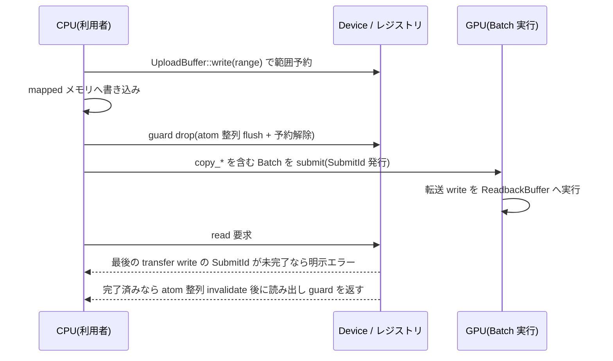

# upload / readback とデータ転送

- created: 2026-07-02
- updated: 2026-07-02
- status: ready for review
- implementation: not-started

## 解決したい問題

CPU から GPU へのデータ投入(upload)と、GPU の計算結果を CPU へ取り出す処理(readback)を、黙って壊れる経路なしに書けるようにする。

Vulkan のホスト可視メモリを素で扱うと、次の 3 種類の「黙って壊れる」罠が利用者コードに残る。

- **方向の取り違え**: upload 向けメモリ(write-combined)を CPU から読むと極端に遅く、readback 向けメモリ(cached)に置くべきデータを upload 側に置いても動いてしまうため、誤りが性能劣化としてしか現れない。
- **非コヒーレントメモリの flush / invalidate 漏れ**: `nonCoherentAtomSize` に整列した flush / invalidate を忘れると、古いデータや未確定のデータが読み書きされるが、コヒーレントな環境では動いてしまい、環境依存の再現困難なバグになる。
- **完了前の読み出し**: GPU の転送 write が完了する前に mapped メモリを読むと、古いデータが黙って返る。

この doc は、これらを「型と生成時の確定」「RAII による範囲予約」「submit 完了を条件とする明示的な読み出し契約」で、実行時の偶発ではなく API 契約として排除する設計を決める。

## 問題の背景

orvk はリソースを handle と論理レジストリで管理し([0002](0002_resource-ownership-and-registry.md))、転送コマンドを含む記録は TaskGraph / CommandEncoder で行い([0005](0005_task-graph-and-command-encoder.md))、実行は Batch 単位の submit と SubmitId による完了追跡で行う([0006](0006_device-and-execution-model.md))。
upload / readback はこの 3 つ(レジストリ・記録・実行)すべてに跨がる唯一の経路である。
CPU 側の mapped メモリ操作と GPU 側の転送コマンドが 1 つのデータフローを構成するため、どこか 1 箇所の契約が曖昧だと全体が壊れる。

利用シナリオも両端に広がる。
standalone(headless)の計算では「submit → 完了を待つ → 読む」というブロッキングな readback が自然である。
一方、レンダラーやアプリケーションのフレームループの内側では、readback の完了待ちでフレームを止められないので、完了をポーリングして揃ったフレームで読む非同期な使い方が要る。
どちらか一方に寄せた API は他方で歪むので、両方が同じ原始的契約の上に立つ形を最初から決めておく必要がある。

philosophy([docs/philosophy.md](../philosophy.md))の「silent trap を残さない」「正しさを後から補わない」を、この経路に適用するのが本 doc である。

## この文書では書かないこと

- 転送コマンドの記録語彙と静的検証の全体(copy 系コマンドのシグネチャ、記録時検証の規則)。[0005](0005_task-graph-and-command-encoder.md) が決める。この doc は upload / readback バッファがそれらのコマンドとどう接続するかだけを書く。
- access 宣言から barrier / ResourceTransition を導出する規則。[0004](0004_access-declaration-and-sync.md) が決める。
- BufferHandle の採番・世代・retire・slot 再利用の規則。[0002](0002_resource-ownership-and-registry.md) が決める。
- SubmitId / SubmitTracker の状態機械と wait / is_submit_complete の意味論。[0006](0006_device-and-execution-model.md) が決める。この doc はそれを読み出し契約の条件として使うだけである。
- swapchain 画像からの読み出し(スクリーンショット等)。swapchain 画像の usage と layout の制約は [0009](0009_surface-swapchain-present.md) の範囲であり、そこで TRANSFER_SRC が許可されていれば本 doc の copy_image_to_buffer がそのまま使える。
- 複数サブシステム間で readback 結果を受け渡す規則。cross-batch handoff([0010](0010_device-sharing-and-handoff.md))の範囲。

## やらないこと

- **row pitch の自動整形・フォーマット変換をやらない(この設計ではやらない。将来も helper 以上にはしない)。**
  copy_image_to_buffer が buffer に書くデータのレイアウト(row length / image height によるパディング、texel block 単位のサイズ)は Vulkan の転送セマンティクスそのままであり、orvk はこれを tight packing への詰め直しや別フォーマットへの変換をせずに公開する。
  自動整形は「バッファに入っているバイト列」と「GPU が書いたバイト列」の対応を隠し、変換コストを暗黙に足す。
  整形が欲しい利用者は完了後の CPU 側で自分のレイアウト要件に合わせて詰め直せばよく、それは orvk の外で完結する。
  将来足すとしても、raw な契約の上に載る明示的な helper であって、既定経路を変える形にはしない。
- **image→image blit をやらない(将来 N ヶ月は再検討しない)。**
  blit はフォーマット変換・スケーリングを伴う別種の操作であり、upload / readback のデータ転送契約とは検証規則も usage 要求も異なる。
  必要になった時点で、対応フォーマットの検証を含めて別の design doc で決める。
- **staging ring / uniform ring といった転送用アロケータの組み込みをやらない(この設計ではやらない)。**
  毎フレームの小さな upload を 1 つの大きな upload バッファから切り出すリングアロケータは有用だが、それは本 doc の upload バッファという原始的契約の上に利用者側または将来の helper として書ける。
  組み込むと「どの範囲がいつ再利用可能か」という寿命判断が orvk の内部に入り、submit 完了追跡と絡んだ暗黙の状態を増やす。
- **upload バッファへの転送以外の usage 付与をやらない(この設計ではやらない)。**
  ホスト可視バッファを vertex / index / uniform として GPU から直接読む構成は可能だが、upload バッファの契約を「CPU が書き、GPU は転送元としてだけ読む」に固定する方が、方向と usage の対応が単純になる。
  GPU が描画・計算で読むデータは device-local な通常バッファ([0002](0002_resource-ownership-and-registry.md))へ upload 転送で運ぶのが既定経路である。
  頻繁に書き換わる小さなデータでこの 1 hop が測定可能な問題になったら、そのとき usage 拡張を別 doc で再検討する。

## 概要

upload と readback を、生成時に方向とメモリ特性が確定する 2 つの専用型 `UploadBuffer` / `ReadbackBuffer` に分離する。
`UploadBuffer` は CpuToGpu(ホスト可視、write-combined)のメモリに置かれ、CPU からの書き込み API だけを持ち、GPU からは転送元(TRANSFER_SRC)としてだけ使える。
`ReadbackBuffer` は GpuToCpu(ホスト可視、cached)のメモリに置かれ、CPU からの読み出し API だけを持ち、GPU からは転送先(TRANSFER_DST)としてだけ使える。

mapped メモリへのアクセスは範囲予約の RAII guard 経由に限定する。
guard はレジストリに範囲を予約し、drop 時に非コヒーレント atom(`nonCoherentAtomSize`)へ整列した flush(書き込み側)を行い、読み出し側は取得時に整列した invalidate を行う。
flush / invalidate 漏れという罠を、利用者が呼び忘れられない構造で消す。

読み出しには明示的な完了条件を置く。
`ReadbackBuffer` の read は「そのバッファへの transfer write を含む最後の submit が完了していること」を条件とし、満たさない場合は古いデータを黙って返さず明示エラーを返す。
この非ブロッキングな read を唯一の原始契約とし、standalone では `wait(SubmitId)` してから read(ブロッキング)、ホスト側フレームワークのフレーム内では `is_submit_complete(SubmitId)` をポーリングして完了したフレームで read(非同期)、と文脈別の使い方を同じ契約の上に置く。

転送コマンドは [0005](0005_task-graph-and-command-encoder.md) の CommandEncoder に既にある copy_buffer / copy_buffer_to_image / copy_image_to_buffer をそのまま使う。
本 doc はそれらのコマンドに対する upload / readback バッファ側の usage 制約と、image を readback するときの TRANSFER_SRC usage / TransferSrc layout 要求を確定する。



(矢印はすべて「要求とその応答」を表す。)

## シナリオ / ユースケース

### standalone(headless)の compute 結果の取り出し

GPU で計算した結果をファイルに書き出すツールを考える。
フレームループが無いので、submit を待ってから読むブロッキングの形が自然である。

```rust
let upload = device.create_upload_buffer(size)?;      // UploadBuffer
let readback = device.create_readback_buffer(size)?;  // ReadbackBuffer

{
    let mut w = upload.write(0..input.len() as u64)?; // 範囲予約 + mapped 書き込み guard
    w.copy_from_slice(&input);
}                                                     // drop で atom 整列 flush

// TaskGraph に記録: upload → device-local buffer へ copy_buffer、
// compute dispatch、結果 buffer → readback へ copy_buffer。
// 各タスクは access 宣言(0004)で TransferRead / TransferWrite を宣言する。
let submit_id = device.submit(batch)?;

device.wait(submit_id)?;                              // ブロッキング(0006)
let r = readback.read(0..output_len)?;                // 完了済みなので成功。invalidate 済みスライス
std::fs::write("out.bin", &*r)?;
```

`wait` を忘れて `read` を呼ぶと、成功したふりをせず「SubmitId N が未完了」という明示エラーが返る。

### フレームループ内の非同期 readback(GPU picking 等)

レンダラーのフレーム内で、前のフレームで発行した picking 結果を読みたい。
フレームを止めないため、完了をポーリングし、揃っていたフレームでだけ読む。

```rust
// frame N: picking 結果を readback バッファ(リングの 1 枚)へ copy する Batch を submit
inflight.push((device.submit(batch)?, ring_index));

// frame N+k: 完了したものだけ読む
while let Some(&(submit_id, idx)) = inflight.front() {
    if !device.is_submit_complete(submit_id)? { break; } // 非ブロッキング(0006)
    let r = ring[idx].read(0..pick_size)?;               // 完了済みなので成功
    apply_pick_result(&*r);
    inflight.pop_front();
}
```

readback バッファを 2 枚以上のリングにするのは利用者の責務である(1 枚を使い回すと、次のフレームの write を submit する前に read 完了を待つ必要が生じ、パイプライン化が壊れる。「落とし穴」参照)。

### image の readback

image の内容を読むには、copy_image_to_buffer で `ReadbackBuffer` へ転送する。
対象 image は生成時 usage に TRANSFER_SRC を含み、そのタスクの access 宣言から TransferSrc layout への ResourceTransition が導出されている必要がある([0004](0004_access-declaration-and-sync.md))。
どちらを欠いても記録時の静的検証([0005](0005_task-graph-and-command-encoder.md))で明示エラーになる。

## 詳細設計

### 型分離: UploadBuffer と ReadbackBuffer

`Device` は通常のバッファ生成([0002](0002_resource-ownership-and-registry.md))とは別に、2 つの専用生成 API を持つ。

- `create_upload_buffer(size)` → `UploadBuffer`。メモリは CpuToGpu(ホスト可視。多くの実装で write-combined、非キャッシュ)。usage は TRANSFER_SRC 固定。
- `create_readback_buffer(size)` → `ReadbackBuffer`。メモリは GpuToCpu(ホスト可視、ホストキャッシュあり)。usage は TRANSFER_DST 固定。

どちらも内部的にはレジストリに登録された 1 つの `BufferHandle` を所有し、`handle()` でそれを公開する。
access 宣言と CommandEncoder の copy 系コマンドは、この `BufferHandle` を通常のバッファと同じ語彙で受け取る。
handle 空間・世代・retire の規則は通常バッファと共通で、特別扱いしない([0002](0002_resource-ownership-and-registry.md))。

型が保証するのは有効な操作の方向である。

- `UploadBuffer` は CPU 書き込み guard(後述)だけを持ち、mapped メモリを読む API を持たない。write-combined メモリの読み戻しという性能罠を、API の不在で塞ぐ。
- `ReadbackBuffer` は CPU 読み出し guard だけを持ち、mapped メモリへ書く API を持たない。
- GPU 側の方向は usage 固定(TRANSFER_SRC / TRANSFER_DST)で決まる。`ReadbackBuffer` の handle を転送元に使う、`UploadBuffer` の handle を転送先に使う、といった記録は [0005](0005_task-graph-and-command-encoder.md) の記録時検証(usage と宣言 access の整合)で明示エラーになる。

メモリ特性(write-combined か cached か)は生成時のメモリタイプ選択で確定し、実行後に変わらない。
「方向とメモリ特性が生成時に確定する」ことを型で表すのがこの分離の核である。

要求するメモリタイプが物理デバイスに存在しない場合(ホスト可視メモリが無い等)は、生成時に明示エラーを返す。
黙って別特性のメモリへ fallback しない。

### mapped 範囲予約の RAII guard

mapped メモリへのアクセスは必ず guard 経由で行う。

- `UploadBuffer::write(range) -> Result<MappedWriteGuard>`。指定バイト範囲をレジストリに予約し、その範囲への `&mut [u8]` 相当のアクセスを提供する。drop 時に範囲を `nonCoherentAtomSize` へ整列(バッファ末尾へクランプ)して flush し、予約を解除する。
- `ReadbackBuffer::read(range) -> Result<MappedReadGuard>`。読み出し契約(次節)を検査したうえで範囲をレジストリに予約し、範囲を atom 整列して invalidate してから `&[u8]` 相当のアクセスを提供する。drop 時に予約を解除する。

予約はレジストリのレコードであり、次の不変条件を検査可能にする。

- **同一バッファ上で交差する予約は同時に存在できない**(明示エラー)。交差しない範囲の guard は並行して持てる。
- **guard が生存する範囲と交差する access 宣言を含む Batch の submit は明示エラー。** CPU がまだ書いている upload 範囲を GPU が読む、GPU がこれから書く readback 範囲を CPU が読んでいる、というホスト・デバイス間レースを submit 時点の検査で止める。
- **guard が生存するバッファの retire は明示エラー**([0002](0002_resource-ownership-and-registry.md) の retire safety に予約検査を加える)。

flush / invalidate を guard の生成・drop に固定することで、「呼び忘れ」という利用者操作そのものを消す。
コヒーレントなメモリタイプが選ばれた場合、flush / invalidate は不要になるが、guard の構造は変えず内部で no-op にする(利用者コードはメモリタイプに依存しない)。

ホスト書き込みの GPU への可視性(HOST_WRITE → 転送 read)は、flush と submit 時の Vulkan の暗黙保証(queue submit はそれ以前のホスト書き込みを device に可視化する)で成立し、追加の barrier 宣言を利用者に要求しない。
GPU 書き込みのホストへの可視性は、次節の完了条件(fence / 完了追跡による device→host の可視化保証)と invalidate の組で成立する。

### 読み出し契約: 完了を条件とし、古いデータを黙って返さない

レジストリは `ReadbackBuffer` ごとに「そのバッファへの transfer write を含む最後の submit の SubmitId」を記録する(submit 時、Batch 内の access 宣言から transfer write 対象を特定して更新する)。

`ReadbackBuffer::read(range)` は次を検査する。

1. そのバッファへの完了済み transfer write が 1 度も無い(一度も書かれていない、または最後の write の submit が未完了)場合、明示エラー。エラーには未完了の SubmitId を含め、利用者が wait / ポーリングへ接続できるようにする。
2. 最後の transfer write を含む submit が Failed の場合も明示エラー(結果は不定なので読ませない)。
3. 完了済みなら invalidate して guard を返す。

条件を「最後の write の submit 完了」にするのは、複数回書かれたバッファで「古い write は完了、新しい write は未完了」の瞬間に読むと新旧の混ざったデータが返り得るからである。
部分的に確定したデータを返す中間状態を契約に持ち込まず、「最後に記録された write まで全部確定しているか、エラーか」の二値にする。

read はブロッキングしない。
これが唯一の原始契約であり、文脈別の使い方はこの上に組む。

- **standalone(ブロッキング)**: `device.wait(submit_id)` してから read。wait は [0006](0006_device-and-execution-model.md) の契約そのままで、readback 専用の待機 API は足さない。
- **フレーム内(非同期)**: `device.is_submit_complete(submit_id)` をポーリングし、完了を確認してから read。read 自体は完了検査を再度行うので、ポーリングを飛ばして read してもレースにはならず、エラーが返るだけである。

暗黙に wait する read を提供しないのは、フレームループ内で「たまたま未完了だったフレームだけ数 ms 止まる」という発見困難な性能罠を作らないためである(「代替案」参照)。

### 転送コマンドとの接続

転送コマンドの語彙は [0005](0005_task-graph-and-command-encoder.md) の CommandEncoder が持つ copy_buffer / copy_buffer_to_image / copy_image_to_buffer であり、本 doc は新しいコマンドを足さない。
本 doc が確定するのは端点側の契約である。

- **upload 経路**: `UploadBuffer` の handle を転送元とする copy_buffer(→ device-local buffer)/ copy_buffer_to_image(→ image)。転送先 image は TRANSFER_DST usage と、access 宣言から導出される TransferDst layout が要る([0004](0004_access-declaration-and-sync.md))。
- **readback 経路**: `ReadbackBuffer` の handle を転送先とする copy_buffer(device-local buffer →)/ copy_image_to_buffer(image →)。**転送元 image は生成時 usage に TRANSFER_SRC を含むこと、そのタスクで TransferSrc layout への遷移が宣言されていることを要求する。** 欠けていれば記録時の静的検証で明示エラー。
- copy_image_to_buffer の buffer 側レイアウト(row length / image height、texel block サイズ)は Vulkan の転送セマンティクスをそのまま公開し、orvk は詰め直しをしない(「やらないこと」)。バッファに何バイト書かれるかの計算は利用者の責務であり、read する範囲もそれに合わせて利用者が決める。

タスクの access 宣言はどちらの経路でも通常どおり要求される(転送元に TransferRead、転送先に TransferWrite)。
upload / readback バッファだから宣言を省略できる、という特例は作らない。
同期の判断点を access 宣言の一本に保つためである([docs/philosophy.md](../philosophy.md))。

## 落とし穴

- **readback バッファ 1 枚の使い回しはパイプライン化を壊す。** frame N の write を含む submit が未完了のうちは frame N+1 の write を含む Batch を submit できない(read guard と write の交差検査、および読む前に完了が要る契約のため、実質的に毎フレーム wait になる)。フレームごとの readback は 2 枚以上のリングにするのが前提であり、orvk はリングを組み込まない(「やらないこと」)。この制約は仕様として受け入れる。
- **raw escape hatch([0011](0011_raw-escape-hatch.md))を使うと型の保護は消える。** raw の mapped pointer を取れば `UploadBuffer` の読み戻し(write-combined の性能罠)も、予約を通らない書き込みも可能になる。escape hatch の一般則どおり、使った瞬間に整合の責務は利用者へ移る。
- **atom 整列により flush / invalidate は予約範囲より広くなる。** `nonCoherentAtomSize`(例: 64B)整列のため、隣接する予約と同じ atom を共有する端のバイトも flush / invalidate される。flush / invalidate は可視化操作でありデータを書き換えないので正しさは壊れないが、「予約したバイトだけが対象」という直感は成り立たない。交差しない予約を並行に使う設計は正しく動くが、atom 境界をまたぐ細切れの並行予約は無駄な可視化コストを生む。
- **copy_image_to_buffer のバイトレイアウトは tight packing とは限らない。** row length を 0(extent 幅で tight)にしても、texel block サイズやフォーマットにより「幅 × 高さ × 4」のような素朴な計算とはずれることがある(block-compressed format 等)。orvk は整形しないので、read 範囲の計算違いは「短く読んで途中で切れる」「余分に読んで未転送領域(前回の内容または不定値)を含む」として現れる。範囲自体はバッファ境界内なら正当なので、この取り違えは orvk では検出できず利用者の責務である。
- **read 成功後に同じバッファへ新しい write を submit すると、次の read の条件はその新しい SubmitId に進む。** 保持し続けた古い guard は drop まで有効(交差 submit は予約検査で止まる)だが、guard を drop して読み直すと条件が変わっている。「一度読めたから以後いつでも読める」わけではない。
- **完了検査の粒度は submit であり、転送コマンド単体ではない。** 同じ submit に readback 転送と重い描画が同居していると、転送自体が終わっていても submit 全体の完了まで read できない。早く読みたい readback は独立した Batch に切り出すのは利用者の設計判断である。

## 代替案

- **単一のバッファ型で方向を実行時フラグにする案。** `create_buffer` に `direction: Upload | Readback` のようなフラグを渡し、1 つの型が write / read 両方の API を持ち、実行時にフラグと突き合わせて検査する。
  - Pros: 型が 1 つ減り、生成 API も 1 本になる。ジェネリックなコード(任意のホスト可視バッファを扱う utility 等)が書きやすい。
  - Cons: 方向違反(readback バッファへの write 等)がコンパイル時でなく実行時エラーになる。write-combined メモリの読み戻しのような「動くが遅い」罠は実行時検査でも塞ぎにくく、read API が型に生えている以上フラグ検査を通れば呼べてしまう。生成時に確定している情報(方向・メモリ特性)を実行時の分岐に戻すのは、確定した事実を型で表すという方針に反する。
  - 方向は生成後に変わらない静的な事実なので、静的に(型で)表す方が simple である。よって採らない。
- **read が未完了時に暗黙に wait する案。** `read` を「未完了なら完了までブロックして必ず成功する」契約にする。
  - Pros: standalone の典型コードが `wait` の 1 行分短くなり、「wait を忘れてエラー」という手戻りが消える。
  - Cons: フレームループ内で使うと、未完了のフレームだけ数 ms 止まる不定期な spike になり、プロファイルしないと気づけない。ブロックするかどうかが呼び出し時点のレースで決まる API は、性能特性を静的に読めなくする。非同期契約(ポーリング)を別 API として並置すると、今度は 2 つの read の使い分けという新しい取り違えが生まれる。
  - 明示エラーを返す非ブロッキング read を唯一の原始契約にし、ブロッキングは `wait` + read の合成で表す方が、止まる場所がコード上に見える。よって採らない。
- **guard を介さず mapped pointer を直接公開し、flush / invalidate を明示 API にする案。** `buffer.mapped_ptr()` と `buffer.flush(range)` / `buffer.invalidate(range)` を素の Vulkan と同じ粒度で公開する。
  - Pros: 最薄のラッパーで、Vulkan を知る利用者には振る舞いが完全に透明。guard のライフタイムに縛られない柔軟なアクセスパターンが書ける。
  - Cons: flush / invalidate の呼び忘れ・整列間違いという、この doc が消したい罠がそのまま残る。ホスト・デバイス間レース(GPU が書いている範囲を CPU が読む)を検査する足場(範囲予約)が無く、submit 時の交差検査ができない。
  - 素の柔軟性が要る利用者には raw escape hatch([0011](0011_raw-escape-hatch.md))が既にあり、安全な既定経路をこの形にする理由が無い。よって採らない。
- **readback 専用の完了待ち API(`readback.wait_and_read()` 等)を足す案。** submit の完了追跡とは別に、readback バッファ自身が「自分への write の完了」を待てる口を持つ。
  - Pros: 利用者が SubmitId を持ち回らなくてよい。
  - Cons: 完了観測の入口が SubmitId 系(wait / is_submit_complete)と readback 系の 2 本になり、同じ事実の観測経路が分裂する。read のエラーが未完了の SubmitId を返すので、SubmitId 系への接続は既に足りている。
  - 完了観測は [0006](0006_device-and-execution-model.md) の一本に保つ。よって採らない。

## セキュリティ・プライバシー

この設計は外部入力・機微データを扱わず、新たな信頼境界を作らないため、新たな検討は不要である。
mapped メモリへのアクセスは guard の範囲検査でバッファ境界内に限定され、範囲外アクセスの口を増やさない。
未転送領域の読み出しがプロセス外のデータを漏らすことはない(バッファは生成時にこのプロセスのために確保されたメモリである)。

## 負荷・コスト

- **範囲予約のレジストリレコード**: guard の生成・drop ごとにレジストリへの予約の追加・削除が 1 件。submit 時の交差検査は「その Batch が触る upload / readback バッファの access 宣言数 × 当該バッファの生存予約数」に比例する。予約は guard の生存中しか存在せず、典型的な利用(書いてすぐ drop、読んですぐ drop)では submit 時点の予約数は 0 に近い。
- **read の完了検査**: SubmitTracker の状態参照 1 回(O(1)、[0006](0006_device-and-execution-model.md))とレジストリの SubmitId 記録の参照 1 回。read ごとの固定コストで、バッファサイズに依存しない。
- **flush / invalidate**: 範囲サイズに比例する可視化コスト。atom 整列による増分は範囲の両端で最大 `nonCoherentAtomSize - 1` バイトずつであり、転送データ量に対して定数。コヒーレントメモリでは no-op。
- **hot path への影響**: upload / readback を使わない Batch の記録・submit にこの設計が足すコストは、submit 時の交差検査の対象抽出(access 宣言の走査に相乗り)だけであり、専用の per-frame 仕事を増やさない。
- **メモリ**: upload / readback バッファは利用者が明示的に生成した分だけ存在する。orvk が暗黙に staging メモリを確保することはない(「やらないこと」のリングアロケータ不採用の帰結)。
