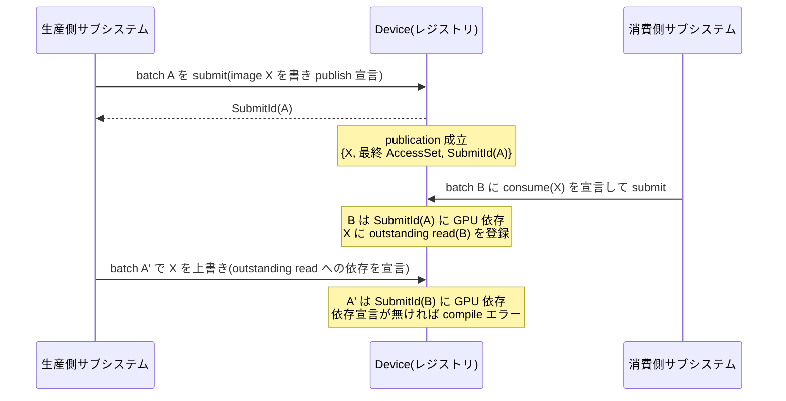

# Device 共有と cross-batch handoff

- created: 2026-07-02
- updated: 2026-07-02
- status: ready for review
- implementation: not-started

## 解決したい問題

単一プロセス内の複数サブシステム(例: アプリケーションの GUI 層と 3D レンダラー)が 1 つの Device を共有し、あるサブシステムが GPU で生成した image を別のサブシステムの batch が CPU ブロックなしに安全に読めるようにする。
この文書は、その共有の契約(何を共有し、誰が何に責任を持つか)と、batch をまたぐ受け渡し(cross-batch handoff)の語彙・データ契約・安全性の担保を決める。
これが決まると、サブシステムごとに Vulkan instance やレジストリを別々に持つ必要がなくなり、受け渡しのたびに CPU で完了を待つストールも発生しなくなる。

## 問題の背景

orvk の実行モデルは Batch 単位の submit である([0006_device-and-execution-model.md](0006_device-and-execution-model.md))。
同期(barrier・レイアウト遷移)は TaskGraph への access 宣言から導出されるが([0004_access-declaration-and-sync.md](0004_access-declaration-and-sync.md))、その導出が及ぶ範囲は 1 つの batch の内側に閉じている。
一方、現実の利用シナリオでは、レンダラーが offscreen image に描いた結果を GUI 層が自分の batch でテクスチャとしてサンプリングする、というように **batch の境界をまたいでリソースが受け渡される**。
このとき次の 3 つのハザードが batch 内の同期導出では扱えない。

- **read-after-write**: 消費側の読み取りが、生産側の書き込みの GPU 完了より先に走ってはいけない。
- **write-after-read**: 生産側が次の内容を書くとき、消費側の読み取りが終わっていない image を上書きしてはいけない。
- **寿命**: 消費側がまだ読んでいる image を生産側が retire し、slot が再利用されてはいけない。

リソースの handle 空間と論理レジストリは Device が単一所有する([0002_resource-ownership-and-registry.md](0002_resource-ownership-and-registry.md))。
つまり「どの handle がどの実体を指し、いつ retire してよいか」を知っているのは Device だけであり、batch をまたぐ受け渡しの安全性を判定できる場所も Device しかない。
この文書は、その判定に必要な情報を利用者がどう宣言し、Device が何をどこまで検査するかを契約として固定する。

## この文書では書かないこと

- handle の採番・世代管理・retire の一般規則。[0002_resource-ownership-and-registry.md](0002_resource-ownership-and-registry.md) が決める。本文書はそこに consume read 由来の retire 遅延条件を 1 つ追加するだけである。
- access 宣言と batch 内の barrier 導出の規則。[0004_access-declaration-and-sync.md](0004_access-declaration-and-sync.md) が決める。
- TaskGraph・CommandEncoder の記録 API。[0005_task-graph-and-command-encoder.md](0005_task-graph-and-command-encoder.md) が決める。
- SubmitId・SubmitTracker・queue submit の実装(semaphore の種別を含む GPU 依存の実現手段)。[0006_device-and-execution-model.md](0006_device-and-execution-model.md) が決める。本文書は「SubmitId への GPU 依存を batch に宣言できる」ことだけを前提にする。
- descriptor heap の slot 割当と容量管理の機構。[0003_bindless-descriptor-heap.md](0003_bindless-descriptor-heap.md) が決める。本文書では共有時の容量競合を落とし穴として扱うにとどめる。
- swapchain image の受け渡し。present は [0009_surface-swapchain-present.md](0009_surface-swapchain-present.md) の acquire/present 契約に従い、本文書の publish/consume の対象外である。

## やらないこと

- **buffer の handoff**。この設計では publish/consume の対象を image(ImageHandle)に限る。実利用シナリオで batch をまたぐ受け渡しが要求されているのは描画結果の image であり、buffer の受け渡しが必要になった時点で同じ publication 語彙を拡張する(契約の形は同じになる見込みで、永続的な禁止ではない)。
- **リングの自動管理**。生産と消費を独立に進めるためのリング(2 枚以上の image の交互利用)は生産側サブシステムが自前で用意する。ライブラリがリングを隠蔽する helper は、この契約が実利用で安定するまで作らない(simple な契約の上に easy を後から足す方針。docs/philosophy.md)。
- **複数 queue 間の ownership transfer**。Device は現状単一 queue である([0006_device-and-execution-model.md](0006_device-and-execution-model.md))。publish/consume の契約は SubmitId への GPU 依存として queue 数に依存しない形で定義するが、queue family ownership transfer が必要になる複数 queue 対応はこの設計ではやらない。
- **heap 容量のサブシステム間仲裁(quota・priority)**。容量は DeviceConfig の総量指定と明示エラー(枯渇時)だけで扱い、サブシステムごとの割当量予約や優先度制御は入れない。実際に競合が問題化するまで機構を足さない。

## 用語集

- **publish**: 生産側が「この image はこの状態で書き終わっており、この submit の完了後に他の batch から読める」と Device のレジストリに登録する宣言。
- **publication**: publish によりレジストリに作られるレコード。ImageHandle・最終 AccessSet・書いた SubmitId の 3 つ組。
- **consume**: 消費側 batch が「この publication を読む」と宣言すること。publication の SubmitId への GPU 依存と、読み取りの追跡登録を伴う。
- **outstanding read**: consume されたがまだ GPU 完了していない読み取り。publication ごとに Device が追跡する。

## 概要

複数サブシステムは `Arc<Device>` を共有し、handle・レジストリ・descriptor heap・queue は全サブシステムで単一である(1 Device = 1 handle 空間)。
batch をまたぐ image の受け渡しは publish / consume の 2 宣言で行う。

- 生産側は batch 内で image を書き終えたら **publish** を宣言する。submit 時に「ImageHandle + 最終 AccessSet + 書いた SubmitId」が publication としてレジストリに成立する。
- 消費側は自分の batch に **consume** を宣言する。consume は publication の SubmitId への GPU 依存(semaphore 待ち)を batch に付与し、CPU をブロックせずに read-after-write を保証する。読み取りの access は publication の最終 AccessSet の状態のまま行う。
- Device は consume を **outstanding read** として追跡する。生産側が同じ image を上書きする batch は、outstanding read への GPU 依存を宣言してから書く(write-after-read)。宣言せずに上書きする batch は compile 時に明示エラーになる。
- publish 済み image の retire は、outstanding read の SubmitId がすべて terminal になるまで自動的に遅延する(寿命)。

生産と消費が互いを待たずに独立進行するには、生産側が 2 枚以上の image をリングとして交互に publish する。
この契約により、同期の判断点は「レジストリ + access 宣言」という一本の経路に集約されたまま、batch 境界という新しい入口が増える(docs/philosophy.md「状態の経路を一本化する」)。



(矢印はすべて「CPU 上の API 呼び出しとその結果」を表す。GPU 依存は Note に記した。)

## シナリオ / ユースケース

アプリケーションが GUI 層と 3D レンダラーの 2 サブシステムを持ち、GUI 内のビューに 3D レンダリング結果を表示する場合を追う。

1. アプリケーションが `Device::new(DeviceConfig)` で Device を 1 つ作り、`Arc<Device>` を両サブシステムに注入する。DeviceConfig の descriptor heap 容量は、両者の需要の合算を見込んでアプリケーションが指定する([0006_device-and-execution-model.md](0006_device-and-execution-model.md))。
2. レンダラーは表示用の offscreen image を 2 枚(リング)作り、それぞれの DescriptorRef を登録して DescriptorHandle を得る([0003_bindless-descriptor-heap.md](0003_bindless-descriptor-heap.md))。
3. レンダラーは毎フレーム、リングの次の image に描く batch を組む。このとき前々回にその image を publish していれば、その publication の outstanding read への依存を宣言してから書く。batch の最後で image を shader read 用の状態にし、publish を宣言して submit する。
4. GUI 層は自分の batch に consume を宣言する。consume はその時点で成立している最新の publication を対象にし、レンダラーの SubmitId への GPU 依存が batch に付く。GUI 層はレンダラーが何をどう描いたかを知る必要がなく、publication に記録された最終 AccessSet だけを前提に、DescriptorHandle 経由でサンプリングする。
5. GUI 層の batch が submit されると、その読み取りは outstanding read として追跡され、GPU 完了(SubmitId が terminal)とともに解消される。レンダラーが誤って依存宣言なしにその image を上書きしようとすれば、batch compile が明示エラーを返す。

GUI 層とレンダラーのフレームレートが異なっても(例: GUI は入力イベント駆動、レンダラーは連続描画)、リングが 2 枚あればレンダラーは GUI 層の読み取り完了を CPU で待たずに次のフレームを書ける。

## 詳細設計

各サブセクションの内容は次のとおり。

1. 共有の契約 — `Arc<Device>` と 1 handle 空間、サブシステムという概念を API に出さないこと。
2. publication のデータ契約 — publish の宣言時期と成立時期、レコードの中身。
3. consume の意味論 — GPU 依存、読み取り状態の固定、outstanding read の登録。
4. write-after-read と retire — 上書きの依存宣言、寿命の自動遅延。
5. 検知できる宣言漏れと検知の限界。

### 共有の契約: `Arc<Device>` と 1 handle 空間

Device は `Send + Sync` であり、リソース生成・batch の構築・submit・完了観測のすべてを `&self` で受ける。
複数サブシステムでの共有は `Arc<Device>` のクローンを各サブシステムのコンストラクタに注入する形を標準とする。
Device の生成と DeviceConfig の決定(heap 容量、present 用途の有無)はサブシステムではなく、それらを束ねるアプリケーションの責務である。

handle 空間は Device ごとに 1 つであり、どのサブシステムが作った BufferHandle / ImageHandle / ImageViewHandle / SamplerHandle も、同じ Device 上の他サブシステムでそのまま有効である。
DescriptorHandle も同一の resource heap / sampler heap を指すので、あるサブシステムが登録した descriptor を別のサブシステムのシェーダがそのまま参照できる。
これが handoff を「handle と publication レコードを渡すだけ」で成立させる基盤であり、翻訳層やコピーを不要にする。

Device の API に「サブシステム」という概念は出さない。
Device が見るのは batch と handle だけであり、どの batch がどのサブシステムに属するかを Device は知らないし、知る必要がない。
サブシステム間の分離は publish/consume という宣言の規律で表現し、識別子の登録・名前空間の分割といった機構を足さない。
この決定の帰結(規律に乗らない共有は検知できない)は「検知できる宣言漏れと検知の限界」で述べる。

### publication のデータ契約

publish は生産側の batch 構築時に TaskGraph へ宣言する。
宣言に必要なのは ImageHandle と、その batch 内での最終 AccessSet(レイアウトとアクセス種別)である。
最終 AccessSet は「他の batch がこの状態のまま読める」ことを生産側が約束する状態であり、通常は shader read 用の状態を指定する。
batch 内の access 宣言との整合(publish に指定した状態が batch 終了時の実際の状態と一致すること)は batch compile 時に検証され、不一致は明示エラーになる。

publication レコードは submit 時にレジストリに成立する。
中身は次の 3 つ組である。

```text
publication = {
    image:      ImageHandle,        // 世代付き。retire 済み handle の publish はエラー
    state:      AccessSet,          // 生産側が約束する最終状態(この状態のまま読む)
    submitted:  SubmitId,           // この submit の完了後に読める
}
```

宣言時ではなく submit 時に成立とするのは、SubmitId が submit で確定するためである。
consume が参照できるのは成立済みの publication だけであり、宣言されたが submit されていない publication への consume は明示エラーになる(黙って待たない。silent trap を残さない)。

同じ ImageHandle への publish は、新しい publication が古い publication を置換する(1 image につき有効な publication は高々 1 つ)。
置換後、古い publication への新規 consume はできないが、置換前に登録された outstanding read の追跡は解消されるまで残る。

### consume の意味論

consume は消費側の batch 構築時に TaskGraph へ宣言する。
consume の宣言は、その時点で成立している対象 image の publication を snapshot し、batch に次の 3 つを与える。

- **GPU 依存**: publication の SubmitId が GPU 上で完了してから、この batch の該当読み取りが実行される依存。CPU はブロックしない。依存の実現手段(semaphore の種別)は [0006_device-and-execution-model.md](0006_device-and-execution-model.md) の submit 実装に委ね、本契約は「SubmitId への GPU 依存」という意味論だけを固定する。現状の単一 queue では submit 順序と barrier に退化しうるが、契約はこの形のまま複数 queue に耐える。
- **読み取り状態の固定**: consume した image への access は publication の `state` のまま行う。消費側 batch がこの image のレイアウトを遷移させる access を宣言すると compile エラーになる。
- **outstanding read の登録**: submit 時に、この batch の SubmitId が publication の outstanding read としてレジストリに登録される。

読み取り状態を固定するのは、image の batch 間状態の書き手を生産側だけに限定するためである。
消費側がレイアウトを遷移させられると、image の現在状態の出所が「最後に publish した生産側」と「最後に consume した消費側」の 2 つに分裂し、生産側は次の書き込みの遷移元を確定できなくなる。
状態の出所を publication 1 点に固定すれば、生産側は自分が publish した状態からの遷移だけを考えればよく、消費側が何をしたかに依存しない。
これは同期判断の単一出所を守る design 判断であり(docs/philosophy.md)、消費側が別レイアウトを必要とする場合の扱いは「落とし穴」で述べる。

consume は複数の batch から同じ publication に対して行ってよい(多消費者)。
outstanding read は publication ごとの集合として追跡される。

### write-after-read と retire

生産側が publish 済みの image を上書きする batch を組むときは、その publication の outstanding read への依存宣言を TaskGraph に置いてから書き込み access を宣言する。
依存宣言は、宣言時点および submit 時点の outstanding read の SubmitId 群への GPU 依存として batch に付く。
これも CPU をブロックしない。

依存宣言を要求するのは、Device が自動で依存を挿入できないからではなく(レジストリは outstanding read を知っているので技術的には可能)、**暗黙の GPU 待ちを API から見えない場所に作らないため**である。
上書きが読み取り完了待ちで遅れることは生産側の性能特性そのものであり、それがコード上のどの宣言に由来するかが読めなければならない。
自動挿入は easy だが、待ちの発生箇所を隠す(simple over easy)。
代わりに、宣言せずに上書きした場合を silent trap にしない。レジストリは publication と outstanding read を知っているので、依存宣言なしの上書き write を batch compile 時に検出し、明示エラーを返す。

retire の安全条件には consume 由来の条件を追加する。
publish 済み image の retire は、[0002_resource-ownership-and-registry.md](0002_resource-ownership-and-registry.md) の遅延 retire の terminal 判定に加え、**その image の全 outstanding read の SubmitId が terminal になるまで**遅延する。
利用者が retire を呼ぶこと自体は失敗しない(遅延されるだけ)であり、slot の再利用(reclaim)がこの条件を満たすまで起きないことをレジストリが保証する。
retire は同時に publication を無効化し、以後の新規 consume は世代不一致として明示エラーになる。

### 検知できる宣言漏れと検知の限界

レジストリが publication と outstanding read を持つことで、次の誤りはすべて明示エラーとして検知できる(いずれも batch compile 時または宣言時)。

| 誤り | 検知点 |
|---|---|
| publish されていない image への consume | consume 宣言時 |
| 宣言済みだが未 submit の publication への consume | consume 宣言時 |
| retire 済み・世代不一致の handle への publish / consume | 宣言時(世代照合) |
| publish 宣言の状態と batch 終端の実状態の不一致 | 生産側 batch compile 時 |
| consume した image のレイアウトを遷移させる access | 消費側 batch compile 時 |
| outstanding read への依存宣言なしの上書き write | 生産側 batch compile 時 |
| 有効な publication を持つ image への、consume を経ない read access(publish した生産側の batch を除く) | batch compile 時 |

一方、次は原理的に検知できない。契約の限界として明示する。

- **publish/consume の規律に一切乗らない共有**。Device はサブシステムを識別しないので、publish されていない image の handle をサブシステム間で受け渡して読んでも、Device にはあるコードが自分の image を再利用しているのと区別がつかない。この場合の batch 間ハザードは利用者の責任である(規律に乗れば上の表の検知がすべて効く、というのがこの契約の提供価値である)。
- **raw escape hatch を経由するアクセス**。raw handle でのコマンド挿入はレジストリの追跡外であり、publish/consume の検査は及ばない([0011_raw-escape-hatch.md](0011_raw-escape-hatch.md) の責務移転の一般則に従う)。
- **DescriptorHandle の直接読み**。bindless heap は Device 全体で単一なので、シェーダが有効な DescriptorHandle を持っていれば consume を宣言していない batch からも物理的には読めてしまう。CommandEncoder の記録時検証は push data に積まれた DescriptorHandle と access 宣言の整合を検査できるが([0005_task-graph-and-command-encoder.md](0005_task-graph-and-command-encoder.md))、buffer 経由でシェーダに渡る handle までは追えない。

## 落とし穴

- **リング 1 枚では生産が消費に律速される**。publish/consume の契約自体は image 1 枚でも正しく動く(上書き前に outstanding read への依存が強制される)が、その依存はまさに「生産の GPU 実行が消費の GPU 完了を待つ」直列化である。消費側のフレームレートが低いと生産側がそれに引きずられる。独立進行が要る場合、生産側は 2 枚以上のリングを用意する必要があり、これは契約が自動では救わない設計責務である。逆に「最新の 1 枚だけ見えればよく、生産が待ってもよい」用途では 1 枚で正しい。
- **消費側は publication の状態のままでしか読めない**。生産側が shader read 状態で publish した image を、消費側が別レイアウトを要する access(たとえば storage 書き込み用の汎用レイアウト)で使うことはできない(compile エラー)。必要なら、消費側が自分の image へコピー([0005_task-graph-and-command-encoder.md](0005_task-graph-and-command-encoder.md) の copy コマンド)してから使うか、生産側に publish 状態の変更を依頼する。API 間の調整をライブラリは肩代わりしない。
- **descriptor heap 容量はサブシステム間で共有の競合資源になる**。heap 容量は Device 生成時に DeviceConfig で総量指定され([0006_device-and-execution-model.md](0006_device-and-execution-model.md))、あるサブシステムの大量確保が別サブシステムの slot 枯渇として現れる。枯渇は明示エラーになるが、エラーを受けたサブシステムには他者の使用量は見えない。アプリケーションは Device 生成時に各サブシステムの必要量(記録なしの capacity 見積もり)を合算して容量を決める必要がある。
- **多消費者の outstanding read は最も遅い消費者まで残る**。複数 batch が同じ publication を consume すると、生産側の上書きは全読み取りの完了に依存する。1 つでも遅い消費者がいると、リング枚数を増やさない限り生産側がそこに律速される。
- **publication の置換は競合を防がない**。生産側が publish を置換した直後に消費側が consume すると、消費側は常に「その時点で成立している最新」を snapshot する。フレーム番号の一致など「どの版を読むか」の調停が要るアプリケーションは、publication の上に自前のプロトコル(たとえば版番号を CPU 側で受け渡す)を重ねる必要がある。orvk が保証するのは版の同一性ではなく、snapshot した版の同期と寿命の安全である。

## 代替案

- **external memory による別 instance / 別 Device 間の共有**。サブシステムごとに独立の Device(または Vulkan instance)を持たせ、`VK_KHR_external_memory` 系拡張で image のメモリを export/import し、external semaphore で同期する案。
  - Pros: サブシステム間の隔離が物理的に強い(handle 空間・heap・queue が完全に別)。別プロセス共有と同じ機構に乗るので、将来プロセス間共有が必要になれば地続きである。
  - Cons: 受け渡しごとに export/import・external semaphore・queue family ownership transfer の手続きが要り、handle とレジストリによる一貫管理がサブシステム境界で切れる。レジストリが同期と寿命を検査できる範囲も Device 単位に縮み、境界をまたぐハザードはすべて利用者責任に戻る。ドライバごとの external memory 対応差にも晒される。
  - 見送り理由: 解きたい問題は単一プロセス内の共有であり、そこでは 1 Device = 1 handle 空間 = 1 レジストリの方が、検査可能性・API の単純さ・受け渡しコスト(ゼロコピー・手続きなし)のすべてで勝る。プロセス間共有は非目標である([0001_goals-and-non-goals.md](0001_goals-and-non-goals.md))。
- **サブシステムごとのレジストリ分離**。Device は 1 つのまま、handle 空間とレジストリをサブシステムごとに分け、handoff 時に「他レジストリの handle の import」を行う案。
  - Pros: あるサブシステムの handle 誤用(他者のリソースへの意図しない access)をレジストリの境界で検出できる。レジストリごとの使用量が見えるので heap 容量の帰属も明確になる。
  - Cons: handle が「どのレジストリのものか」という文脈を持ち、受け渡しに import/export の翻訳層が要る。descriptor heap は物理的に単一なので、レジストリを分けても slot 空間の分割か二重管理が必要になり、bindless の「1 つの heap を全シェーダが同じ index で見る」単純さが壊れる。retire の安全判定もレジストリをまたぐ参照の追跡が必要になり、結局グローバルな追跡が復活する。
  - 見送り理由: 分離が防げる誤用より、分離が持ち込む概念(レジストリの帰属・import・slot 空間の対応)の絡み合いが大きい。1 handle 空間を保ち、共有の規律は publish/consume という宣言で表す方が simple である(docs/philosophy.md)。
- **handoff を作らず、全サブシステムの仕事を単一 batch に統合する**。フレームごとにアプリケーションが 1 つの TaskGraph を組み、全サブシステムがそこへタスクを記録する案。batch 内なので同期はすべて access 宣言から自動導出され、publish/consume の語彙自体が不要になる。
  - Pros: batch 間ハザードが存在しなくなり、この文書の契約(publication・outstanding read・リング)が丸ごと要らない。同期の検査可能範囲も batch 内検証だけで完結する。
  - Cons: 全サブシステムが記録のタイミングと頻度を 1 つの batch 構築に同期させられる。GUI 層(イベント駆動・低頻度)とレンダラー(連続描画)のように submit の周期が異なるサブシステムを束ねられず、一方の記録が終わるまで他方の submit ができない。サブシステムの記録失敗が batch 全体を巻き込み、障害の分離もできない。
  - 見送り理由: 「複数サブシステムが独立に進行しながら 1 Device を共有する」という要件そのものを満たせない。単一 batch に収まる用途では今でもそう書けばよく(handoff は強制ではない)、この案を既定にする理由がない。
- **消費側が CPU で完了を待ってから submit する**。GPU 依存の代わりに、消費側が `wait(SubmitId)` でブロックしてから自分の batch を submit する案。
  - Pros: 新しい語彙が不要で、既存の wait / is_submit_complete([0006_device-and-execution-model.md](0006_device-and-execution-model.md))だけで read-after-write は満たせる。
  - Cons: 消費側スレッドが生産側の GPU 完了までブロックし、CPU と GPU のパイプライン化が壊れる。write-after-read と retire 寿命は依然としてどこにも担保されず、結局追跡機構が要る。
  - 見送り理由: read-after-write しか解けないうえ、CPU ブロックという性能上の恒久コストを既定にしてしまう。GPU 依存で表せる待ちを CPU に持ち込まない。

## セキュリティ・プライバシー

この設計は単一プロセス内の共有だけを扱い、プロセス外部からの入力・機微データを扱わないため、新たな攻撃面の検討は不要である。
ただし信頼境界について 1 点明示する: bindless heap は Device 全体で単一なので、サブシステム間に隔離はなく、有効な DescriptorHandle を得たシェーダはどのサブシステムのリソースでも物理的に読める。
publish/consume は正しさ(同期・寿命)の契約であって、アクセス制御の機構ではない。
同一プロセス内のコードは相互に信頼されているというのが本設計の信頼モデルであり、相互不信のコード間の隔離が要る用途は本設計の対象外である。

## 負荷・コスト

- **publication のレジストリコスト**: publish 1 回につきレコード 1 つ(handle・AccessSet・SubmitId の固定サイズ)。有効な publication は image ごとに高々 1 つなので、メモリは publish 中の image 数に比例する。
- **consume のコスト**: consume 1 宣言につき、GPU 依存 1 つ(同じ SubmitId への依存は batch 内で重複排除できる)と outstanding read 登録 1 つ。batch compile 時の検査(表の各項目)は handle をキーにしたレジストリ照会であり、batch 内の宣言数に対して線形。コマンド記録の hot path(vkCmd* 呼び出し)には何も足さない。
- **outstanding read の追跡**: publication ごとの SubmitId 集合。解消は SubmitTracker の terminal 遷移に相乗りし、submit ごとの追加仕事は自分が読んだ publication 数に比例する。
- **GPU 側**: consume の GPU 依存は semaphore 待ち相当が batch submit ごとに高々(依存する生産側 submit 数)個。フレームごとの handoff が 1〜2 本という典型シナリオでは submit あたり 1〜2 個であり、submit 自体のコストに埋もれる規模である。
- **メモリの実コストはリング**: 独立進行のためのリングは image メモリを枚数分倍加させ、descriptor slot も枚数分消費する。これは契約のコストではなく利用者の設計選択だが、この設計が誘導するコストとしてここに明示する。
