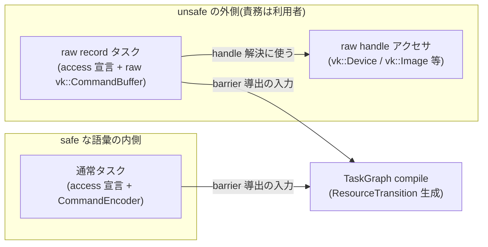

# raw Vulkan への escape hatch

- created: 2026-07-02
- updated: 2026-07-02
- status: ready for review
- implementation: not-started

## 解決したい問題

orvk の記録語彙(タスクグラフ + CommandEncoder のコマンド集合)に無い Vulkan 機能を、利用者がライブラリを fork せずに使えるようにする。
記録語彙は意図的に小さく保つ([0005](0005_task-graph-and-command-encoder.md))ため、ray tracing・query・vendor 拡張のような機能は語彙の外に必ず残る。
語彙の外へ出る口が無いと、利用者は「その機能を諦める」か「orvk を捨てて raw Vulkan に戻る」の二択になり、ライブラリとして成立しない。
本 doc は、raw Vulkan handle への unsafe アクセサと、タスクグラフへの raw コマンド記録挿入口、そしてそれらを使った瞬間に利用者へ移る責務の契約を決める。

## 問題の背景

orvk の安全性は「リソースの状態(image layout / access)を論理レジストリとタスクグラフの access 宣言だけが知っていて、同期はそこから一意に導出される」という一本化の上に立つ([0004](0004_access-declaration-and-sync.md))。
raw Vulkan を直接叩くコードは、この一本化の外でリソース状態を変えられるため、無条件に共存させると導出された barrier が現実と食い違い、safe な API 側の正しさ保証まで壊れる。
一方で、Vulkan は毎年拡張が増える API であり、orvk がすべてを語彙化して追従することは現実的でない(語彙化はレビューと設計コストを伴う意思決定である)。
「安全な語彙の内側」と「利用者が責任を負う外側」を型と API の境界としてはっきり分けるのが orvk の方針である(docs/philosophy.md「Vulkan 専用ラッパーという文脈」)。raw handle の公開には既存の Vulkan ラッパーにも先例がある(参考事例: C++ の Daxa)。
Rust には `unsafe` という言語機構があり、この境界を grep 可能・レビュー可能な形で刻める。
本 doc はその境界の具体的な形を決める。

## この文書では書かないこと

- access 宣言の語彙と barrier 導出のアルゴリズム自体([0004](0004_access-declaration-and-sync.md) の担当)。
- タスクグラフと CommandEncoder の通常タスクの記録モデル([0005](0005_task-graph-and-command-encoder.md) の担当)。
- レジストリ・handle の世代管理と retire の意味論([0002](0002_resource-ownership-and-registry.md) の担当)。本 doc は raw アクセサがそれをどう参照するかだけを書く。
- descriptor heap の実体レイアウトと DescriptorHandle の ABI([0003](0003_bindless-descriptor-heap.md) の担当)。
- Device の生成・queue 構成・feature ゲート([0006](0006_device-and-execution-model.md) の担当)。

## やらないこと

- **利用者が raw Vulkan で生成したリソース(vk::Image 等)をレジストリへ import する口は、この設計では作らない。**
  import はエイリアスの寿命追跡・layout 追跡・所有権の分割という別の設計問題を持ち込む。
  escape hatch の実需として import 要求が繰り返し観測されたら、独立した design doc で語彙昇格として検討する(条件付きの再検討であり、永続的な禁止ではない)。
- **拡張機能ごとの safe な型付きラッパー(例: ray tracing 専用 module)を先回りして作らない。**
  実需が escape hatch 上のコードとして証明されるまで語彙化しない(詳細は「詳細設計 / 語彙昇格の方針」)。
- **raw コマンド記録の内容を orvk 側で検証・追跡しない。**
  部分的な検証(例: 「触ってよいリソースの allowlist チェック」)は、安全であるかのような誤解を生む silent trap になるため、契約は全面的に利用者へ移す(詳細は「詳細設計 / 責務移転の契約」)。

## 概要

escape hatch は 2 つの口からなる。

1. **raw handle アクセサ**: Device 上の `unsafe fn` として、instance / physical device / logical device / queue の raw handle と、BufferHandle / ImageHandle / ImageViewHandle / SamplerHandle / pipeline 参照から対応する raw Vulkan handle(vk::Buffer 等)を取り出す口を提供する。
   リソース handle からの解決はレジストリを引き、retire 済みなら明示エラーを返す。
2. **raw record タスク**: TaskGraph に、通常タスクと同じ access 宣言(AccessSet)を完全に行ったうえで、raw の vk::CommandBuffer へ直接コマンドを書くクロージャを登録する `unsafe` な挿入口を提供する。
   graph の compile はこのタスクを通常タスクと同格の node として扱い、宣言から ResourceTransition と barrier を導出する。

どちらの口も `unsafe` であり、その意味は Rust の通常のメモリ安全性より広い契約である。
**escape hatch を使った瞬間、リソース状態(image layout / access)をレジストリとタスクグラフの想定と食い違わせない責務が利用者へ移る。**
orvk はこの契約違反を検出しない(できないからこそ unsafe である)。

escape hatch で繰り返し書かれる操作は「その機能に実需がある」ことのコードとしての証拠であり、記録語彙への昇格候補として扱う。
ray tracing のような将来機能は、まず escape hatch で書かれ、実需が固まってから新しい design doc で語彙へ昇格する。



(矢印はすべて「データ・情報の流れ」を表す。通常タスクと raw record タスクの access 宣言は同じ compile への入力になり、raw record タスクのクロージャは raw handle アクセサで得た handle を使う。)

## シナリオ / ユースケース

**1. timestamp query を挟むレンダラー。**
レンダラーサブシステムが GPU 時間を計測したい。
query pool は orvk の語彙に無いので、利用者は raw device handle から `vkCreateQueryPool` で pool を自分で作り(所有も破棄も利用者)、TaskGraph の raw record タスクとして `vkCmdWriteTimestamp2` を挟む。
このタスクはレジストリ管理リソースに触れないので access 宣言は空でよい。
graph の compile は依存の無いタスク間で記録順を保存する([0004](0004_access-declaration-and-sync.md) の記録順安定トポロジカルソート)ため、「隣のタスクの前後」という timestamp の位置は記録順で決まる。
結果の読み出しは submit 完了(`is_submit_complete(SubmitId)`)後に `vkGetQueryPoolResults` で行う。

**2. 語彙に無い転送コマンドを使う。**
利用者が `vkCmdBlitImage2`(image→image blit は記録語彙に無い)を使いたい。
raw record タスクを作り、src image に transfer read、dst image に transfer write の access 宣言を完全に行う。
compile が導出する barrier により、クロージャに入った時点で両 image は宣言どおりの layout / access になっている。
クロージャ内で raw handle アクセサから vk::Image を取り出し、blit を記録する。
クロージャを抜ける時点の状態を宣言どおりに保てば、後続の通常タスクは何も知らずに正しく動く。

**3. ray tracing の先行利用。**
acceleration structure の build と `vkCmdTraceRaysKHR` はすべて escape hatch で書く。
AS 用の buffer は orvk の BufferHandle として確保し(レジストリ管理下)、build と trace を raw record タスクで記録する。
AS build の access 種(acceleration structure build stage / AS write)は AccessSet の語彙に無いため、宣言には raw access(語彙外機能のための最保守宣言。「詳細設計 / raw record タスク」)を使う。

```rust
unsafe {
    graph.task()
        .access_raw(scratch_buffer)?   // 語彙外 access: ALL_COMMANDS / MEMORY_READ|WRITE 相当
        .access_raw(as_buffer)?
        .record_raw(|cmd| { /* vkCmdBuildAccelerationStructuresKHR ... */ Ok(()) });
}
```

この利用が実コードとして繰り返されたら、access 宣言の語彙(AS build の access 種)とコマンド語彙の昇格を新しい design doc で検討する。

## 詳細設計

サブセクションの目次:

- **raw handle アクセサ** — どの handle をどんなシグネチャで出すか、なぜアクセサ自体を unsafe にするか。
- **raw record タスク** — TaskGraph への挿入口の形と、compile がそれをどう扱うか。
- **責務移転の契約** — unsafe が意味する具体的な不変条件の列挙。
- **語彙昇格の方針** — escape hatch を将来機能の受け皿・実需の観測点として使う運用。

### raw handle アクセサ

Device に次の `unsafe fn` 群を置く。

| 対象 | 入力 | 返り値 |
|---|---|---|
| instance | なし | vk::Instance |
| physical device | なし | vk::PhysicalDevice |
| logical device | なし | vk::Device |
| queue | なし | vk::Queue(単一 queue。[0006](0006_device-and-execution-model.md)) |
| buffer | BufferHandle | Result<vk::Buffer, Error> |
| image | ImageHandle | Result<vk::Image, Error> |
| image view | ImageViewHandle | Result<vk::ImageView, Error> |
| sampler | SamplerHandle | Result<vk::Sampler, Error> |
| pipeline | GraphicsPipelineId / ComputePipelineId([0007](0007_pipeline-registration-and-cache.md)) | Result<vk::Pipeline, Error> |

pipeline の解決は「既に解決済み(キャッシュに VkPipeline が存在する)」場合にだけ成功する。
未解決の id には明示エラーを返し、解決(VkPipeline 生成)を副作用として起こさない(生成のタイミングは [0007](0007_pipeline-registration-and-cache.md) の bind lowering 時点に一本化する)。

設計判断は次の 3 点である。

**アクセサ自体を `unsafe fn` にする。**
raw handle は Copy 可能な整数値であり、取得するだけならメモリ安全性を壊さない。
それでもアクセサを unsafe にするのは、ここでの unsafe が「この呼び出しがメモリ安全か」ではなく「この handle で行うすべての操作についてレジストリ整合の責務を引き受ける」という契約の宣言だからである。
契約の宣言を取得点に置くことで、escape hatch の利用箇所が `unsafe` ブロックとして grep 可能・コードレビューで発見可能になる。
使用点(ash 等の raw API 呼び出し)も unsafe だが、取得点の unsafe は「orvk との契約」、使用点の unsafe は「Vulkan API の契約」と、二つの契約が別物であることを型の上で表す。

**リソース handle の解決はレジストリを引き、無効なら明示エラーを返す。**
BufferHandle 等は index + generation のパックであり([0002](0002_resource-ownership-and-registry.md))、retire 済み・世代不一致の handle に対しては raw handle を返さずエラーを返す。
黙って古い vk::Buffer を返すのは silent trap であり許さない。
ただしエラーを返せるのは解決の瞬間だけである。
解決後に得た raw handle のコピーを保持し続けた場合、その寿命は利用者の責務になる(「責務移転の契約」)。

**raw handle の型は orvk が re-export する Vulkan バインディング crate の型をそのまま使う。**
独自の newtype で包むと、利用者の拡張コード(バインディング crate の関数を直接呼ぶコード)との間で毎回変換が要るだけで安全性は増えない。
バインディング crate の選定は [0006](0006_device-and-execution-model.md) の担当であり、本 doc は「その crate の handle 型を変換なしで出す」ことだけを決める。

descriptor heap 自体の raw handle(heap の backing buffer 等)は出さない。
heap のスロット割当はレジストリが所有しており([0003](0003_bindless-descriptor-heap.md))、raw 書き込みを許すと DescriptorHandle の generation 検証が意味を失う。
利用者が独自 descriptor を使いたい場合、自分で heap なり descriptor set なりを raw で作って raw record タスク内で使うことはできる(orvk の heap と混ぜないことが契約)。

### raw record タスク

TaskGraph の task builder に、通常タスクと並ぶもう一つの記録形態として raw record タスクを追加する。
形は次のとおり(シグネチャは設計を伝えるための形であり、正確な型は実装 PR で決める)。

```rust
// 通常タスク: encoder は検証付きの語彙しか受け付けない
graph.task()
    .access(/* AccessSet 宣言 */)
    .record(|encoder: &mut CommandEncoder| { /* ... */ });

// raw record タスク: 宣言は同じ語彙、記録は raw command buffer へ直接
unsafe {
    graph.task()
        .access(/* AccessSet 宣言 */)
        .record_raw(|cmd: vk::CommandBuffer| -> Result<(), Error> { /* raw の vkCmd* を直接呼ぶ */ Ok(()) });
}
```

設計判断は次の 5 点である。

**access 宣言は通常タスクと同じ語彙(AccessSet)を基本とし、語彙外機能のために raw access 宣言を 1 つだけ足す。**
raw record タスク専用の宣言体系を作らない。
compile は raw record タスクを通常タスクと同格の node として DAG に置き、ハザード解析・トポロジカルソート・ResourceTransition 生成をまったく同じ経路で行う([0004](0004_access-declaration-and-sync.md) / [0005](0005_task-graph-and-command-encoder.md))。
ただし escape hatch の存在理由は「語彙に無い機能」であり、その access 種(acceleration structure build 等)は AccessSet で表せない。
このために **raw access 宣言**(`access_raw`: 全 stage / 全 access 相当の最保守宣言。image は General layout)を raw record タスク限定で認める。
導出される barrier は ALL_COMMANDS 相当に退化するが、正しさは保たれ、宣言の完全性という契約は語彙外機能でも満たせる。
最保守宣言が性能上問題になる機能は、それ自体が語彙昇格(後述)の実需の証拠である。

**クロージャに渡すのは raw の vk::CommandBuffer だけにする。**
宣言済みリソースの raw handle 解決は、専用のコンテキスト型を作らず Device の raw handle アクセサ(前節)で行う。
取得経路を一本にすることで、「コンテキスト経由なら安全」という誤解の余地を消す。
クロージャは submit 経路の lowering 中(compile が挿入した barrier の記録後)に呼ばれ、vk::CommandBuffer はその間しか有効でない(保持は契約違反)。
クロージャは `Result` を返し、`Err` はそのタスクの record 失敗として submit 経路のエラー([0006](0006_device-and-execution-model.md) の失敗分類 CommandRecord)に合流する(どのタスクで失敗したかを含めて報告する)。
なお宣言済みリソースの handle は access 宣言の時点で世代検証されているため、クロージャ内のアクセサ解決は通常失敗しない(失敗しうるのは宣言していない handle を解決した場合である)。

**クロージャ内のコマンドと access 宣言の整合は検証しない。**
通常タスクでは CommandEncoder が記録時に宣言との整合を静的検証するが、raw record タスクの記録内容を orvk は解釈しない。
宣言の完全性(実際に触るリソースをすべて宣言すること)は利用者の契約である。
部分検証を入れない理由は「やらないこと」に書いたとおり、検証できる範囲の狭さを利用者が誤認する silent trap を作らないためである。

**状態の契約は「入りも出も宣言どおり」とする。**
クロージャに入る時点で、宣言した各リソースは宣言どおりの layout / access になっていることを orvk が保証する(barrier は compile が挿入済み)。
クロージャを出る時点で、宣言した各リソースが宣言どおりの layout / access のままであることを利用者が保証する。
クロージャ内部で一時的に別の layout へ遷移させること(例: 拡張機能が要求する特殊 layout)は自由だが、出る前に必ず宣言状態へ戻す。
この「入り = 出 = 宣言」という対称な契約により、compile は raw record タスクの前後で通常タスクと同じ推論を使える。

**コマンドバッファの周辺状態(ambient state)の契約を固定する。**
クロージャは rendering scope の外で呼ばれる(クロージャ内で `vkCmdBeginRendering` / `vkCmdEndRendering` を使うのは自由だが、対で閉じて抜けること)。
bound pipeline と dynamic state(viewport / scissor 等)は orvk がタスク境界で前提にしない(各通常タスクは必要な bind を自分で行う)ため、raw record タスクが汚してよく、復元義務は無い。
descriptor heap のバインドについては、raw record タスクを含む Batch では orvk がそのタスクの後にバインドを再確立する。
したがって raw タスク内で独自の heap や descriptor set をバインドしてもよく、復元義務は無い(orvk の heap スロットへの書き込みだけが禁止である。「責務移転の契約」)。

raw record タスクも checkpoint / truncate によるロールバック([0005](0005_task-graph-and-command-encoder.md))の対象であり、truncate で捨てられたタスクのクロージャは呼ばれない。

**graph の外で状態を変えたリソースの復帰は dirty 申告で行う。**
raw record タスクは「入り = 出 = 宣言」の契約で ResourceStateTable([0004](0004_access-declaration-and-sync.md))との整合が保たれるため、追加の申告は要らない。
一方、orvk の submit 経路の外(raw の vk::Queue への直接 submit。責務移転の契約 5 のとおり単独構成でのみ成立)でレジストリ管理リソースの状態を変えた場合は、安全な語彙に戻る前に Device へ **dirty 申告** を行う。
申告は「handle + 現在の image layout(任意)」の形を取り、layout を申告すれば内容を保持したまま、申告しなければ from を UNDEFINED として(内容非保持で)、次のアクセスが宣言状態へ narrowing する([0004](0004_access-declaration-and-sync.md) の dirty の意味論)。
申告漏れの帰結は 0004 の「落とし穴」のとおり非決定的破損であり、orvk は検出できない。

### 責務移転の契約

escape hatch の unsafe が意味する契約を、利用者が守るべき不変条件として列挙する。
これが本 doc の核であり、rustdoc の `# Safety` 節にもこの内容を書く。

1. **状態整合**: raw record タスクを出る時点で、宣言した全リソースの layout / access が宣言どおりであること。宣言していないリソースの状態を変えないこと。
2. **宣言の完全性**: raw record タスク内で読み書きするすべてのレジストリ管理リソースを access 宣言に含めること。宣言漏れは barrier 導出をすり抜け、データレースになる。
3. **所有権の不可侵**: Device・レジストリ・pipeline キャッシュが所有するオブジェクト(raw アクセサで得た vk::Buffer / vk::Image / vk::ImageView / vk::Sampler / vk::Pipeline、および vk::Device 等)を destroy / free しないこと。レジストリ管理リソースの破棄は retire だけが行い、VkPipeline の破棄は Device の寿命でのみ行われる(pipeline に retire は存在しない。[0007](0007_pipeline-registration-and-cache.md))。
4. **寿命**: raw handle のコピーを、その handle の retire・reclaim([0002](0002_resource-ownership-and-registry.md))を越えて使わないこと。orvk が解決時に返すエラーは解決の瞬間の検証であり、それ以降の寿命は利用者が追う。
5. **queue の外部同期**: raw の vk::Queue へ直接 submit する場合、orvk の submit([0006](0006_device-and-execution-model.md) の queue 直列化)と並行しないよう利用者が外部同期すること。この外部同期は、アプリが全 submit 経路(orvk 経由・raw とも)を自分で掌握している単独構成でのみ成立する。共有 Device 構成([0010](0010_device-sharing-and-handoff.md))では他サブシステムの submit タイミングを知る手段が無いため、**raw queue submit は事実上使えない**(「落とし穴」)。また raw submit の完了は SubmitTracker の外であり、orvk の wait / is_submit_complete では観測できない。
6. **heap の不可侵**: orvk の resource heap / sampler heap([0003](0003_bindless-descriptor-heap.md))のスロットへ書き込まないこと(バインド状態は orvk がタスク後に再確立するため復元義務は無い。「raw record タスク」の ambient state 契約)。
7. **利用者生成物の自己管理**: raw で生成したオブジェクト(query pool、AS、独自 pipeline 等)の寿命・破棄・同期はすべて利用者の責務であり、レジストリは関知しない。破棄は関連する SubmitId の完了を利用者が確認してから行う。

契約違反の帰結は未定義動作である(validation layer のエラー、描画結果の破損、device lost のいずれにもなりうる)。
orvk は違反を検出せず、検出できる部分集合のチェックも入れない。
「一部は検出される」という期待を作ると、検出されない違反が silent trap になるからである。
そのかわり境界は型で明示される: `unsafe` を書いていないコードは、この契約を一切負っていないことが保証される。

### 語彙昇格の方針

escape hatch は「語彙の外への非常口」であると同時に、「次に語彙化すべき機能の観測点」である。

- 記録語彙に無い Vulkan 機能(ray tracing、mesh shader、query、vendor 拡張など)は、まず escape hatch で書く。
  orvk は将来機能を先回りして語彙化しない。
- 利用者コードの中で escape hatch の同じパターンが繰り返し書かれることは、その機能に実需がある証拠として扱う。
  推測やロードマップではなく、動いているコードを昇格の根拠にする(philosophy「構造の物理形・最適化は実需が証明するまで遅延」の語彙版)。
- 昇格は新しい番号の design doc で意思決定する。
  昇格の内容は機能により、コマンド語彙の追加(CommandEncoder のメソッド)、access 宣言語彙の追加(新しい access 種)、リソース種の追加(レジストリの新レコード種)のいずれか、または組み合わせになる。
- 昇格後、その機能の escape hatch 利用は safe な語彙へ移行できる(pre-v1 方針として旧経路の並存を残す義務はなく、escape hatch は汎用の口として残るだけである)。

この方針により、記録語彙は「実需が証明された操作の集合」として成長し、escape hatch は常にその一歩先を受け止める。

## 落とし穴

- **宣言漏れは即座には壊れない。**
  access 宣言に入れ忘れたリソースへの書き込みは、多くのドライバ・多くのタイミングで偶然正しく動き、特定の GPU や特定のタスク並びでだけ壊れる。
  validation layer の synchronization validation を有効にしたテストを利用者側で持つことを強く推奨する(orvk は検出しない)。
- **validation layer のエラーは orvk 内部を指す。**
  raw record タスクで layout を宣言どおりに戻し忘れると、エラーが観測されるのは次に compile が挿入した barrier(orvk の lowering コード)であり、メッセージは orvk 内部を指す。
  原因は利用者の raw コードにあるため、escape hatch 利用者はまず自分の raw record タスクを疑う必要がある。
- **raw handle のキャッシュは世代検証をすり抜ける。**
  解決済みの vk::Image を保持し続けると、元の handle が retire・reclaim された後にドライバがオブジェクトを再利用し、まったく別のリソースへ書き込む事故になる。
  BufferHandle 等の世代付き handle を保持して毎回解決し直すのが正しい形である。
- **共有 Device では契約が process 全体に及ぶ。**
  複数サブシステムが 1 つの Device を共有する構成([0010](0010_device-sharing-and-handoff.md))では、1 つのサブシステムの契約違反が他のサブシステムのタスクを壊す。
  違反の観測点(壊れた描画)と原因(別サブシステムの raw コード)が別の場所になるため、デバッグ時は escape hatch 利用箇所(`unsafe` の grep)を横断的に疑う必要がある。
- **raw で作った pipeline は通常タスクで使えない。**
  CommandEncoder の bind_graphics_pipeline / bind_compute_pipeline は orvk の pipeline 参照しか受け取らない([0007](0007_pipeline-registration-and-cache.md))。
  raw pipeline は raw record タスク内で raw の vkCmdBindPipeline を呼んで使う。
  これは制限であると同時に、検証済み語彙の内側に未知の pipeline 状態を持ち込ませない境界でもある。
- **共有 Device では raw queue submit が事実上使えない。**
  責務移転の契約 5 の外部同期は、他サブシステムの submit タイミングを知る手段が API 上に無い共有 Device 構成では満たせない。
  共有構成で GPU 仕事を追加する正しい口は raw record タスク(orvk の Batch に乗る)であり、raw の vkQueueSubmit ではない。
- **cross-batch handoff との併用は宣言経由に限る。**
  publish / consume([0010](0010_device-sharing-and-handoff.md))が担保するのは宣言された最終 access 状態である。
  raw record タスクで publish 対象 image の状態を宣言と食い違わせると、consume 側の semaphore 依存が正しくても内容・layout が壊れる。

## 代替案

- **escape hatch を提供しない案。**
  記録語彙にあるものだけが orvk でできるすべてであり、語彙に無い機能は orvk 本体への機能追加(語彙化)を待つ、という設計。
  - Pros: unsafe の契約が存在せず、orvk の保証がライブラリ利用の全域で成り立つ。レジストリ・barrier 導出の想定が破られる経路が構造的に無い。
  - Cons: Vulkan の拡張速度に語彙化が追いつかず、語彙に無い機能が必要になった利用者はライブラリを fork するか捨てるしかない。ray tracing のような大型機能を「実需の観測なしに」先回りで設計する圧力がかかり、語彙が推測ベースで肥大する。
  - 見送り理由: Vulkan 専用ラッパーの存在価値は「Vulkan の能力に到達できること」であり、到達不能な領域を作る案は目的と矛盾する。
- **safe なまま部分的に公開する案。**
  raw handle を出す代わりに、拡張機能ごとに型付きの safe API(例: query 専用 module、ray tracing 専用 module)を orvk が用意し、内部で状態整合を管理する設計。
  - Pros: 利用者は unsafe を書かず、契約は orvk 内部に閉じる。機能ごとに最適な safe 語彙を設計できる。
  - Cons: どの機能を公開するかを orvk が先回りで決めることになり、「実需が証明されるまで語彙化しない」方針と矛盾する。公開されていない機能には結局到達できず、到達不能領域の問題(前案の Cons)が残る。拡張ごとの safe 設計はそれ自体が大きな設計・保守コストであり、需要不明のまま積み上がる。
  - 見送り理由: この案は escape hatch の代替ではなく、語彙昇格(実需が証明された機能を safe な語彙にする)として escape hatch の**後段**に置くのが正しい。先回りの safe 公開は easy を simple より優先する判断であり採らない。
- **raw handle アクセサを safe にし、使用点の unsafe だけに任せる案。**
  handle は Copy 可能な整数値で、取得自体はメモリ安全性を壊さないため、アクセサを通常の fn にし、raw API 呼び出し側の unsafe(ash 等が既に要求する)だけを境界とする設計。
  - Pros: Rust の unsafe の最小主義(メモリ安全性を壊しうる操作だけを unsafe にする)に忠実。API が一段軽くなる。
  - Cons: orvk 固有の契約(レジストリ整合の責務移転)の引き受け点がコード上に現れず、escape hatch の利用箇所を grep で発見できない。使用点の unsafe は「Vulkan API の契約」の宣言であり、「orvk との契約」の宣言を兼ねさせると 2 つの契約が混ざる。
  - 見送り理由: ここでの unsafe はメモリ安全性の印ではなく契約移転の印であり、契約の引き受けを取得点で明示させる方が境界として simple である。
- **CommandEncoder に raw コマンド挿入メソッドを混ぜる案。**
  通常タスクの record クロージャ内で、CommandEncoder から `unsafe fn raw(&mut self) -> vk::CommandBuffer` のような口を出し、検証付きコマンドと raw コマンドを 1 タスク内で織り交ぜる設計。
  - Pros: 「基本は語彙、一部だけ raw」という細粒度の混在が書ける。タスクを分けなくてよい。
  - Cons: CommandEncoder の記録時静的検証(rendering 状態機械等)が raw 挿入をまたいだ瞬間に前提を失い、検証の意味が「raw を使っていなければ正しい」という条件付きに劣化する。safe な語彙と unsafe の境界が 1 つの型の中で混ざり、philosophy の「同じ顔の API に混ぜない」に反する。
  - 見送り理由: タスク単位で safe / raw を分ける本案は、境界がタスクという既存の単位に一致して読みやすく、CommandEncoder の検証を無条件に保てる。細粒度の混在が必要なら raw record タスクを前後に分割すれば足りる。

## セキュリティ・プライバシー

escape hatch は外部入力や機微データを扱わず、同一プロセス内の利用者コードに raw handle を渡すだけである。
利用者コードは元より同一プロセスで任意の unsafe を書ける立場にあるため、この API は新しい信頼境界を作らない。
新たなセキュリティ・プライバシー上の検討は不要である。

## 負荷・コスト

- raw handle アクセサはレジストリの 1 レコード参照(index + generation 検証)であり、O(1)・アロケーションなし。呼び出し頻度は利用者次第だが、通常タスクの handle 解決と同じコスト構造である。
- raw record タスクは compile 上は通常タスクと同格の 1 node であり、DAG 構築・トポロジカルソート・ResourceTransition 生成のコストはタスク数に対して通常タスクと同じスケールで増える。raw であることによる追加コストは無い。
- escape hatch を使わないプログラムに対しては、この設計は hot path に何も足さない(アクセサと record_raw は呼ばれなければコストゼロ)。
