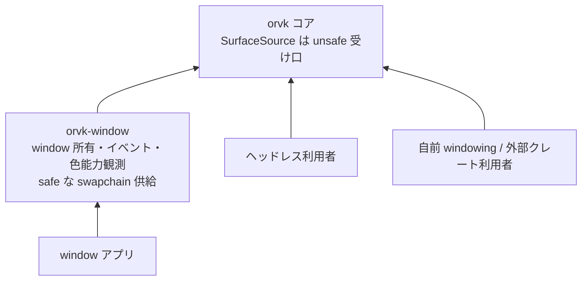

# windowing クレート orvk-window の新設

- created: 2026-07-03
- updated: 2026-07-03
- status: ready for review
- implementation: not-started

## 解決したい問題

orvk で window に描くアプリケーションを書く利用者は、現状の設計([0009](0009_surface-swapchain-present.md))では全員が自分で windowing を書く必要がある。
Win32 / Wayland の window 生成・イベントループ・DPI・モニタ管理はそれ自体が大きなプラットフォームコードであり、さらに HDR / 広色域の出力を正しく扱うには、OS の色管理(Wayland の color-management プロトコル、Windows の Advanced Color)を観測して swapchain の format / colorspace 選定([0009](0009_surface-swapchain-present.md))に接続する協調が要る。
既存の汎用 windowing クレート(winit 等)はこの色まわりの制御を表現できず、利用者は「汎用クレートを使うと色が正しくならない、自作すると重い」の二択に落ちる。

本 doc は、この負担を **コアの純粋さ(ヘッドレス利用に windowing 依存が付かないこと)を保ったまま** 解消するため、同リポジトリの別クレート **orvk-window** を新設することを決める。
決めるのは crate の新設と責務境界・コアとの接続の形であり、イベント型の全列挙のような API 細部は実装 PR と後続 doc に委ねる。

## 問題の背景

コア crate `orvk` が window を扱わないのは [0001](0001_goals-and-non-goals.md) の非目標であり、その理由は 2 つある。
第一に、windowing はイベントループ・入力・DPI と不可分の別ドメインであり、GPU ライブラリの語彙(リソース・同期・実行)と混ぜると両方の設計が濁る。
第二に、ヘッドレス利用(CI・オフライン計算)が一級の入口である以上、コアに windowing 依存を付けられない。
GPU ラッパーライブラリが native window handle だけを受け取り、windowing を外に置くのはこの分野の標準的な構成でもある(サンプルは外部の windowing ライブラリと組み合わせる形が通例)。

一方で、[0009](0009_surface-swapchain-present.md) は surface 入力として中立な `SurfaceSource`(生ポインタ、unsafe)を受け、surface format は利用者が候補列で渡す契約にした。
この契約は「正しい入力を作る側」を空白のまま残している。
とくに HDR / 広色域では、出力先モニタの能力(対応 colorspace、HDR 有効か、SDR white level)を OS から観測しないと format 候補列を正しく組めず、その観測 API は windowing(display / window の管理)と同じ層にある。
つまり色を正しく扱う windowing は orvk の swapchain 契約と協調して設計される必要があり、汎用 windowing クレートの外付けでは埋まらない。

この空白を埋める場所として、orvk リポジトリ内の別クレートという選択肢を本 doc で確定する。
コアの非目標([0001](0001_goals-and-non-goals.md))は「コア crate が window を扱わない」ことであり、リポジトリが windowing クレートを持たないことではない。

## この文書では書かないこと

- コアの surface / swapchain / present 契約([0009](0009_surface-swapchain-present.md))。本 doc はそれを変更せず、その上に safe な供給側を立てる。
- orvk-window のイベント型・window 属性・モニタ API の全列挙。crate の骨格が立った後の実装 PR と後続 doc で確定する。
- 色変換・トーンマッピングの実装。orvk-window が扱うのは「出力能力の観測と出力設定」までで、ピクセル値の変換は利用者(レンダラー)の責務である。
- コア crate の構成([0001](0001_goals-and-non-goals.md) の全体決定 1)。orvk-window は別プロダクトの別 crate であり、コアの単一 crate 方針を変えない。

## やらないこと

- **GUI フレームワーク化をしない。** ウィジェット・レイアウト・テーマは orvk-window の責務ではない(恒久)。提供するのは window・イベント・出力設定までで、その上に GUI を組むのは利用者側のレイヤである。
- **入力の高水準化をしない。** キーボードショートカット・ジェスチャ認識・IME の編集モデルのような高水準の入力処理は持たない。raw に近いイベント(キー・ポインタ・テキスト入力・resize・DPI 変更・クローズ要求)の配送までとする。
- **winit 互換 API にしない。** 互換を目標にすると winit のイベントモデル・抽象の制約(色管理の欠落を含む)を引き継ぐ。orvk-window は orvk との協調(SurfaceSource 供給、swapchain 再生成との整合、色能力の観測)を最優先に設計する。
- **X11 / macOS 対応をしない(当面)。** 対応プラットフォームはコアの surface 対応([0009](0009_surface-swapchain-present.md))と揃えて Win32 / Wayland とする。コア側が広がれば追従を検討する。
- **コアから orvk-window への依存を作らない(恒久)。** 依存は orvk-window → orvk の一方向のみ。コアは orvk-window の存在を知らず、0009 の契約だけを公開し続ける。

## 概要

リポジトリを cargo workspace とし、コア `orvk` と **`orvk-window`** の 2 crate を置く。

- **orvk(コア、既存設計のまま)**: window を扱わない。surface 入力は `SurfaceSource`(unsafe)。ヘッドレス利用はコアだけで完結する。
- **orvk-window(新設)**: window の生成・寿命管理、イベントループ(raw 入力・resize・DPI・クローズ)、モニタ列挙と出力能力の観測(HDR 有効・対応 colorspace・SDR white level 等)、そして orvk への **safe な surface 供給** を担う。

コアとの接続の核は「unsafe 契約の safe 化」である。
[0009](0009_surface-swapchain-present.md) の swapchain 生成が unsafe なのは、orvk が native handle の有効性と window の生存を検証できないからだった。
orvk-window は window を自分で所有しているため、この安全条件を型と寿命で保証でき、swapchain 生成を safe API として包める。
利用者から見ると「orvk-window を使えば unsafe を書かずに window 表示まで到達でき、自前 windowing や外部クレートを使う場合は従来どおり 0009 の unsafe 経路を使う」という二層になる。

(矢印は Cargo 依存。ヘッドレス利用者と自前 windowing の利用者は orvk-window に触れない。)

## シナリオ / ユースケース

- **window に描くツールを最短で立てる。**
  利用者は orvk-window で window とイベントループを作り、window から safe に swapchain を得て、フレームごとに acquire → 記録 → present([0009](0009_surface-swapchain-present.md))を回す。
  Win32 / Wayland のプラットフォームコードも unsafe も書かない。
  resize イベントは orvk-window が extent 付きで配送し、利用者はそれを swapchain の recreate(0009)に渡す。
- **HDR / 広色域モニタへ正しく出す。**
  利用者は orvk-window のモニタ観測 API で出力先の能力(HDR 有効か、対応 colorspace、SDR white level)を取り、それに基づいて swapchain の format / colorspace 候補列(0009)を組む。
  モニタ間の window 移動や設定変更は能力変更イベントとして配送され、利用者は swapchain を作り直して追従できる。
- **ヘッドレス利用者・自前 windowing の利用者。**
  orvk-window に依存しない。コアの API 面・依存はこの doc の前後で何も変わらない。

## 詳細設計

### crate 境界と依存方向

- workspace のメンバは `orvk`(コア)と `orvk-window`。依存は orvk-window → orvk の一方向のみとする。
- orvk-window が orvk から使うのは、`SurfaceSource` の組み立てと swapchain 生成([0009](0009_surface-swapchain-present.md))、および Device の present 用途の照会だけである。記録・submit・リソースの語彙には触れない(それらは window アプリ自身が使う)。
- コアの design doc(0001〜0011)の契約は本 doc で一切変更しない。orvk-window はそれらの契約の「利用者」の位置に立つ。

### 責務の内訳

orvk-window が担うのは次の 4 つである。

1. **window の生成と寿命管理**: Win32 / Wayland の window を作り、所有する。orvk へ渡す native handle の有効性は orvk-window の所有によって保証される。
2. **イベントループ**: raw に近いイベント(キー・ポインタ・テキスト入力・resize・DPI / scale 変更・フォーカス・クローズ要求・モニタ能力変更)を利用者へ配送する。ループの駆動形(poll / callback)は実装 PR で確定するが、「GPU の frame ループと利用者側で合成できる」ことを要件とする。
3. **モニタと出力能力の観測**: モニタ列挙、window が載っているモニタの解決、HDR / 広色域の能力(Wayland は color-management プロトコル、Windows は Advanced Color 相当の情報)の観測と変更通知。観測結果は swapchain の format / colorspace 候補列(0009)を組むための材料として公開する。
4. **safe な surface 供給**: window から swapchain を作る safe API を提供する。内部で `SurfaceSource` を組み立ててコアの unsafe API を呼び、「swapchain より先に window を破棄できない」ことを型(所有・借用)で強制する。

### unsafe 契約の safe 化

[0009](0009_surface-swapchain-present.md) の安全条件は「ポインタが有効であること」「swapchain(と Device)の破棄まで window が生存すること」の 2 つだった。
orvk-window の window 型はこの両方を構造で満たす。

- ポインタの有効性: handle は orvk-window 自身が生成した window のものである。
- 生存: swapchain を window の所有物(または window への借用を保持する型)として提供し、window の drop を swapchain の drop より後にできない設計にする。

これによりコアの unsafe API は「orvk-window を使わない利用者のための土台」として残り、orvk-window の利用者は unsafe を書かない。
コア側に safe 化のための変更は不要である(safe 化は所有情報を持つ側でしかできず、その所有者が orvk-window である)。

### 色能力の観測と swapchain への接続

orvk-window は「観測と設定の口」に徹し、色変換はしない。

- 観測: モニタごとに「HDR が有効か」「対応する colorspace の集合」「SDR white level」等を、プラットフォームの色管理 API から取得して中立な型で公開する。取得できない環境では「不明」を明示的に返す(黙って SDR 相当を仮定しない)。
- 接続: 利用者は観測結果から 0009 の `format_candidates` を組む。典型的な組み合わせ(SDR sRGB、HDR10、scRGB 系)の候補列を返すヘルパーを orvk-window 側に置く(0009 の既定候補ヘルパーの色対応版)。
- 変更追従: モニタ設定の変更・window の移動は能力変更イベントとして配送し、swapchain の作り直し(0009 の recreate)は利用者の判断で行う(0009 が自動再生成を採らないのと同じ理由)。

## 落とし穴

- **イベントループのモデルは一度公開すると変えにくい。** poll 型か callback 型か、スレッドの制約(Win32 はメッセージポンプのスレッド親和性、Wayland はディスパッチの所有)はプラットフォームの制約が強く、抽象の選択を誤ると後から利用者コードを巻き込んで作り直しになる。実装 PR の前に両プラットフォームの制約を洗う必要がある(本 doc はモデルを未確定のまま残している)。
- **HDR / 色管理の OS 差は抽象しきれない。** Wayland の color-management とWindows の Advanced Color は能力の表現粒度が違い、「不明」が返る環境も多い。orvk-window の観測型は最大公約数ではなく「取れるものを取れた形で返し、取れないことを明示する」設計にしないと、silent な SDR フォールバックが混入する。
- **外部 windowing クレートとの併用者には二重の存在になる。** 既に winit 等でアプリを組んでいる利用者は orvk-window を使わず 0009 の unsafe 経路を使うことになり、HDR 観測などの便益を得られない。観測 API だけを window 生成と分離して提供できるかは実装で見極める(できれば併用者にも観測部分を貸せる)。
- **コアと別 crate ゆえのバージョン整合。** orvk-window はコアの 0009 契約に依存するため、コアの破壊的変更に追従が要る。同一 workspace で同時に変更するため通常は問題にならないが、公開時のバージョン運用(コアと合わせるか独立か)は公開時に決める。

## 代替案

- **windowing を一切提供しない(全利用者が自作、現状維持)。**
  - Pros: リポジトリの責務が GPU ライブラリだけに閉じ、プラットフォームコードの保守が発生しない。
  - Cons: window に描く全利用者が Win32 / Wayland の windowing と色管理観測を再発明する。とくに HDR / 広色域はコアの swapchain 契約(0009 の format 候補)と協調した観測が必須で、各自の自作では正しさが揃わない。「ヘッドレスでは最短、window 表示では最長」という利用体験の段差が残る。
  - 見送り理由: 0009 が意図的に残した「正しい入力を作る側」の空白を埋める場所がどこにも無くなる。コアの純粋さは別 crate 化で守れるため、提供しない理由にならない。
- **winit を採用して薄いブリッジを提供する。**
  - Pros: 実績ある windowing をそのまま使え、実装コストが最小。エコシステムの慣習に乗れる。
  - Cons: 現行の winit は HDR / 広色域・色管理の観測と制御を表現できず、本 doc の中心要件が満たせない。イベントモデルと window 属性の抽象も winit に固定され、orvk 側の要件(swapchain 再生成との整合、色能力イベント)を後付けできない。
  - 見送り理由: 要件の核(色)が満たせない。将来 winit が色管理を表現できるようになれば、orvk-window の実装を winit ベースに差し替える再検討はあり得る(その場合も orvk-window の API 面を保てるかで判断する)。
- **コア crate に windowing を統合する(feature ゲート)。**
  - Pros: crate が 1 つで済み、利用者の依存指定が単純になる。
  - Cons: コアの公開面に windowing の型・イベント・プラットフォーム依存が入り、ヘッドレス利用者にも概念上の重さが付く。feature で切っても doc・API リファレンス・コンパイル時間の混線は残る。windowing の設計変更がコアのバージョンを動かす。
  - 見送り理由: 責務が別ドメインであることは 0001 の判断のとおりで、同居の利便は workspace の別 crate でほぼ同等に得られる。
- **orvk-window を別リポジトリにする。**
  - Pros: リポジトリごとの関心が完全に分離する。
  - Cons: orvk-window は 0009 の契約(SurfaceSource、swapchain 生成、recreate)と密に協調して設計・変更されるため、リポジトリを分けると契約変更のたびに 2 リポジトリの同期が要る。コアと windowing は同じ設計判断のループ(この design doc 群)で育てる方が安い。
  - 見送り理由: 分離の利益が薄く、協調のコストだけが増える。コアが安定して orvk-window の変更頻度が独立した時点で、分離は改めて検討できる。

## セキュリティ・プライバシー

orvk-window は OS の windowing / 色管理 API と利用者コードの間に立つだけで、外部入力・機微データを扱わない。
native handle の有効性はライブラリ内部の所有で閉じるため、0009 の unsafe 契約が利用者へ露出する面はむしろ減る。
新たな検討は不要である。

## 負荷・コスト

- コアには何も足さない(コアは orvk-window を知らない)。ヘッドレス利用者のビルド・実行への影響はゼロである。
- orvk-window のイベント配送・観測はプラットフォーム API のコストそのままで、GPU の hot path(記録・submit)とは独立している。
- リポジトリとしてはプラットフォームコード(Win32 / Wayland × window・イベント・色観測)の保守が加わる。これは本 doc が「全利用者の再発明」から「リポジトリ 1 箇所の実装」へ集約したコストそのものである。
